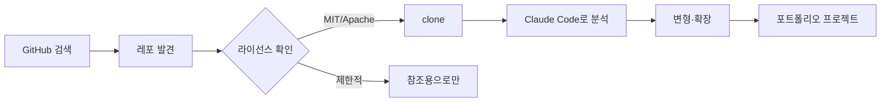
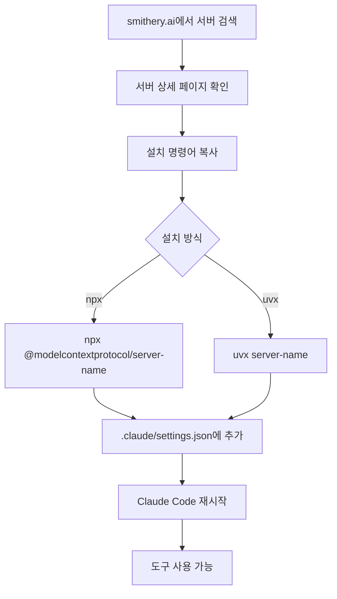

# Claude Code 생태계 탐색 허브

> 이 문서에 수록된 리소스는 Claude Code 생태계의 일부분입니다. 항상 아래 **3개 허브**를 추가로 탐색해 최신 리소스를 확인하세요.

## 핵심 개념 / 작동 원리

Claude Code 생태계는 **공식 내장 기능** 과 **커뮤니티 확장** 두 축으로 구성됩니다.

```mermaid
flowchart TD
    A[Claude Code 사용자] --> B{무엇이 필요한가?}
    B -->|자동화 스킬| C[Skills Directory]
    B -->|외부 도구 연결| D[Smithery.ai MCP 레지스트리]
    B -->|오픈소스 레포| E[GitHub Advanced Search]
    C --> F[/skill-name 슬래시 명령어]
    D --> G[.claude/settings.json mcpServers 설정]
    E --> H[clone → 분석 → 변형]
    F & G & H --> I[프로젝트에 통합]
```

생태계 탐색 흐름:
1. **목적 파악** — 어떤 문제를 해결하고 싶은가?
2. **허브 검색** — 3개 허브에서 관련 리소스 검색
3. **검증** — 라이선스, 스타 수, 최근 업데이트 확인
4. **도입** — 설치/설정 후 프로젝트에 통합
5. **커스텀** — 학습 맥락에 맞게 변형

## 한 줄 요약

공식 스킬 디렉토리 + MCP 레지스트리 + GitHub 검색 — 세 허브를 함께 쓰면 Claude Code 생태계의 전체를 탐색할 수 있다.

## 프로젝트에 도입하기

생태계 탐색은 설치보다 **검색 전략** 이 중요합니다.

### 탐색 시작 프롬프트 (복사용)

```text
Claude Code 생태계에서 [목적] 에 도움되는 리소스를 찾아줘.
다음 3개 허브를 탐색해:
1. Smithery.ai (MCP 서버): https://smithery.ai/
2. Claude Skills Directory: https://claudeskills.info/
3. GitHub 10K+ 스타 레포: https://github.com/search?q=stars%3A%3E10000&type=Repositories
각 허브별로 대학생 프로젝트에 적합한 옵션을 추천해줘.
```

## 실전 예제 (대학생 관점)

**시나리오**: 동아리 공지 게시판 프로젝트에서 Supabase DB 작업을 Claude Code로 자동화하고 싶다.

1. **Smithery.ai 검색**: "supabase" 검색 → Supabase MCP 서버 발견
2. **GitHub 검색**: `supabase stars:>1000` → 공식 supabase-js 레포 확인
3. **Skills Directory**: "database" 검색 → 관련 커스텀 스킬 확인
4. **도입**: Supabase MCP 설정 + 관련 스킬 설치

---

## 허브 1 — GitHub Advanced Search

**URL**: [github.com/search](https://github.com/search?q=stars%3A%3E10000&type=Repositories)

GitHub에서 Stars 10K+ 레포지토리를 검색해 Claude Code와 시너지가 좋은 오픈소스 프로젝트를 찾습니다.

### 유용한 검색 필터

| 필터 | 예시 | 설명 |
|------|------|------|
| `stars:>10000` | `stars:>10000 language:TypeScript` | 인기 TypeScript 레포 |
| `topic:claude-code` | `topic:claude-code` | Claude Code 관련 레포 |
| `topic:mcp` | `topic:mcp` | MCP 관련 레포 |
| `created:>2025-01-01` | `created:>2025-01-01 stars:>500` | 최신 인기 레포 |

### 대학생 활용 시나리오



- 졸업작품용 스타터 키트 탐색
- 인기 라이브러리 내부 구조 학습
- 공모전 아이디어 레퍼런스 수집

---

## 허브 2 — Smithery.ai (MCP 레지스트리)

**URL**: [smithery.ai](https://smithery.ai/)

MCP(Model Context Protocol) 서버들의 중앙 레지스트리입니다. Claude Code에서 외부 도구(DB, API, 파일 시스템 등)를 연결할 때 시작점이 됩니다.

### MCP 서버 설치 흐름



### settings.json 예시 (Smithery 서버)

```json
{
  "mcpServers": {
    "server-name": {
      "command": "npx",
      "args": ["-y", "@modelcontextprotocol/server-name"],
      "env": {
        "API_KEY": "${SERVER_API_KEY}"
      }
    }
  }
}
```

### 주요 카테고리

| 카테고리 | 대학생 활용 |
|---------|-----------|
| 데이터베이스 (Supabase, PostgreSQL) | 풀스택 프로젝트, 데이터 과목 |
| 파일 시스템 (Filesystem) | 로컬 파일 관리 자동화 |
| GitHub | PR 관리, 이슈 트래킹 |
| 웹 크롤링 (Fetch, Browser) | 데이터 수집, 스크래핑 과제 |
| 검색 (Brave, Tavily) | 리서치 자동화 |

---

## 허브 3 — Claude Skills Directory

**URL**: [claudeskills.info](https://claudeskills.info/)

커뮤니티가 작성한 커스텀 Skills(SKILL.md)을 모아 놓은 아카이브입니다. 공식 내장 스킬 외에 특수 목적 스킬을 발견할 수 있습니다.

### 스킬 설치 흐름

```mermaid
flowchart LR
    A[claudeskills.info 탐색] --> B[스킬 발견]
    B --> C[SKILL.md 내용 확인]
    C --> D{라이선스 확인}
    D -->|허용| E[~/.claude/skills/에 저장]
    E --> F[/skill-name 으로 호출]
```

### 커스텀 스킬 설치 방법

```bash
# 1. 스킬 디렉토리 생성
mkdir -p ~/.claude/skills/my-skill

# 2. SKILL.md 파일 작성
cat > ~/.claude/skills/my-skill/SKILL.md << 'EOF'
# My Custom Skill

TRIGGER: Use when ...

## Instructions
1. Step one
2. Step two
EOF
```

### 대학생이 찾으면 좋은 스킬 키워드

- `report` — 보고서 작성 자동화
- `korean` — 한국어 특화 스킬
- `refactor` — 리팩터링 지원
- `api` — API 설계/문서화
- `test` — 테스트 코드 생성

## 학습 포인트 / 흔한 함정

**함정 1: 출처 불명 스킬/MCP 서버 무분별 설치**
- 스킬은 Claude Code의 행동을 직접 제어합니다. 반드시 내용을 읽고 신뢰할 수 있는 소스인지 확인하세요.

**함정 2: API 키 하드코딩**
- MCP 서버 설정에서 API 키는 반드시 환경 변수(`${ENV_VAR}`)로 관리하세요.

**함정 3: 최신 버전 미확인**
- MCP 서버와 스킬은 활발히 업데이트됩니다. 설치 전 마지막 커밋 날짜를 확인하세요.

## 관련 리소스

- [MCP 서버 해설](/mcp/) — 주요 MCP 서버 한국어 가이드
- [Skills 해설](/skills/) — 48개 공식 스킬 한국어 해설
- [Hooks 레시피](/hooks/) — 이벤트 기반 자동화
- [GitHub 레포 큐레이션](/repos/) — 추천 오픈소스 레포

---

| 항목 | 내용 |
|---|---|
| 원본 URL | https://smithery.ai/ |
| 작성자/출처 | Claude-Code-Study 프로젝트 |
| 라이선스 | MIT (해설) / 각 플랫폼별 약관 (원본) |
| 해설 작성일 | 2026-04-12 |

> ⚠️ 외부 허브의 모든 리소스는 각 소유자의 저작권과 약관을 따릅니다. 설치 전 라이선스를 반드시 확인하세요.
