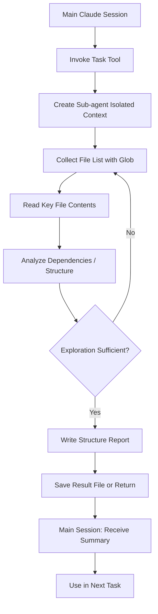

# Codebase Exploration Agent (explore-agent)

## Core Concepts / How It Works

Claude Code's sub-agents run in isolated independent contexts via the `Task` tool. The Explore Agent pattern delegates the task of "explore this repo and summarize it" from the main session to a sub-agent.



Advantages of sub-agents:
- **Context Isolation**: Hundreds of files read during exploration do not pollute the main context
- **Parallelizable**: Multiple agents can simultaneously explore different directories
- **Reusable**: Saving exploration results to a file allows reuse in later sessions

## One-Line Summary

When joining a new project or revisiting an old codebase, use the Explore Agent pattern to quickly understand the overall structure and automatically organize a list of key files.

## Getting Started

Sub-agents use Claude Code's **Task tool** directly without requiring a separate skill file.

### Basic Exploration Prompt (Copy-ready)

```text
Run a sub-agent to perform the following exploration task:

Target: [directory path]
Purpose: [what you want to understand]
Output file: docs/codebase-map.md

Exploration steps:
1. Understand directory structure (using Glob patterns)
2. Check dependencies from package.json / config files
3. Read entry point files (index.ts, main.ts, page.tsx)
4. Organize the list of key files and their roles
5. Save results to the output file in markdown format
```

### Parallel Exploration (Frontend + Backend simultaneously)

```text
Run two sub-agents in parallel:
- Agent 1: Explore structure of apps/frontend/ → docs/frontend-map.md
- Agent 2: Explore structure of apps/backend/ → docs/backend-map.md
```

## Practical Example

**Scenario**: A new team member joins the Next.js 15 "Student Club Notice Board" project and needs to understand the overall structure.

```text
Run a sub-agent to explore the entire structure of this project.
Tasks for the agent:
1. Understand directory tree structure (apps/, packages/, content/, scripts/)
2. Identify the role and key files of each directory
3. Check dependencies and scripts from package.json
4. Read entry point file contents
5. Save results as docs/codebase-map.md
```

Example `docs/codebase-map.md` generated by the sub-agent:

```markdown
# Codebase Structure Map (as of 2026-04-12)

## Directory Roles
| Directory | Role |
|---|---|
| apps/docs/ | VitePress documentation site |
| packages/parser/ | SKILL.md → JSON parser |
| content/ko/ | Korean commentary content |

## Key Files
- apps/docs/.vitepress/config.ts — VitePress configuration
- scripts/sync-content-to-docs.ts — Content sync script
```

## Learning Points / Common Pitfalls

- **Understanding Isolated Contexts**: Sub-agents do not share memory with the main session. You must save results to a file or use the Task tool's return value.
- **Specify Scope Clearly**: Scopes like "explore the entire project" are too broad and will be slow. Narrowing to something like "only VitePress config in apps/docs/" is more efficient.
- **Result Caching Strategy**: Saving exploration results to `docs/codebase-map.md` and committing to git eliminates the need to re-explore in future sessions. Only re-explore when code changes.
- **Use Parallel Exploration**: When frontend and backend are separate, run two sub-agents simultaneously to cut the time in half.
- **Context Saving Effect**: Exploring a large repo may require reading dozens of files. Delegating to a sub-agent means the main context only receives the summary.

## Related Resources

- [Plan Agent](/en/agents/plan-agent) — Agent dedicated to creating implementation plans
- [Parallel Dispatch (parallel-dispatch)](/en/agents/parallel-dispatch) — Parallel agent pattern
- [Dispatching Parallel Agents skill](/skills/dispatching-parallel-agents) — Related skill
- [Subagent-Driven Development skill](/skills/subagent-driven-development) — Advanced sub-agent patterns

---

| Field | Value |
|---|---|
| Source URL | https://docs.anthropic.com/en/docs/claude-code/sub-agents |
| Author / Source | Anthropic |
| License | CC BY 4.0 |
| Translation Date | 2026-04-12 |
