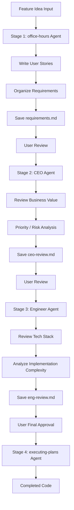

# GStack Role-Based Agent Pipeline (gstack-roles)

## Core Concepts / How It Works

The GStack pattern is a multi-agent pipeline that runs agents with different roles **sequentially**. Each agent receives the output of the previous agent as input and supplements it from its own role's perspective.



Since each agent runs in an independent context:
- Previous exploration history does not contaminate the next agent
- The persona of each role is clearly maintained
- Outputs at each stage are preserved as files and are traceable

## One-Line Summary

Run agents with roles such as CEO, designer, and engineer sequentially to systematically process everything from idea brainstorming to final implementation in a structured pipeline.

## Getting Started

### When to Use

- When you want to process a new feature idea step by step from a business perspective review → design review → technical implementation
- When you want to verify the design from each role's perspective to improve quality
- When you're developing alone but want multi-angle reviews as if you had a team
- When a startup or solo developer wants to simulate the role-by-role review process of a real team with Claude

### Pipeline Automation Prompt Pattern

Copy and use the following prompt block:

```text
Run the GStack pipeline in order for the "[feature name]" feature:
1. office-hours agent (requirements organization)
   → Output: docs/plans/[feature-name]-requirements.md
2. ceo-review agent (business review)
   → Output: docs/plans/[feature-name]-ceo-review.md
3. eng-review agent (technical review)
   → Output: docs/plans/[feature-name]-eng-review.md
4. After my final approval, the executing-plans agent (implementation)

After each stage is complete, show me the results and confirm before proceeding to the next stage.
```

### Prompt Templates for Each Role Agent

**office-hours agent (requirements organization)**:
```text
Run a sub-agent to organize the requirements for the following feature.
Role: Requirements Analyst (Office Hours Facilitator)

Feature idea: [idea description]

Tasks:
1. Write user stories (AS-A / I-WANT / SO-THAT format)
2. Write a list of functional/non-functional requirements
3. Specify In Scope / Out of Scope
4. Save to docs/plans/[feature-name]-requirements.md
```

**CEO agent (business review)**:
```text
Run a sub-agent to review the following feature plan from a CEO perspective.
Role: Startup CEO (business value focused)

Input document: docs/plans/[feature-name]-requirements.md

Review items:
1. Does this feature contribute to core user value?
2. Is the value appropriate relative to the implementation cost (development time)?
3. What elements can be removed from MVP scope?
4. What are the potential risks?

Output: docs/plans/[feature-name]-ceo-review.md
```

**Engineer agent (technical review)**:
```text
Run a sub-agent to review the following feature plan from a senior engineer perspective.
Role: Full-stack Senior Engineer

Input documents:
- docs/plans/[feature-name]-requirements.md
- docs/plans/[feature-name]-ceo-review.md

Current tech stack: [list stack]

Review items:
1. Architecture proposal
2. DB schema change scope
3. Impact on existing code changes
4. Implementation order and estimated time

Output: docs/plans/[feature-name]-eng-review.md
```

## Practical Example

**Scenario**: Full pipeline for adding a "notice subscription alert" feature to a Next.js 15 "Student Club Notice Board" project

### Stage 1: office-hours agent (requirements organization)

```text
Run a sub-agent to organize the requirements for the following feature.
Role: Requirements Analyst (Office Hours Facilitator)

Feature idea:
- When a club member subscribes to a specific category of notices, they receive an email notification when a new notice is posted

Tasks:
1. Write user stories (AS-A / I-WANT / SO-THAT format)
2. Write a list of functional/non-functional requirements
3. Specify In Scope / Out of Scope
4. Save to docs/plans/notice-subscribe-requirements.md
```

### Stage 2: CEO agent (business review)

```text
Run a sub-agent to review the following feature plan from a CEO perspective.
Role: Startup CEO (business value focused)

Input document: docs/plans/notice-subscribe-requirements.md

Review items:
1. Does this feature contribute to core user value?
2. Is the value appropriate relative to the implementation cost (development time)?
3. What elements can be removed from MVP scope?
4. What are the potential risks?

Output: docs/plans/notice-subscribe-ceo-review.md
```

### Stage 3: Engineer agent (technical review)

```text
Run a sub-agent to review the following feature plan from a senior engineer perspective.
Role: Full-stack Senior Engineer

Input documents:
- docs/plans/notice-subscribe-requirements.md
- docs/plans/notice-subscribe-ceo-review.md

Current tech stack: Next.js 15, Prisma, NextAuth.js, Nodemailer

Review items:
1. Email sending architecture proposal (synchronous vs asynchronous queue)
2. DB schema change scope
3. Impact on existing code changes
4. Implementation order and estimated time

Output: docs/plans/notice-subscribe-eng-review.md
```

### Stage 4: executing-plans agent (implementation)

```text
Run a sub-agent to start implementation based on the following plans.

Input documents:
- docs/plans/notice-subscribe-requirements.md
- docs/plans/notice-subscribe-ceo-review.md
- docs/plans/notice-subscribe-eng-review.md

Implementation order (follow the order in the eng-review document):
1. Add Subscription model to Prisma schema
2. Implement subscription API route (/api/notices/subscribe)
3. Add email sending logic when a notice is created
4. Add subscription button component

Output a completion confirmation message at each step.
```

## Learning Points / Common Pitfalls

- **Meaning of Sequential Execution**: The GStack pipeline processes stages in order, unlike parallel dispatch. There is a dependency relationship where the result of the previous agent becomes the input of the next.
- **Insert Human Review Gates**: Adding a gate where a person reviews the results between each stage and approves the next step allows early detection when an agent is heading in the wrong direction.
- **Effect of Role Personas**: Asking the CEO agent "what is the value relative to cost?" produces genuinely different-perspective feedback. Role personas are an effective way to guide the model to focus on a specific viewpoint.
- **Accumulating vs. Overwriting Documents**: Each stage's results must be saved to separate files (accumulated) so you can go back and modify earlier stages. Overwriting a single file loses previous reviews.
- **Pipeline Stopping Points**: If the engineer review concludes that "this feature is too complex to implement with the current tech stack," don't proceed to the implementing stage and redefine the requirements instead. The pipeline must always allow going back to earlier stages.

## Related Resources

- [plan-agent](./plan-agent.md) — Can strengthen the first stage (requirements organization) of GStack with the Plan Agent pattern
- [parallel-dispatch](./parallel-dispatch.md) — Use for parallel implementation after completing the GStack pipeline
- [brainstorming skill](../skills/brainstorming.md) — Can replace the idea divergence stage with the brainstorming skill instead of the office-hours agent
- [Course Project Development](../use-cases/) — Full workflow applying the GStack pipeline to a semester-end project

---

| Field | Value |
|---|---|
| Source URL | https://docs.anthropic.com/en/docs/claude-code/sub-agents |
| License | CC BY 4.0 |
| Translation Date | 2026-04-12 |
| Author | Claude-Code-Study Project |
