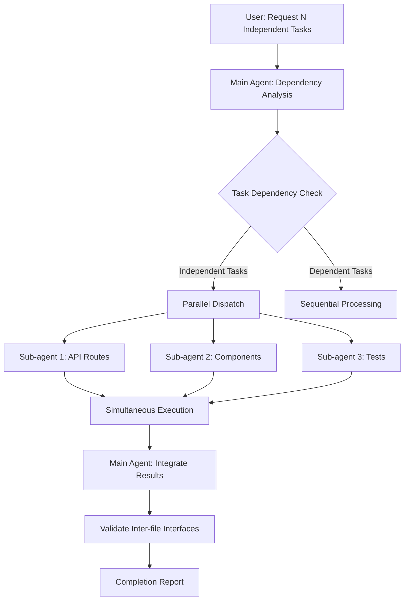

# Parallel Task Dispatch Pattern (parallel-dispatch)

## Core Concepts / How It Works

The parallel dispatch pattern distributes tasks that do not depend on each other to multiple sub-agents simultaneously, reducing total processing time.



Core rules — conditions for parallelization:
1. Task A's result must not be the input of Task B (non-dependency)
2. The same file must not be modified simultaneously (conflict prevention)
3. Each task must be independently completable

Comparison between serial and parallel processing:
```
Serial approach (default):
Time: ──[A: 5min]──[B: 5min]──[C: 5min]──  Total 15min

Parallel dispatch:
Time: ──[A: 5min]──  Total 5min
      ──[B: 5min]──
      ──[C: 5min]──
```

## One-Line Summary

Dispatch N independent tasks without dependencies to sub-agents simultaneously to dramatically reduce total work time.

## Getting Started

### When to Use

- When you need to simultaneously implement multiple unrelated files (API routes, components, tests)
- When you need to independently update multiple packages in a monorepo
- When refactoring styles across multiple pages at the same time
- When you need to fix multiple independent bugs simultaneously

### Parallel Dispatch Prompt Pattern

Copy and use the following prompt block:

```text
Run [N] sub-agents simultaneously to process the following [N] tasks in parallel.
Each task is independent of each other.

[Agent 1 - Role Name]
Responsible for: [file path or directory]
Tasks:
- [subtask 1]
- [subtask 2]
Reference files: [files to reference]

[Agent 2 - Role Name]
Responsible for: [file path or directory]
Tasks:
- [subtask 1]
Reference files: [files to reference]

After all agents complete, summarize the results and validate the interfaces between files.
```

### Dependency Analysis Prompt

Before parallelizing, first check for dependencies between tasks:

```text
Analyze the following task list and divide them into groups
that can be processed in parallel and groups that must be
processed sequentially.

Task list:
1. [Task A]
2. [Task B]
3. [Task C]
4. [Task D]

Criteria:
- Tasks that modify the same file go in the same group
- If one task's output is another task's input, process sequentially
- The rest can be parallelized
```

### Task Tool Call Example

Internally, Claude Code calls multiple Task tools simultaneously:

```text
[Task 1] Implement API routes
  Responsible for: backend/routes/notices/
  Completion criteria: Create 4 endpoints GET/POST/PUT/DELETE

[Task 2] Implement frontend components  <- simultaneous execution
  Responsible for: frontend/components/notices/
  Completion criteria: Create 3 components NoticeList, NoticeCard, NoticeForm

[Task 3] Create test files  <- simultaneous execution
  Responsible for: backend/routes/notices/__tests__/
  Completion criteria: Write full API integration tests
```

## Practical Example

**Scenario**: Simultaneously implementing API routes, frontend components, and tests for notice CRUD in a Next.js 15 "Student Club Notice Board" project

### Actual Usage in a Claude Code Session

```text
Run 3 sub-agents simultaneously to process the following 3 tasks in parallel.
Each task is independent of each other.

[Agent 1 - API Routes]
Responsible for: backend/routes/notices/ directory
Tasks:
- GET /api/notices → Return full notice list (with pagination)
- POST /api/notices → Create new notice (authentication required)
- PUT /api/notices/:id → Edit notice (author only)
- DELETE /api/notices/:id → Delete notice (author only)
Reference files: backend/middleware/auth.ts, backend/types/notice.ts

[Agent 2 - Frontend Components]
Responsible for: frontend/components/notices/ directory
Tasks:
- NoticeList.tsx: Notice list + infinite scroll
- NoticeCard.tsx: Individual notice card
- NoticeForm.tsx: Notice create/edit form
Reference files: frontend/types/notice.ts, frontend/hooks/useAuth.ts

[Agent 3 - Tests]
Responsible for: backend/routes/notices/__tests__/ directory
Tasks:
- notices.test.ts: Full API route tests
- Mock setup: prisma, nextauth
Reference files: vitest.config.ts, backend/utils/test-helpers.ts

Summarize the results after all agents complete.
```

### Parallel Dispatch Result Integration Example

After 3 agents complete simultaneously, the main agent reports:

```
[Agent 1 Complete] 4 API routes created
  - backend/routes/notices/index.ts (GET, POST)
  - backend/routes/notices/[id].ts (PUT, DELETE)

[Agent 2 Complete] 3 frontend components created
  - frontend/components/notices/NoticeList.tsx
  - frontend/components/notices/NoticeCard.tsx
  - frontend/components/notices/NoticeForm.tsx

[Agent 3 Complete] Test file created
  - backend/routes/notices/__tests__/notices.test.ts
  - 12 test cases total

Integration result: All files created successfully.
Need to verify that NoticeList.tsx calls /api/notices.
```

## Learning Points / Common Pitfalls

- **File Conflict Prevention is Top Priority**: If two agents modify the same file simultaneously, the last written content overwrites the previous. Always clearly separate the file areas each agent is responsible for.
- **Shared Type Files Must Be Sequential**: Shared type files like `types/notice.ts` should be written by one agent first, then other agents reference it sequentially.
- **3-5 Is the Practical Limit**: Theoretically N agents can run in parallel, but running too many simultaneously can cause confusion for the main agent when integrating results. Practically, 3-5 is appropriate.
- **Specify the Integration Stage Explicitly**: After parallel completion, explicitly request an integration stage where the main agent validates inter-file interfaces (API call URLs, type matching, etc.).
- **Handling Failed Agents**: If 1 out of 3 fails, the other 2 are already complete. You can request only the failed agent to be re-run.

## Related Resources

- [plan-agent](./plan-agent.md) — Apply the Plan Agent pattern first to separate design before parallel implementation
- [gstack-roles](./gstack-roles.md) — A variant pattern that extends role-based agents from sequential to parallel
- [subagent-driven-development skill](../skills/subagent-driven-development.md) — Skill version of parallel dispatch
- [Team Collaboration Workflow](../use-cases/) — Application cases of this pattern in per-member parallel development

---

| Field | Value |
|---|---|
| Source URL | https://docs.anthropic.com/en/docs/claude-code/sub-agents |
| License | CC BY 4.0 |
| Translation Date | 2026-04-12 |
| Author | Claude-Code-Study Project |
