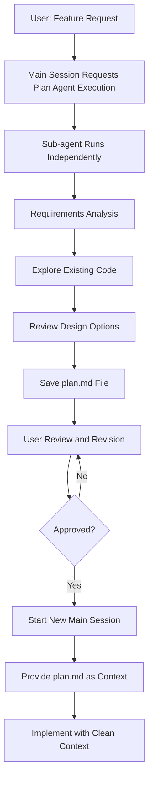

# Design Isolation Agent (plan-agent)

## Core Concepts / How It Works

The Plan Agent pattern delegates the design exploration process to a sub-agent to protect the main session's context.



Claude Code's context window is finite. Files read during design exploration, conversations, and discarded code fragments all consume context. By delegating this design exploration to a sub-agent, the main session receives only the final design document and can start implementation in a clean state.

Integration with the `/writing-plans` skill:
- The `/writing-plans` skill provides a structured prompt pattern for plan creation
- Instructing the Plan Agent to follow this skill's format produces consistently high-quality design documents

## One-Line Summary

Before implementation work, run a Plan sub-agent separately to write a design document, preserving the main implementation session's context window and improving design quality.

## Getting Started

### When to Use

- When you want to systematically design how to build a new feature before implementing it
- When you want to avoid the conversations and file reading during design exploration from contaminating the implementation session context
- When you need to share the design document with team members or have it reviewed

### Plan Agent Prompt Pattern

Copy and use the following prompt block:

```text
Run a sub-agent to write an implementation plan for the feature below.
Without touching the main session, just save the plan to a file.

Feature: [name of feature to implement]
Feature requirements:
- [requirement 1]
- [requirement 2]

Agent tasks:
1. Explore related files in the current project
2. Understand the existing data model
3. Write the implementation plan following the /writing-plans skill format
4. Save the result to docs/plans/[feature-name]-plan.md
```

### Task Tool Call Example (Claude Code internals)

When a Plan Agent runs, Claude Code internally uses a Task tool like this:

```text
Task: Write implementation plan for notice like feature
Description: |
  1. Explore frontend/components/notices/
  2. Understand backend/routes/ structure
  3. Analyze data model in prisma/schema.prisma
  4. Write plan in writing-plans format
  5. Save to docs/plans/like-feature-plan.md

Output: Plan file path and summary
```

### Handing Off to the Implementation Session

After reviewing the plan, start implementation in a new session:

```text
Please implement the like feature using the docs/plans/like-feature-plan.md
generated above as reference.
Follow the order in the plan and confirm at each step.
```

## Practical Example

**Scenario**: Before adding a notice like feature to the Next.js 15 "Student Club Notice Board" project, separately write the design first

### Actual Usage in a Claude Code Session

**Request Plan Agent Execution from the Main Session:**

```text
Run a sub-agent to write an implementation plan for the feature below.
Without touching the main session, just save the plan to a file.

Feature: Notice Like Feature
- Logged-in club members can like a notice
- Like count is displayed in the notice list
- Liking twice by the same person cancels the like

Agent tasks:
1. Explore notice-related files in the current project (frontend/components/notices/, backend/routes/)
2. Understand the existing data model (prisma/schema.prisma or types folder)
3. Write the implementation plan following the /writing-plans skill format
4. Save the result to docs/plans/like-feature-plan.md
```

### `docs/plans/like-feature-plan.md` Generated by the Plan Agent

```markdown
# Notice Like Feature Implementation Plan

## 1. Goal
Implement a toggle feature where logged-in club members can like a notice,
and duplicate likes are automatically cancelled.

## 2. Current State Analysis
- Notice model: id, title, content, authorId, createdAt
- Authentication: NextAuth.js session confirmed
- Notice list component: frontend/components/notices/NoticeList.tsx

## 3. Change Scope

### Data Model Changes (prisma/schema.prisma)
model NoticeLike {
  id        String   @id @default(cuid())
  noticeId  String
  userId    String
  createdAt DateTime @default(now())

  @@unique([noticeId, userId])  // Prevent duplicate likes
}

### API Route (backend/routes/notices/[id]/like.ts)
- POST: Toggle like (add or delete)
- GET: Query like count for a specific notice

### Frontend (frontend/components/notices/LikeButton.tsx)
- New component: Like button + count display

## 4. Implementation Order
1. DB migration (add NoticeLike model)
2. Implement API route + tests
3. Implement LikeButton component
4. Integrate into NoticeCard
5. Integration tests

## 5. Estimated Time
Approximately 2 hours (1 Claude session)
```

## Learning Points / Common Pitfalls

- **Plan in a Separate Session, Implement in a New Session**: Ideally, after the Plan Agent completes its work, start a new session to begin implementation so the exploration history from planning does not mix into the implementation session.
- **Mandatory Plan Review Step**: Do not directly execute the plan written by the sub-agent without review. The agent may have mistakenly claimed to have explored files that don't exist or made incorrect assumptions.
- **Save Plans to Files**: Saving the plan to a file allows referencing it across multiple sessions and version-controlling it with git. Plans that only exist in memory disappear when the session ends.
- **Use the `/writing-plans` Skill**: This skill enforces a requirements → analysis → options → decision → execution plan structure. Explicitly instructing the Plan Agent to follow this skill's format produces more systematic plans.
- **Plan Granularity**: Plans that are too detailed reduce flexibility during implementation. Be detailed about "what to build" but delegate "how to build it at the code level" to the implementation session.

## Related Resources

- [parallel-dispatch](./parallel-dispatch.md) — Can combine with parallel agents when implementing multiple features simultaneously
- [gstack-roles](./gstack-roles.md) — Use the Plan Agent as the first stage of the GStack pipeline
- [writing-plans skill](../skills/writing-plans.md) — The original plan-writing structure that the Plan Agent should follow
- [executing-plans skill](../skills/executing-plans.md) — Used in the implementation stage after plan creation

---

| Field | Value |
|---|---|
| Source URL | https://docs.anthropic.com/en/docs/claude-code/sub-agents |
| License | CC BY 4.0 |
| Translation Date | 2026-04-12 |
| Author | Claude-Code-Study Project |
