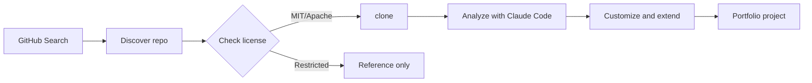
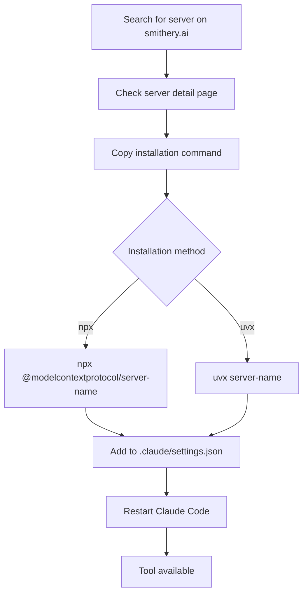
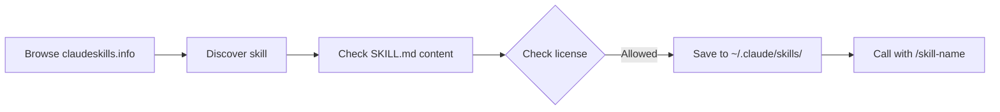

# Claude Code Ecosystem Exploration Hub

> The resources listed in this document are part of the Claude Code ecosystem. Always explore the **3 hubs** below to check for the latest resources.

## Core Concepts / How It Works

The Claude Code ecosystem consists of two axes: **official built-in features** and **community extensions**.

```mermaid
flowchart TD
    A[Claude Code User] --> B{What do you need?}
    B -->|Automation skills| C[Skills Directory]
    B -->|Connect external tools| D[Smithery.ai MCP Registry]
    B -->|Open source repos| E[GitHub Advanced Search]
    C --> F[/skill-name slash command]
    D --> G[.claude/settings.json mcpServers configuration]
    E --> H[clone → analyze → customize]
    F & G & H --> I[Integrate into project]
```

Ecosystem exploration flow:
1. **Identify purpose** — What problem do you want to solve?
2. **Search hubs** — Search for relevant resources across the 3 hubs
3. **Verify** — Check license, star count, and recent updates
4. **Adopt** — Install/configure and integrate into the project
5. **Customize** — Adapt to your learning context

## One-Line Summary

Official skills directory + MCP registry + GitHub search — using all three hubs together lets you explore the entire Claude Code ecosystem.

## Getting Started

Ecosystem exploration is more about **search strategy** than installation.

### Exploration Starter Prompt (Copy and Use)

```text
Find resources in the Claude Code ecosystem that help with [purpose].
Explore the following 3 hubs:
1. Smithery.ai (MCP servers): https://smithery.ai/
2. Claude Skills Directory: https://claudeskills.info/
3. GitHub repos with 10K+ stars: https://github.com/search?q=stars%3A%3E10000&type=Repositories
Recommend suitable options for a student project from each hub.
```

## Practical Example (Student Perspective)

**Scenario**: I want to automate Supabase DB work with Claude Code in my Student Club Notice Board project.

1. **Smithery.ai search**: Search "supabase" → discover Supabase MCP server
2. **GitHub search**: `supabase stars:>1000` → check official supabase-js repo
3. **Skills Directory**: Search "database" → check related custom skills
4. **Adopt**: Configure Supabase MCP + install related skills

---

## Hub 1 — GitHub Advanced Search

**URL**: [github.com/search](https://github.com/search?q=stars%3A%3E10000&type=Repositories)

Search for Stars 10K+ repositories on GitHub to find open-source projects that work well in synergy with Claude Code.

### Useful Search Filters

| Filter | Example | Description |
|------|------|------|
| `stars:>10000` | `stars:>10000 language:TypeScript` | Popular TypeScript repos |
| `topic:claude-code` | `topic:claude-code` | Claude Code related repos |
| `topic:mcp` | `topic:mcp` | MCP related repos |
| `created:>2025-01-01` | `created:>2025-01-01 stars:>500` | Recent popular repos |

### Student Use Scenarios



- Explore starter kits for graduation projects
- Learn the internal structure of popular libraries
- Collect reference ideas for competitions

---

## Hub 2 — Smithery.ai (MCP Registry)

**URL**: [smithery.ai](https://smithery.ai/)

Central registry for MCP (Model Context Protocol) servers. Starting point when connecting external tools (DB, API, file system, etc.) in Claude Code.

### MCP Server Installation Flow



### settings.json Example (Smithery Server)

```json
{
  "mcpServers": {
    "server-name": {
      "command": "npx",
      "args": ["-y", "@modelcontextprotocol/server-name"],
      "env": {
        "API_KEY": "${SERVER_API_KEY}"
      }
    }
  }
}
```

### Main Categories

| Category | Student Use |
|---------|-----------|
| Database (Supabase, PostgreSQL) | Full-stack projects, data courses |
| File System (Filesystem) | Local file management automation |
| GitHub | PR management, issue tracking |
| Web Crawling (Fetch, Browser) | Data collection, scraping assignments |
| Search (Brave, Tavily) | Research automation |

---

## Hub 3 — Claude Skills Directory

**URL**: [claudeskills.info](https://claudeskills.info/)

Archive of custom Skills (SKILL.md) written by the community. You can discover special-purpose skills beyond the official built-in skills.

### Skill Installation Flow



### How to Install Custom Skills

```bash
# 1. Create skill directory
mkdir -p ~/.claude/skills/my-skill

# 2. Write SKILL.md file
cat > ~/.claude/skills/my-skill/SKILL.md << 'EOF'
# My Custom Skill

TRIGGER: Use when ...

## Instructions
1. Step one
2. Step two
EOF
```

### Skill Keywords Worth Searching for Students

- `report` — Report writing automation
- `korean` — Korean language specialized skills
- `refactor` — Refactoring support
- `api` — API design/documentation
- `test` — Test code generation

## Learning Points / Common Pitfalls

**Pitfall 1: Recklessly installing skills/MCP servers from unknown sources**
- Skills directly control Claude Code's behavior. Always read the content and verify the source is trustworthy.

**Pitfall 2: Hardcoding API keys**
- In MCP server configurations, always manage API keys as environment variables (`${ENV_VAR}`).

**Pitfall 3: Not checking the latest version**
- MCP servers and skills are actively updated. Check the last commit date before installation.

## Related Resources

- [MCP Server Guide](/mcp/) — Korean guide for major MCP servers
- [Skills Guide](/skills/) — Korean explanation of 48 official skills
- [Hooks Recipes](/hooks/) — Event-driven automation
- [GitHub Repo Curation](/repos/) — Recommended open-source repos

---

| Field | Value |
|---|---|
| Source URL | https://smithery.ai/ |
| Author/Source | Claude-Code-Study Project |
| License | MIT (explanation) / Terms of service per platform (original) |
| Explanation Date | 2026-04-12 |

> All resources from external hubs are subject to the copyright and terms of service of each owner. Always verify the license before installation.
