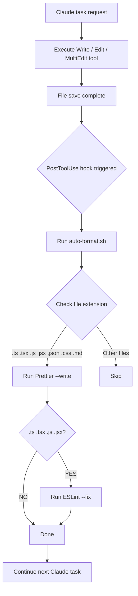

# Auto Format Hook (auto-format)

## Core Concepts / How It Works

The `PostToolUse` hook runs **immediately after** Claude uses a specific tool. When file-modifying tools such as `Write`, `Edit`, or `MultiEdit` complete, the hook is triggered and the specified command is automatically executed.



Exit code behavior:
- `0`: Success, Claude task continues
- `1`: Error, stderr delivered to Claude (task not interrupted)
- `2`: Task blocked (not used in this hook)

## One-Line Summary

Automatically runs Prettier and ESLint every time Claude modifies a file, keeping code style consistently clean.

## Getting Started

### Step 1: Create the Script File

```bash
mkdir -p scripts
cat > scripts/auto-format.sh << 'EOF'
#!/usr/bin/env bash
# Automatically apply formatting to files modified by Claude
set -e

FILE="$1"
if [ -z "$FILE" ] || [ ! -f "$FILE" ]; then
  exit 0
fi

export PATH="./node_modules/.bin:$PATH"

case "$FILE" in
  *.ts|*.tsx|*.js|*.jsx|*.json|*.css|*.md)
    prettier --write "$FILE" 2>&1 || true
    ;;
  *) exit 0 ;;
esac

case "$FILE" in
  *.ts|*.tsx|*.js|*.jsx)
    eslint --fix "$FILE" 2>&1 || true
    ;;
esac

exit 0
EOF
chmod +x scripts/auto-format.sh
```

### Step 2: Configure `.claude/settings.json`

```json
{
  "hooks": {
    "PostToolUse": [
      {
        "matcher": "Write|Edit|MultiEdit",
        "hooks": [
          {
            "type": "command",
            "command": "bash scripts/auto-format.sh \"$CLAUDE_TOOL_INPUT_PATH\""
          }
        ]
      }
    ]
  }
}
```

### Step 3: Verify Behavior

When you ask Claude to modify a file, Prettier + ESLint will run automatically.

## Practical Example

**Scenario**: Eliminating the inconvenience of having to manually run `pnpm format` after every component Claude generates for the Next.js 15 "Student Club Notice Board" project.

```
Request to Claude:
"Create a notice list component for the Student Club Notice Board.
File: components/notices/NoticeList.tsx"
```

The moment Claude saves the file → `auto-format.sh` runs automatically → Prettier + ESLint applied. The developer no longer needs to manually run `pnpm format`.

```bash
# Path setup for pnpm workspace monorepo
# Add to the top of scripts/auto-format.sh:
export PATH="./node_modules/.bin:$PATH"
```

## Learning Points / Common Pitfalls

- **File path injection method**: In a `PostToolUse` hook, the modified file path is passed via the `CLAUDE_TOOL_INPUT_PATH` environment variable. Always verify the environment variable list in the official documentation.
- **No infinite loop concern**: Even if Prettier modifies the file, `PostToolUse` is not triggered again. Hooks only respond to Claude tool executions.
- **Beware of slow formatters**: ESLint `--fix` can take several seconds on large files. If it's slow, restrict to `Write` only or add a condition to exclude large files.
- **Windows Git Bash environment**: Path separator `\` issues can occur. Add slash conversion handling to the `FILE` variable.

## Related Resources

- [Block Dangerous Commands (block-dangerous)](/en/hooks/block-dangerous) — Hook to block destructive commands
- [Auto Test (auto-test)](/en/hooks/auto-test) — Hook to automatically run tests
- [Completion Notification (notify-complete)](/en/hooks/notify-complete) — Desktop notification when a task completes
- [Full Hooks Recipe List](/en/hooks/) — All Hooks recipes

---

| Field | Value |
|---|---|
| Source URL | https://docs.anthropic.com/en/docs/claude-code/hooks |
| Author / Source | Anthropic |
| License | CC BY 4.0 |
| Translation Date | 2026-04-12 |
