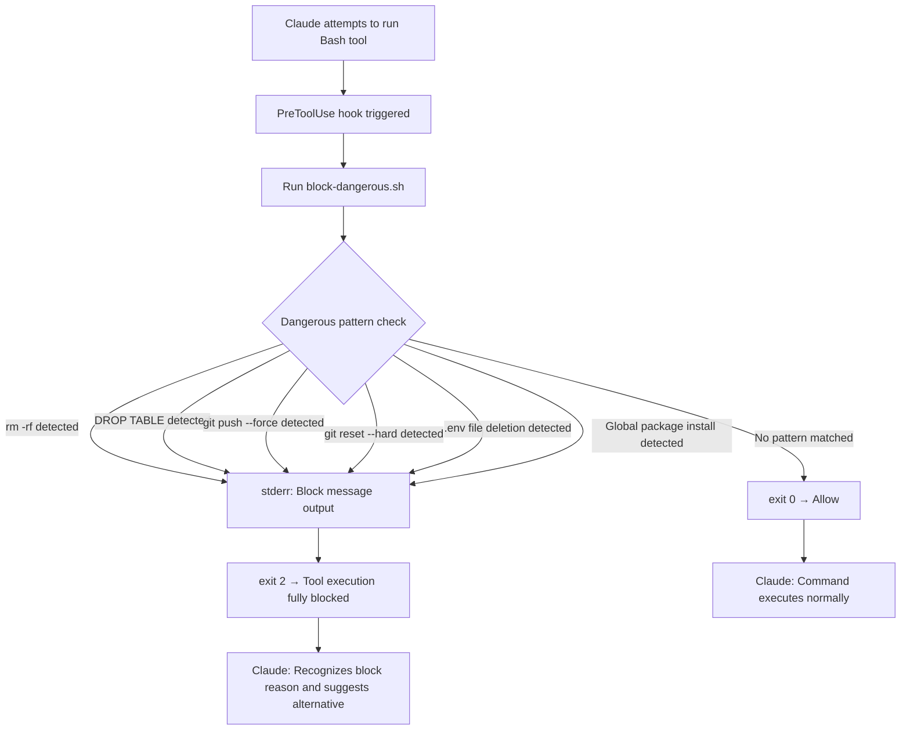

# Block Dangerous Commands Hook (block-dangerous)

## Core Concepts / How It Works

The `PreToolUse` hook is triggered **immediately before** Claude executes a tool. When the hook exits with `exit code 2`, Claude **completely refuses** to execute that tool and delivers the message printed to stderr to the user.



`exit code` meanings:
- `0`: Allow — continue tool execution
- `2`: Block — stop tool execution and deliver the rejection reason to Claude
- `1`: Error — indicates the hook itself encountered an error (execution may continue)

## One-Line Summary

Uses a `PreToolUse` hook to proactively block destructive commands such as `rm -rf`, `DROP TABLE`, and `git push --force` before Claude executes them.

## Getting Started

**Scenario**: Preventing Claude from accidentally deleting data or force-pushing in the Next.js 15 "Student Club Notice Board" project

### `.claude/settings.json` Configuration

```json
{
  "hooks": {
    "PreToolUse": [
      {
        "matcher": "Bash",
        "hooks": [
          {
            "type": "command",
            "command": "bash /workspace/scripts/block-dangerous.sh"
          }
        ]
      }
    ]
  }
}
```

### `scripts/block-dangerous.sh` Script

```bash
#!/usr/bin/env bash
# PreToolUse hook: block dangerous Bash commands before execution
# The command Claude is about to run is passed via the CLAUDE_TOOL_INPUT_COMMAND env var

COMMAND="${CLAUDE_TOOL_INPUT_COMMAND:-}"

# Allow if no command provided
if [ -z "$COMMAND" ]; then
  exit 0
fi

# ─────────────────────────────────────────────
# Dangerous pattern list
# ─────────────────────────────────────────────

# 1. Filesystem destruction
if echo "$COMMAND" | grep -qE 'rm\s+-[a-z]*r[a-z]*f|rm\s+-[a-z]*f[a-z]*r'; then
  echo "[block-dangerous] Denied: 'rm -rf' command is not allowed." >&2
  echo "[block-dangerous] Alternative: Specify files to delete explicitly or move to trash." >&2
  exit 2
fi

# 2. Database table deletion
if echo "$COMMAND" | grep -qiE 'DROP\s+TABLE|DROP\s+DATABASE|TRUNCATE\s+TABLE'; then
  echo "[block-dangerous] Denied: SQL DROP/TRUNCATE commands are not allowed." >&2
  echo "[block-dangerous] Alternative: Manage schema changes through migration files." >&2
  exit 2
fi

# 3. Git force push
if echo "$COMMAND" | grep -qE 'git\s+push.*(--force|-f)'; then
  echo "[block-dangerous] Denied: 'git push --force' is not allowed." >&2
  echo "[block-dangerous] Alternative: Use 'git push --force-with-lease' or consult an admin." >&2
  exit 2
fi

# 4. Git history destruction
if echo "$COMMAND" | grep -qE 'git\s+reset\s+--hard|git\s+clean\s+-[a-z]*f'; then
  echo "[block-dangerous] Denied: 'git reset --hard' or 'git clean -f' is not allowed." >&2
  echo "[block-dangerous] Alternative: Stash your changes or ask the user for confirmation." >&2
  exit 2
fi

# 5. Deleting or overwriting environment variable files
if echo "$COMMAND" | grep -qE '(rm|>|truncate)\s+.*\.env'; then
  echo "[block-dangerous] Denied: Deleting or overwriting .env files is not allowed." >&2
  echo "[block-dangerous] Alternative: Modify .env.example or add new variables to .env.local." >&2
  exit 2
fi

# 6. Modifying system-wide global packages
if echo "$COMMAND" | grep -qE 'npm\s+install\s+-g|pnpm\s+add\s+-g|yarn\s+global'; then
  echo "[block-dangerous] Warning: Installing global packages is discouraged." >&2
  echo "[block-dangerous] Alternative: Add as a project local dependency: pnpm add -D [package]" >&2
  exit 2
fi

# All checks passed → allow
exit 0
```

## Practical Example

### Real Block Scenarios

**Scenario 1 — Accidental attempt to delete everything**

When Claude attempts to run:
```bash
rm -rf ./node_modules ./dist
```

The hook triggers and blocks it:
```
[block-dangerous] Denied: 'rm -rf' command is not allowed.
[block-dangerous] Alternative: Specify files to delete explicitly or move to trash.
```

Claude receives the block message and suggests an alternative:
```
rm -rf was blocked. To safely clean node_modules, you can use:
pnpm store prune  or  npx rimraf node_modules
```

**Scenario 2 — Force push blocked**
```bash
git push origin main --force
# → [block-dangerous] Denied: 'git push --force' is not allowed.
```

**Scenario 3 — DB deletion blocked**
```bash
psql -c "DROP TABLE notices;"
# → [block-dangerous] Denied: SQL DROP/TRUNCATE commands are not allowed.
```

## Learning Points / Common Pitfalls

- **Understand exit codes clearly**: exit 0 (allow), exit 1 (error), exit 2 (block) — these three must be clearly distinguished. Only exit 2 fully prevents tool execution.
- **Watch for false positives**: Commands like `rm -rf node_modules` that you actually want to allow may be blocked. Don't make patterns too broad — maintain an allowlist alongside them if needed.
- **`CLAUDE_TOOL_INPUT_COMMAND` environment variable**: The entire command string that Claude intends to run via the Bash tool is stored in this variable. Check the official documentation for the environment variables injected per hook type.
- **Limits of pipeline command detection**: Obfuscated forms like splitting `rm -rf /` into `rm -r/ -f` or using variable substitution can evade detection. Treat this as a "mistake prevention" safety net, not a perfect security tool.
- **Team-wide configuration**: Committing `.claude/settings.json` to git applies the same safety net to all team members.

## Related Resources

- [Auto Format Hook](/en/hooks/auto-format) — A PostToolUse hook recipe that automatically formats code after file saves.
- [Work Log Hook](/en/hooks/work-log) — Records all of Claude's tool usage history, including blocked commands.
- [supabase-mcp](/en/mcp/supabase-mcp) — The DROP TABLE blocking hook becomes even more important when used together with Supabase MCP.

---

| Field | Value |
|---|---|
| Source URL | https://docs.anthropic.com/en/docs/claude-code/hooks |
| License | CC BY 4.0 |
| Translation Date | 2026-04-12 |
| Author | Claude-Code-Study Project |
