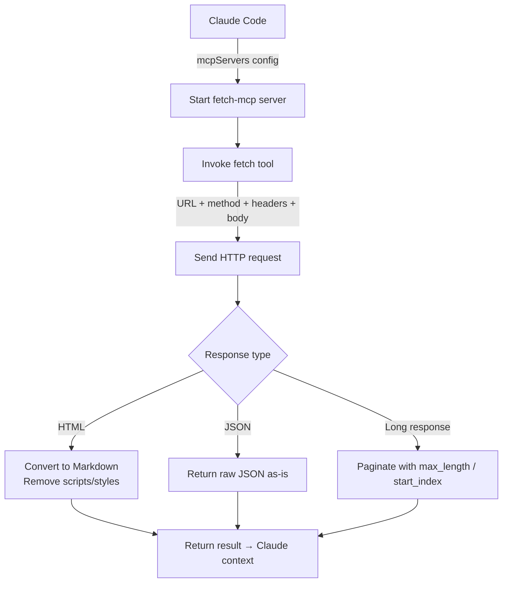

# fetch-mcp

## Core Concepts / How It Works

`fetch-mcp` is a tool that executes HTTP/HTTPS requests and delivers the responses to Claude. HTML responses are automatically converted to Markdown so that Claude can understand the content more effectively.



### Available Tools

| Tool | Description |
|---|---|
| `fetch` | Executes an HTTP GET request to a URL and returns the response |

### fetch Tool Parameters

| Parameter | Type | Description |
|---|---|---|
| `url` | string (required) | The URL to request |
| `method` | string | HTTP method (default: GET) |
| `headers` | object | Request header key-value pairs |
| `body` | string | Request body (for POST/PUT, etc.) |
| `max_length` | number | Maximum response length (default: 5000 characters) |
| `start_index` | number | Response start position (for pagination) |
| `raw` | boolean | Return raw HTML without Markdown conversion |

### Processing Behavior

- **HTML responses**: Converted to Markdown by default (script/style tags removed)
- **JSON responses**: Returned as raw JSON
- **Long responses**: Can be paginated using `max_length` and `start_index`
- **Authenticated APIs**: Authorization headers can be included in `headers`

## One-Line Summary

An MCP server that lets Claude directly execute HTTP requests during a conversation, enabling calls to public APIs and retrieval of web documents.

## Getting Started

### Prerequisites

- Node.js 18+
- Internet connection

### Claude Code `.claude/settings.json` Configuration

```json
{
  "mcpServers": {
    "fetch": {
      "command": "npx",
      "args": ["-y", "@modelcontextprotocol/server-fetch"]
    }
  }
}
```

### Claude Desktop `claude_desktop_config.json` Configuration

```json
{
  "mcpServers": {
    "fetch": {
      "command": "npx",
      "args": ["-y", "@modelcontextprotocol/server-fetch"]
    }
  }
}
```

No extra environment variables or additional configuration are required. For APIs that require authentication, you must specify the headers in your prompt at request time.

## Practical Example

**Scenario**: You are developing a Next.js 15 "Student Club Notice Board" project and need to integrate an external API or refer to the latest library documentation.

**Example 1: Testing a Public API**

```
Use fetch to verify that the following endpoint responds correctly:
https://jsonplaceholder.typicode.com/posts/1

Analyze the response structure and write code to call this API
from a Next.js App Router server component.
```

**Example 2: Real-Time Reference to Library Docs**

```
Fetch the official Supabase Row Level Security documentation and read it:
https://supabase.com/docs/guides/database/row-level-security

Then write the appropriate RLS policy SQL for the notices table
in our Student Club Notice Board:
- Only logged-in users can read
- Only admin role can write
```

**Example 3: Calling the GitHub API Directly (No Token, Public Info)**

```
Use fetch to call the following GitHub API and retrieve
the latest release information for the modelcontextprotocol/servers repo:
https://api.github.com/repos/modelcontextprotocol/servers/releases/latest
```

**Example 4: Paginating a Long Document**

```
Fetch this document and summarize the App Router routing rules:
https://nextjs.org/docs/app/building-your-application/routing
If the content is long, increase start_index to retrieve it in chunks.
```

**Example 5: Testing an API via POST Request**

```
Test the notice creation API on our local dev server:
URL: http://localhost:3000/api/notices
Method: POST
Headers: Content-Type: application/json
Body: {"title": "Test Notice", "content": "Content"}

Check the response code and body, and let me know if there are any issues.
```

## Learning Points / Common Pitfalls

### Effective Usage Tips

- **Connect docs to code**: Fetch official documentation with `fetch` and immediately ask "write code based on this document" to get code that accurately reflects the latest API.
- **Use the default `raw: false`**: HTML pages are converted to Markdown by default, making structured documents easier to understand.
- **Test local servers**: You can test your development API at `http://localhost:3000` directly, enabling fast verification without Postman.

### Common Pitfalls

- **Cannot access authenticated URLs**: Admin pages that require login or private APIs generally cannot be fetched. Cookie-based authentication is not supported.
- **Not a CORS bypass**: Since this is a server-side request rather than a browser request, CORS is not relevant — but IP blocking or User-Agent filtering may apply.
- **Dynamically rendered pages**: Pages rendered by JavaScript (e.g., React SPAs) will only return empty HTML. Meaningful content can only be retrieved from SSR/SSG pages.
- **Watch out for Rate Limits**: Repeatedly calling an external API may trigger rate limits. Since fetched data persists in the conversation context, minimize repeated calls.
- **Response length limit**: The default `max_length` is 5000 characters, so long documents may be truncated. Use `start_index` to read them sequentially.

### Security Considerations

- This MCP allows Claude to execute arbitrary HTTP requests. It can also access internal network addresses (`192.168.x.x`, `10.x.x.x`, `localhost`), so use caution when combining untrusted prompt inputs with this MCP.
- If you enter API keys directly in the prompt, they will remain in the conversation history. Use environment variables or a separate secrets management approach for sensitive keys.

## Related Resources

- [github-mcp](/en/mcp/github-mcp) — Use github-mcp instead of fetch-mcp when you need to interact with the GitHub API with authentication.
- [filesystem-mcp](/en/mcp/filesystem-mcp) — Combine with filesystem-mcp to save data fetched by fetch to local files.
- [sequential-thinking](/en/mcp/sequential-thinking) — Effective when combined with sequential-thinking MCP to analyze complex API responses step by step.

---

| Field | Value |
|---|---|
| Source URL | https://github.com/modelcontextprotocol/servers/tree/main/src/fetch |
| License | MIT |
| Translation Date | 2026-04-12 |
| Author | Claude-Code-Study Project |
