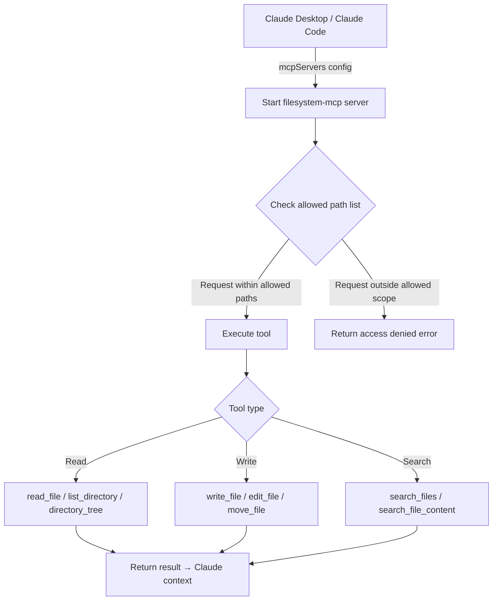

# filesystem-mcp

## Core Concepts / How It Works

`filesystem-mcp` requires you to specify allowed directory paths in the configuration, and only permits file operations within those boundaries. It uses a safe sandbox approach that prevents path traversal attacks.



### Available Tools

| Tool | Description |
|---|---|
| `read_file` | Read the full contents of a single file |
| `read_multiple_files` | Read multiple files at once |
| `write_file` | Create or overwrite a file |
| `edit_file` | Edit only a specific part of an existing file (search & replace) |
| `create_directory` | Create a directory |
| `list_directory` | List files and folders inside a directory |
| `directory_tree` | Output directory structure in tree format |
| `move_file` | Move or rename a file |
| `search_files` | Search for files by filename pattern |
| `search_file_content` | Search file contents with a regular expression |
| `get_file_info` | Retrieve file metadata (size, date, etc.) |
| `list_allowed_directories` | Check the currently allowed directory list |

### Security Model

- Only paths specified in the configuration file are accessible
- Access outside the allowed scope via symbolic links is blocked
- Relative path (`../`) escape attempts are blocked

## One-Line Summary

An MCP server that allows reading and writing files limited to specified local directories, enabling Claude Desktop to handle project files safely.

## Getting Started

### Prerequisites

- Node.js 18+
- Local directory paths to allow access to

### Claude Code `.claude/settings.json` Configuration

```json
{
  "mcpServers": {
    "filesystem": {
      "command": "npx",
      "args": [
        "-y",
        "@modelcontextprotocol/server-filesystem",
        "/Users/username/projects",
        "/Users/username/Documents"
      ]
    }
  }
}
```

### Windows Path Example

```json
{
  "mcpServers": {
    "filesystem": {
      "command": "npx",
      "args": [
        "-y",
        "@modelcontextprotocol/server-filesystem",
        "C:\\Users\\kik32\\workspace\\club-notice-board",
        "C:\\Users\\kik32\\Documents\\notes"
      ]
    }
  }
}
```

### Claude Desktop `claude_desktop_config.json` Configuration (macOS example)

```json
{
  "mcpServers": {
    "filesystem": {
      "command": "npx",
      "args": [
        "-y",
        "@modelcontextprotocol/server-filesystem",
        "/Users/username/workspace/club-notice-board"
      ]
    }
  }
}
```

**Key point**: Items in the `args` array after the package name are the allowed paths. Multiple paths can be listed in sequence.

## Practical Example

**Scenario**: You want to analyze and modify a Next.js 15 "Student Club Notice Board" project from Claude Desktop. You are using Claude Desktop instead of the Claude Code CLI.

**Example 1: Understanding Project Structure**

```
Show me the full directory tree of the club-notice-board project.
Then read all page.tsx files under the app/ folder
and summarize the routing structure.
```

**Example 2: Bulk Analysis of Multiple Files**

```
Read the following files all at once and compare how the Supabase client
is initialized differently in server vs client components:
- lib/supabase/server.ts
- lib/supabase/client.ts
- middleware.ts
```

**Example 3: Searching File Contents**

```
Find all files in the entire project that use the "createServerClient"
function and list them.
```

**Example 4: Modifying a Configuration File**

```
Read tailwind.config.ts and change
darkMode to the 'class' mode.
Show the before/after diff as well.
```

## Learning Points / Common Pitfalls

### Effective Usage Tips

- **Principle of least privilege**: Restrict allowed paths to the project root. Allowing the entire home directory (`/Users/username`) is risky.
- **Separate read-only operations**: When you only need to analyze files, craft prompts that use only `read_file` and `list_directory` to prevent accidental file modifications.
- **Run `directory_tree` first**: When working with a large project, guide Claude to use `directory_tree` first to understand the structure before reading only the necessary files.

### Common Pitfalls

- **Avoid redundant use with Claude Code**: If you are using the Claude Code CLI, file access capabilities are already built in. You only need this MCP when working in parallel with Claude Desktop.
- **Beware of large files**: Reading tens of thousands of lines via `read_file` can fill up the context window. It is recommended to use `search_file_content` to locate only the relevant sections.
- **`write_file` overwrites silently**: `write_file` overwrites existing files without warning. Always back up or run a git commit before modifying important files.
- **Windows path separators**: On Windows, paths must use `\\` or `/`. Inside JSON, use `\\` for escaping.

### Security Considerations

- Keep allowed paths as narrow as possible. Never include directories that contain sensitive information (`.env`, SSH keys, certificates).
- If Claude has `write_file` permission, it may accidentally overwrite configuration files. Consider running paths containing critical files in read-only mode.
- Do not commit the configuration file with allowed paths to a team project — everyone has different local paths.

## Related Resources

- [github-mcp](/en/mcp/github-mcp) — Use in combination when pushing local file changes (filesystem-mcp) to GitHub or creating PRs.
- [fetch-mcp](/en/mcp/fetch-mcp) — Use together in workflows where external documentation is fetched and reflected in local files.
- [Auto Format Hook](/en/hooks/auto-format) — A Hooks recipe that automatically applies code formatting after a file is saved.

---

| Field | Value |
|---|---|
| Source URL | https://github.com/modelcontextprotocol/servers/tree/main/src/filesystem |
| License | MIT |
| Translation Date | 2026-04-12 |
| Author | Claude-Code-Study Project |
