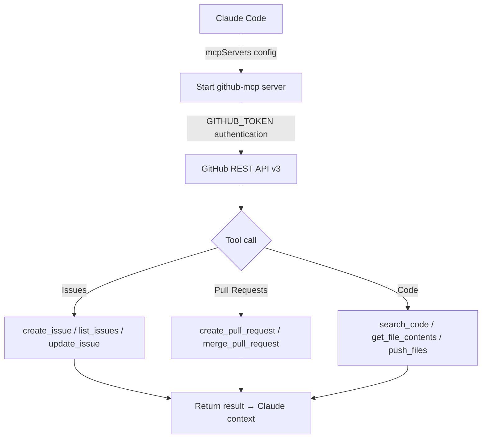

# github-mcp

## Core Concepts / How It Works

The `github-mcp` server is an MCP server that wraps the GitHub REST API v3, allowing Claude to directly manage GitHub issues, PRs, and code during a conversation.



### Available Tools

| Tool | Description |
|---|---|
| `create_or_update_file` | Create or modify a file in a repository |
| `search_repositories` | Search GitHub repositories |
| `create_repository` | Create a new repository |
| `get_file_contents` | Retrieve file or directory contents |
| `push_files` | Commit multiple files at once |
| `create_issue` | Create an issue |
| `create_pull_request` | Create a pull request |
| `fork_repository` | Fork a repository |
| `create_branch` | Create a branch |
| `list_commits` | List commits |
| `list_issues` | List issues |
| `update_issue` | Update an issue |
| `add_issue_comment` | Add a comment to an issue |
| `list_pull_requests` | List pull requests |
| `get_pull_request` | Retrieve pull request details |
| `merge_pull_request` | Merge a pull request |
| `search_code` | Search code |
| `search_issues` | Search issues/PRs |
| `get_issue` | Retrieve issue details |

### Authentication

Set your GitHub Personal Access Token (PAT) as the `GITHUB_TOKEN` environment variable. The `public_repo` scope is sufficient for read-only operations, while `repo` scope is required for creating issues, merging PRs, and other write actions.

## One-Line Summary

An MCP server that lets Claude directly call the GitHub API, enabling issue creation, PR review, and code search during a conversation.

## Getting Started

### Prerequisites

- Node.js 18+
- GitHub Personal Access Token ([GitHub Settings > Developer settings > Personal access tokens](https://github.com/settings/tokens))

### Claude Code `.claude/settings.json` Configuration

```json
{
  "mcpServers": {
    "github": {
      "command": "npx",
      "args": ["-y", "@modelcontextprotocol/server-github"],
      "env": {
        "GITHUB_TOKEN": "ghp_enter_your_token_here"
      }
    }
  }
}
```

### Claude Desktop `claude_desktop_config.json` Configuration

```json
{
  "mcpServers": {
    "github": {
      "command": "npx",
      "args": ["-y", "@modelcontextprotocol/server-github"],
      "env": {
        "GITHUB_TOKEN": "ghp_enter_your_token_here"
      }
    }
  }
}
```

**Important**: Do not hardcode the `GITHUB_TOKEN` value in the config file. Use environment variables or a secrets management tool whenever possible.

## Practical Example

**Scenario**: You are working on a team project for a Next.js 15 "Student Club Notice Board" and want to create GitHub issues and review PRs while chatting with Claude.

**Example 1: Creating a Bug Issue**

```
I found a bug where pagination doesn't work in the notice list API.
Please create a GitHub issue for it.

Repo: mygithub05253/club-notice-board
Title: [Bug] Notice list pagination not working
Body: Page 2 and above requests always return the first page results.
Include sections for reproduction steps, expected behavior, and actual behavior.
```

**Example 2: PR Code Review**

```
Fetch the contents of PR #42 and review the code.
In particular, check if there are any security issues related to Supabase RLS policies.
```

**Example 3: Searching Similar Repo Code**

```
Search GitHub for public repos implementing Next.js App Router + Supabase Auth
and compare 3 session handling patterns found in middleware.ts files.
```

**Example 4: Listing Issues and Prioritizing**

```
Fetch the list of open issues in mygithub05253/club-notice-board,
classify them by bug/feature/improvement labels, and sort them by priority.
```

## Learning Points / Common Pitfalls

### Effective Usage Tips

- **Use issue templates**: When creating issues, asking "write this as a bug report template" will prompt Claude to produce structured, well-formatted issues.
- **Combine code search with analysis**: You can fetch relevant code using `search_code` and immediately request analysis.
- **Automate branching workflows**: You can handle the full flow — `create_branch` → code changes → `push_files` → `create_pull_request` — within a single conversation.

### Common Pitfalls

- **Insufficient token scope**: Attempting write operations on a private repo without the `repo` scope will result in a 403 error. Verify the required scopes in advance.
- **Rate limit exceeded**: Code search has strict API rate limits. Bulk searches may trigger 429 errors.
- **Be careful with PR merges**: The `merge_pull_request` tool actually performs the merge. Claude will only execute it when explicitly requested, but extra caution is needed in team projects.

### Security Considerations

- The `GITHUB_TOKEN` carries strong permissions. Never hardcode it in configuration files or commit it to git.
- It is recommended to use Fine-grained Personal Access Tokens to grant minimum required permissions on a per-repository basis.
- Where possible, use a separate, restricted token for read-only operations.
- Add `.claude/settings.json` to `.gitignore`, or separate the token into an environment variable.

## Related Resources

- [filesystem-mcp](/en/mcp/filesystem-mcp) — An MCP for directly manipulating local files from Claude. Useful to combine before and after GitHub code changes.
- [fetch-mcp](/en/mcp/fetch-mcp) — Can be used as an alternative to retrieve only public GitHub information without a token.
- [supabase-mcp](/en/mcp/supabase-mcp) — Code changes (github-mcp) and DB migrations (supabase-mcp) can be linked in a single workflow.

---

| Field | Value |
|---|---|
| Source URL | https://github.com/modelcontextprotocol/servers/tree/main/src/github |
| License | MIT |
| Translation Date | 2026-04-12 |
| Author | Claude-Code-Study Project |
