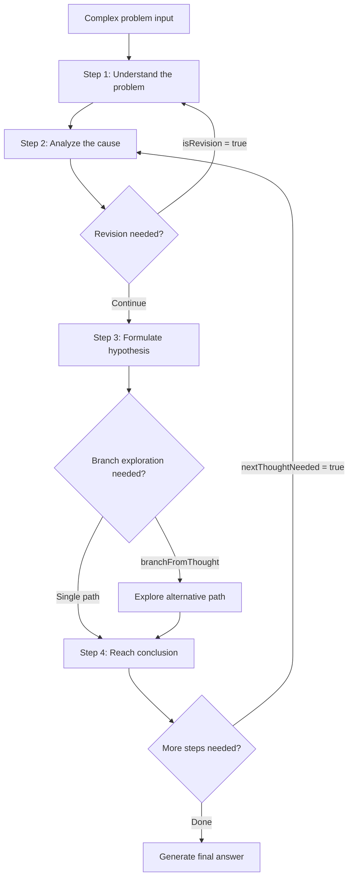

# sequential-thinking

## Core Concepts / How It Works

The `sequential-thinking` MCP server provides a single `sequentialthinking` tool. It forces Claude to explicitly declare **thinking steps (thoughts)** before generating a response and to proceed through them in order.



Each thinking step consists of the following fields:

| Field | Description |
|---|---|
| `thought` | Reasoning content for the current step |
| `thoughtNumber` | Current step number |
| `totalThoughts` | Estimated total number of steps (dynamically adjustable) |
| `nextThoughtNeeded` | Whether another step is needed |
| `isRevision` | Whether this step revises a previous step |
| `branchFromThought` | Step number from which branching begins |

Key characteristics:
- **Dynamic step count adjustment**: `totalThoughts` can be increased if the problem turns out to be more complex than expected
- **Backward revision**: Can go back and correct earlier steps if reasoning was wrong
- **Branch exploration**: Compare multiple approaches in parallel
- **Minimum 3 steps recommended**: For simple questions, this adds unnecessary overhead

## One-Line Summary

An MCP server that breaks down complex problems into sequential thought blocks, improving Claude's reasoning accuracy and transparency.

## Getting Started

### `.claude/settings.json` Configuration

```json
{
  "mcpServers": {
    "sequential-thinking": {
      "command": "npx",
      "args": ["-y", "@modelcontextprotocol/server-sequential-thinking"]
    }
  }
}
```

### Verifying Installation

```bash
# After configuring, restart Claude Code and verify the tool is active
# Ask Claude the following:
# "Can you use the sequential thinking tool?"
```

### Claude Desktop (`claude_desktop_config.json`) Configuration

```json
{
  "mcpServers": {
    "sequential-thinking": {
      "command": "npx",
      "args": ["-y", "@modelcontextprotocol/server-sequential-thinking"]
    }
  }
}
```

Prerequisites: Node.js 18+, npx available in the environment.

## Practical Example

**Scenario**: An intermittent 403 error has occurred in the notice creation API of the Next.js 15 "Student Club Notice Board".

```text
Use /mcp sequential-thinking to analyze the following bug step by step:

- Next.js 15 App Router, using Supabase Auth
- Intermittent 403 on POST /api/notices
- Error log: "Row Level Security policy violation"
- Reproduction condition: mainly occurs when posting a notice immediately after login
```

Claude's sequential thinking flow:

```
Step 1: Analyze 403 error conditions
 → RLS policy violation + "immediately after login" = suspected timing issue

Step 2: Trace Supabase Auth token passing route
 → Client → API Route → Supabase client order check
 → Timing issue when supabaseServerClient() reads cookie/header?

Step 3: App Router characteristics and session synchronization
 → Session may not have propagated yet after middleware refresh

Step 4: Root cause conclusion (isRevision = false)
 → Route Handler creates Supabase client with old cookie before middleware session refresh completes
 → Fix: After session refresh in middleware, include new token in response headers
```

## Learning Points / Common Pitfalls

- **Apply complexity threshold**: The effect is most pronounced for problems with 3 or more intertwined conditions. For simple questions, responses will actually be slower.
- **Provide step count hints**: Giving hints like "analyze this in 5 steps" helps Claude set an appropriate `totalThoughts`.
- **Leverage the revision feature**: When a middle step revises a prior step, that point is the key logical branching decision.
- **Avoid excessive step counts**: Setting more than 10 steps causes a sharp increase in token consumption. 5–7 steps is generally the recommended upper limit.
- **Don't ignore the process by looking only at results**: The real value of this MCP lies in the intermediate reasoning steps.
- **No security risks**: This is a pure reasoning structuring tool that does not access the external network or file system.

## Related Resources

- [investigate (skill)](/skills/investigate) — A similar 4-step root cause analysis skill
- [systematic-debugging (skill)](/skills/systematic-debugging) — A debugging decision-making framework
- [GitHub MCP](/en/mcp/github-mcp) — MCP for integration
- [Fetch MCP](/en/mcp/fetch-mcp) — Another popular MCP server

---

| Field | Value |
|---|---|
| Source URL | https://github.com/modelcontextprotocol/servers/tree/main/src/sequentialthinking |
| Author / Source | Anthropic (Model Context Protocol) |
| License | MIT |
| Translation Date | 2026-04-12 |
