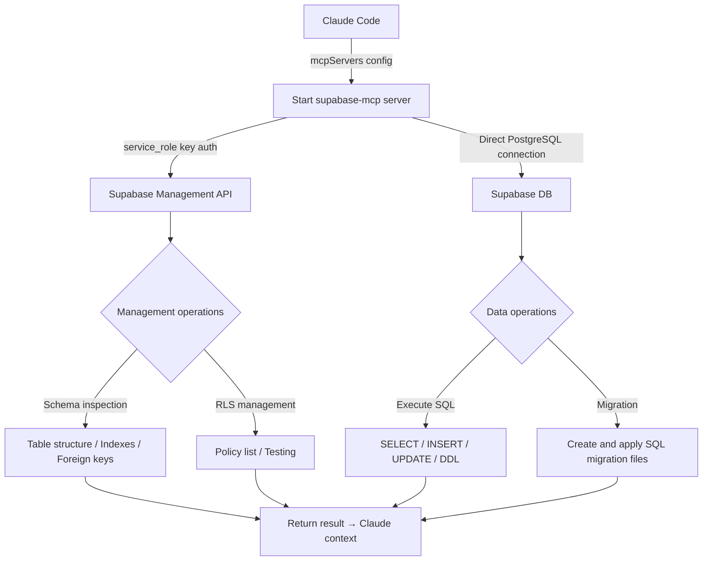

# supabase-mcp

## Core Concepts / How It Works

`supabase-mcp` allows Claude to directly manage a Supabase project database through the Supabase Management API and a direct PostgreSQL connection.



**Note**: Multiple community versions of the Supabase MCP server emerged between 2024 and 2025, and Supabase has also started providing its own official MCP. Check the latest official guide before installing.

Reference links:
- Supabase official MCP: Refer to the [MCP section in the Supabase official documentation](https://supabase.com/docs/guides/getting-started/mcp)
- Community version: https://github.com/supabase-community/supabase-mcp

### Key Features

- **Schema inspection**: View table, column, index, and foreign key structures
- **Execute SQL**: Run SELECT, INSERT, UPDATE, DELETE, and DDL statements directly
- **RLS policy management**: List and test RLS policies
- **Supabase Management API integration**: Manage project settings, Edge Functions, Storage, and more
- **Migration support**: Create and apply SQL file-based migrations

### Authentication

Uses the Supabase `service_role` key. This key has powerful permissions that bypass RLS, so extra care regarding security is required.

## One-Line Summary

An MCP server for managing your Supabase project directly from Claude, handling table inspection, RLS policy checks, and SQL execution during a conversation.

## Getting Started

### Prerequisites

- Node.js 18+
- A Supabase project created
- Supabase `service_role` key (Project Settings > API)
- Supabase project URL

### Claude Code `.claude/settings.json` Configuration

The example below is based on the community version. Check the latest README for the actual package name and configuration method.

```json
{
  "mcpServers": {
    "supabase": {
      "command": "npx",
      "args": ["-y", "@supabase-community/supabase-mcp"],
      "env": {
        "SUPABASE_URL": "https://your-project-ref.supabase.co",
        "SUPABASE_SERVICE_ROLE_KEY": "eyJhbGci..."
      }
    }
  }
}
```

### Official Supabase MCP (as of 2025)

If Supabase provides an official MCP, use the format below. Refer to the [Supabase official documentation](https://supabase.com/docs) for the exact method.

```json
{
  "mcpServers": {
    "supabase": {
      "command": "npx",
      "args": [
        "-y",
        "@supabase/mcp-server-supabase@latest",
        "--access-token",
        "your-personal-access-token"
      ]
    }
  }
}
```

**Important**: Do not hardcode the `service_role` key in the configuration file. Keep it in an environment variable or add `.claude/settings.json` to `.gitignore`.

## Practical Example

**Scenario**: The Next.js 15 "Student Club Notice Board" project uses Supabase as its database. The following schema is in place:
- `profiles` table: User profiles
- `notices` table: Notices
- `comments` table: Comments

**Example 1: Inspecting the Schema**

```
Show me the structure of all tables in the Supabase project.
In particular, explain the columns, types, and constraints
of the notices table in detail.
```

**Example 2: Validating RLS Policies**

```
Show me the list of RLS policies set on the notices table.
Then execute SQL with regular user permissions to query notices
and confirm that RLS is working correctly.
```

**Example 3: Writing and Applying a Migration**

```
Write a migration SQL to add an is_pinned column
(boolean, default false) to the notices table and apply it.
Verify that the table structure has changed after applying.
```

**Example 4: Data Analysis**

```
From the notices table over the last 30 days, query the following using SQL:
1. Top 5 users who created the most notices
2. Top 5 notices with the most comments
```

**Example 5: Diagnosing Performance Issues**

```
Show me the current index status of the notices table.
If an appropriate index for the "fetch latest notices by author" query
is missing, add one.
```

## Learning Points / Common Pitfalls

### Effective Usage Tips

- **Inspect schema first**: Starting a conversation with "show me all current table structures" provides Claude with schema context, which improves the quality of all subsequent SQL generation.
- **Use transactions**: When modifying multiple tables simultaneously, use transactions to maintain consistency.
- **Separate dev and production**: Keep development and production Supabase projects separate, and connect only the development project to the MCP.

### Common Pitfalls

- **Exposing the service_role key**: This key completely bypasses RLS. Manage it separately even in `.env` files, and never commit it to git.
- **Connecting directly to production DB**: Claude may accidentally delete data or alter the schema. Only use this in development/staging environments, and connect to production in read-only mode.
- **Version conflicts**: The community version and the official version have different configuration methods. Always consult the latest documentation for whichever version you are using.
- **SQL Injection risk**: Do not pass raw user input directly into prompts to generate SQL. Get into the habit of reviewing SQL generated by Claude before executing it.

### Security Considerations

- The `service_role` key has permissions roughly equivalent to a database administrator. If this key is exposed, all your data is at risk.
- In production environments, avoid direct manipulation via MCP at all costs. Manage changes through migration files and a CI/CD pipeline.
- It is recommended to monitor for unusual access in your Supabase project using "Database Webhooks" or the "Realtime" feature.

## Related Resources

- [github-mcp](/en/mcp/github-mcp) — You can combine workflows where migration SQL files are written (supabase-mcp) and submitted as a PR on GitHub (github-mcp).
- [fetch-mcp](/en/mcp/fetch-mcp) — You can directly call the Supabase REST API via fetch-mcp to verify RLS behavior from an external perspective.
- [Block Dangerous Commands Hook](/en/hooks/block-dangerous) — Use together as a safety net to proactively block dangerous SQL like `DROP TABLE` that Claude might attempt.

---

| Field | Value |
|---|---|
| Source URL | https://github.com/supabase-community/supabase-mcp |
| License | MIT |
| Translation Date | 2026-04-12 |
| Author | Claude-Code-Study Project |
