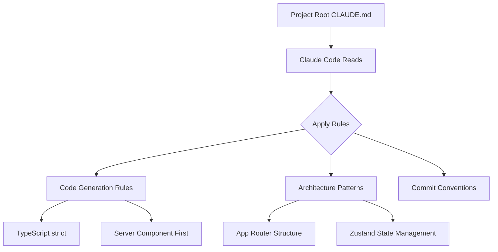

# CLAUDE.md Template for Next.js 15 Projects

## Core Concepts / How It Works



CLAUDE.md is a configuration file placed at the project root that defines the rules Claude Code must follow when working on a given project. This template is optimized for Next.js 15 App Router-based projects.

## One-Line Summary

A ready-to-use CLAUDE.md template for Next.js 15 + TypeScript + Tailwind CSS projects that guides Claude Code to correctly apply App Router patterns, Server Component-first principles, and shadcn/ui components.

## Getting Started

Create a `CLAUDE.md` file at the project root and paste in the template below:

```bash
# Run from the project root
touch CLAUDE.md
```

```markdown
# [Project Name] CLAUDE.md

## Language & Code Style
- All comments and commit messages: **Korean** (or your preferred language)
- TypeScript strict mode, no `any`
- 2-space indentation
- Variables/functions: camelCase, components: PascalCase, constants: UPPER_SNAKE_CASE

## Framework Rules
- **Next.js 15 App Router** (no pages/ router)
- **Server Component first**: `"use client"` directive only when strictly necessary
- **Tailwind CSS** + shadcn/ui components preferred
- **Zustand**: client-side global state only (server state via React Query or Server Action)

## Directory Structure
\`\`\`
src/
  app/          # Next.js App Router pages
  components/
    ui/         # shadcn/ui components (minimize modifications)
    features/   # Feature-specific components
  lib/          # Utilities, helpers
  store/        # Zustand stores
  types/        # TypeScript type definitions
  actions/      # Server Actions
\`\`\`

## Commit Conventions
- feat: new feature
- fix: bug fix
- docs: documentation change
- refactor: refactoring

## Prohibited
- `any` type
- `pages/` router usage
- Bypassing Server Action without direct fetch
- Leftover console.log (after development is complete)
```

## Practical Example

Applying to a Student Club Notice Board project (Next.js 15 + Supabase):

```markdown
# Student Club Notice Board CLAUDE.md

## Stack
- Next.js 15 App Router + TypeScript strict
- Supabase (DB + Auth + Storage)
- Tailwind CSS + shadcn/ui
- Zustand (client state)
- React Hook Form + Zod (form validation)

## Notes
- Auth: Supabase Auth (including social login)
- Image upload: Supabase Storage → Next.js Image component
- Real-time notifications: Supabase Realtime subscription
- API routes: no /api/ usage, Server Action only

## Folder Structure
src/
  app/
    (auth)/      # Pages that don't require authentication
    (dashboard)/ # Pages after login
  components/
    notices/     # Notice-related components
    auth/        # Auth-related components
```

## Learning Points / Common Pitfalls

**Server Component first mistake**:
```typescript
// ❌ Unnecessarily made into a client component
"use client";
export default function UserName({ name }: { name: string }) {
  return <span>{name}</span>; // No interaction — should be a Server Component!
}

// ✅ Server Component is sufficient
export default function UserName({ name }: { name: string }) {
  return <span>{name}</span>;
}
```

**Common pitfalls**:
- Overusing `"use client"` → increases bundle size
- Missing `revalidatePath` in Server Action → cache not refreshed
- Directly modifying shadcn/ui components → conflicts on updates

## Related Resources

- [Fullstack MCP Settings Combination](/en/my-collection/mcp-settings-fullstack.md)
- [Spring Boot Project CLAUDE.md](/en/my-collection/custom-claude-md-spring.md)
- [Integrated Setup Prompt](/en/prompts/integrated-setup.md)
- [Korean Commit Message Hook](/en/my-collection/hook-auto-commit-msg.md)

## Source & Attribution

| Field | Value |
|-------|-------|
| Source URL | https://github.com/mygithub05253/Claude-Code-Study |
| Author | Claude-Code-Study Community |
| License | MIT |
| Translation Date | 2026-04-13 |
| Category | my-collection / custom resources |
