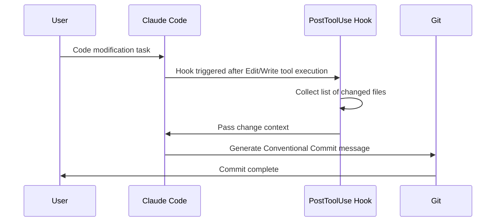

# Auto Commit Message Generation Hook

## Core Concepts / How It Works



A pattern that uses the PostToolUse Hook to automatically generate Conventional Commits-style commit messages after file modifications.

## One-Line Summary

After Edit/Write tool execution, analyzes the changes and automatically generates a commit message in the format `feat: add notice CRUD API`, enforcing the team's commit conventions.

## Getting Started

Add the following Hook configuration to `~/.claude/settings.json`:

```json
{
  "hooks": {
    "PostToolUse": [
      {
        "matcher": "Edit|Write",
        "hooks": [
          {
            "type": "command",
            "command": "node C:/Users/[username]/.claude/hooks/suggest-commit-msg.js"
          }
        ]
      }
    ]
  }
}
```

Create the `~/.claude/hooks/suggest-commit-msg.js` file:

```javascript
#!/usr/bin/env node
/**
 * PostToolUse Hook: Suggests a commit message after file modification
 * Reads tool execution result from stdin and provides context
 */
const readline = require('readline');

const rl = readline.createInterface({ input: process.stdin });
const lines = [];

rl.on('line', (line) => lines.push(line));
rl.on('close', () => {
  const input = lines.join('\n');
  // Extract changed file path (hook delivers as JSON)
  try {
    const data = JSON.parse(input);
    const filePath = data?.tool_input?.file_path || data?.tool_input?.path || '';
    if (filePath) {
      process.stderr.write(
        `[Hook] Changed file: ${filePath}\n` +
        `Commit message example: feat: [feature description]\n` +
        `Please follow Conventional Commits format.\n`
      );
    }
  } catch {
    // Ignore JSON parse failures
  }
  process.exit(0);
});
```

## Practical Example

Auto commit message generation during Student Club Notice Board development:

```
[Scenario]
1. Claude Code modifies NoticeService.java
2. PostToolUse Hook triggered
3. Hook detects changed file: src/main/java/.../NoticeService.java
4. Passes context to Claude Code
5. Generated commit message:
   "feat: implement notice CRUD service layer

   - Add create/read/update/delete methods for notices
   - Apply @Transactional read-only as default
   - Include DTO conversion logic

   Co-Authored-By: Claude Sonnet 4.6 <noreply@anthropic.com>"
```

## Learning Points / Common Pitfalls

**Conventional Commits format**:
```
type(scope): description in your language

feat:     add new feature
fix:      bug fix
docs:     documentation change
refactor: refactoring (no functional change)
test:     add/modify tests
chore:    build/config change
```

**Common pitfalls**:
- Hook scripts need execute permission (Linux/Mac: `chmod +x`)
- On Windows, `node` must be in PATH
- Watch for stdin read timeout (explicitly include `process.exit(0)` for long processing)

## Related Resources

- [Hooks Recipe Hub](/en/hooks/)
- [Hooks Setup Prompt](/en/prompts/setup-hooks.md)
- [Fullstack MCP Settings](/en/my-collection/mcp-settings-fullstack.md)
- [Next.js CLAUDE.md Template](/en/my-collection/custom-claude-md-nextjs.md)

## Source & Attribution

| Field | Value |
|-------|-------|
| Source URL | https://github.com/mygithub05253/Claude-Code-Study |
| Author | Claude-Code-Study Community |
| License | MIT |
| Translation Date | 2026-04-13 |
| Category | my-collection / Hooks recipes |
