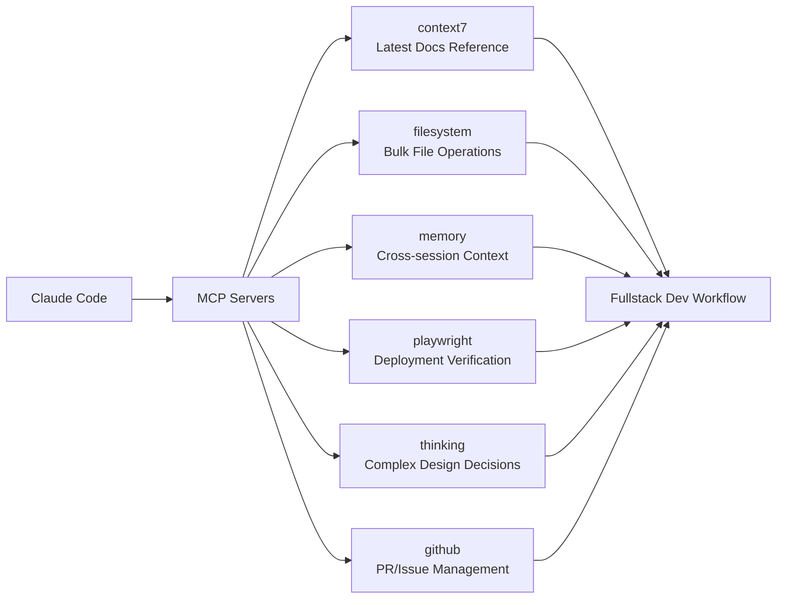

# Fullstack MCP Settings Combination

## Core Concepts / How It Works



A guide to the MCP server combination and configuration for maximizing Claude Code usage in fullstack projects (Next.js 15 frontend + Spring Boot/Node.js backend).

## One-Line Summary

When developing a frontend (Next.js) and backend (Spring Boot/Express) simultaneously, combine context7 + filesystem + memory + playwright + thinking to automate latest doc reference, bulk file operations, cross-session context retention, and visual verification.

## Getting Started

```bash
# Windows environment (cmd /c wrapper required)
claude mcp add context7 -- cmd /c npx -y @upstash/context7-mcp@latest
claude mcp add thinking -- cmd /c npx -y @modelcontextprotocol/server-sequential-thinking
claude mcp add playwright -- cmd /c npx -y @playwright/mcp@latest
claude mcp add filesystem -- cmd /c npx -y @modelcontextprotocol/server-filesystem "C:/Users/[username]/workspace"
claude mcp add memory -- cmd /c npx -y @modelcontextprotocol/server-memory
claude mcp add --transport http github https://api.githubcopilot.com/mcp/

# Verify installation
claude mcp list
```

### Token Management Strategy
```
Default active: context7 + filesystem + memory + thinking
During QA/verification: add playwright
During PR work: add github
→ Keep 5-6 active at a time
```

## Practical Example

**Student Club Notice Board Development Scenario**:

```
Scenario: Next.js 15 frontend + Spring Boot backend fullstack development

1. New feature design (using thinking MCP)
   "Design the notice CRUD API" → step-by-step analysis with Sequential Thinking

2. Latest docs reference (using context7 MCP)
   "use context7" + "Write according to official Next.js 15 Server Actions docs"

3. Bulk file creation (using filesystem MCP)
   Create multiple component/service files simultaneously

4. Post-deployment verification (using playwright MCP)
   "Take a screenshot of the deployed /notices page and verify"

5. PR creation (using github MCP)
   Automatic PR creation after GitHub OAuth authentication
```

## Learning Points / Common Pitfalls

**Context window management**:
- Playwright has 22 tools, ~3,442 tokens → activate only during QA
- context7 uses explicit "use context7" trigger
- memory MCP is useful for saving progress during long translation/analysis tasks

**Common pitfalls**:
- Too many MCP servers active → increased token consumption
- On Windows, calling npx directly without `cmd /c` fails
- GitHub MCP HTTP mode requires OAuth authentication (browser prompt on first use)

## Related Resources

- [MCP Server Installation Prompt](/en/prompts/install-mcp.md)
- [Next.js 15 CLAUDE.md Template](/en/my-collection/custom-claude-md-nextjs.md)
- [Spring Boot CLAUDE.md Template](/en/my-collection/custom-claude-md-spring.md)
- [MCP Server Hub](/en/mcp/)

## Source & Attribution

| Field | Value |
|-------|-------|
| Source URL | https://github.com/mygithub05253/Claude-Code-Study |
| Author | Claude-Code-Study Community |
| License | MIT |
| Translation Date | 2026-04-13 |
| Category | my-collection / MCP settings |
