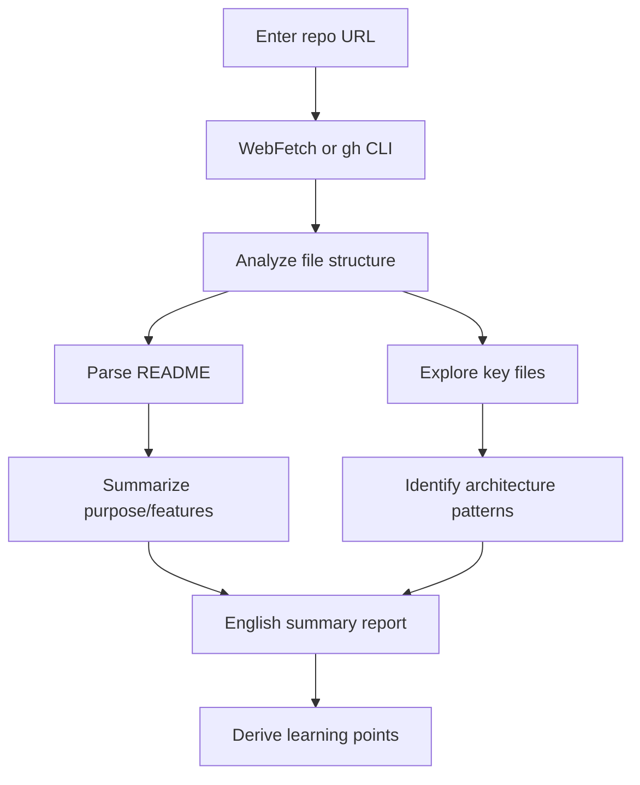

# External Repository Analysis Prompt

## Core Concepts / How It Works



A prompt template for systematically analyzing a GitHub repository and generating an English summary report. Provides links and summaries only, without copying external code.

## One-Line Summary

Given a GitHub URL, summarizes the repo's purpose, core tech stack, architecture patterns, and learning value in English, outputting in the `content/en/repos/` commentary file format.

## Prompt Template

```
Please analyze the following GitHub repository and write an English commentary file.

Repo URL: [GitHub URL]

Analysis requests:
1. Core purpose of the repo and the problem it solves
2. Tech stack (language, frameworks, major packages)
3. Architecture patterns (if any)
4. Relevance to Claude Code / AI development workflows
5. Three key points university students can learn
6. Scenarios for applying to real projects

Output format:
- content/en/repos/ 7-section structure
- frontmatter: title, source_url, source_author, license, tags, last_reviewed
- No copying of original code, links and English summary only

Do not copy any external original code; include only links and English descriptions.
```

## Practical Example

```
Analysis request: https://github.com/vercel/next.js

Sample output:
---
title: "Next.js — React Fullstack Framework"
source_url: "https://github.com/vercel/next.js"
source_author: "Vercel"
license: "MIT"
tags: ["Next.js", "React", "TypeScript", "fullstack"]
---

# Next.js — React Fullstack Framework

## 1. Core Concepts
Next.js is a React-based fullstack framework that...
[mermaid diagram]

## 2. One-Line Summary
A modern React fullstack framework that solves both SEO and performance
simultaneously with App Router + Server Components
...
```

## Learning Points / Common Pitfalls

- No copying of original code (respect copyright)
- For repos without a README, infer from package.json and key files
- Focus on code quality and learning value rather than star count

## Related Resources

- [GitHub Repo Commentary Hub](/en/repos/)
- [Ecosystem Exploration Hub](/en/ecosystem/)
- [Integrated Setup Prompt](/en/prompts/integrated-setup.md)

## Source & Attribution

| Field | Value |
|-------|-------|
| Source URL | https://github.com/mygithub05253/Claude-Code-Study |
| Author | Claude-Code-Study Community |
| License | MIT |
| Translation Date | 2026-04-13 |
| Category | prompts / repo analysis |
