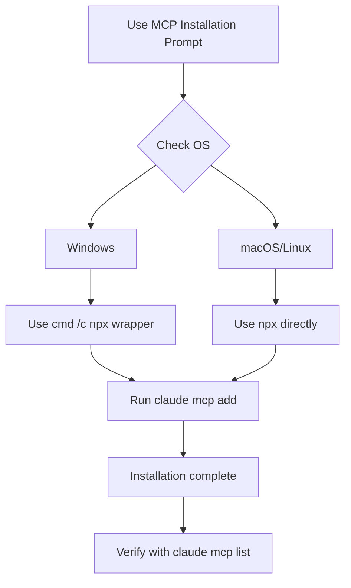

# MCP Server Installation Prompt

## Core Concepts / How It Works



A prompt template that explains why the `cmd /c` wrapper is needed when installing MCP servers on Windows, describes the role of each MCP server, and provides the correct installation commands.

## One-Line Summary

When asked to "install MCP servers on Windows", automatically applies the `cmd /c npx` wrapper and installs context7, filesystem, memory, playwright, thinking, and github MCP servers in order.

## Prompt Template

```
Please install the following MCP servers in a Windows environment.
On Windows, you must use the cmd /c wrapper.

Installation list:
1. context7 (@upstash/context7-mcp@latest) - Reference latest VitePress/Vue/TS docs
2. thinking (@modelcontextprotocol/server-sequential-thinking) - Complex design decisions
3. playwright (@playwright/mcp@latest) - Visual verification of deployed sites
4. filesystem (@modelcontextprotocol/server-filesystem) - Bulk file operations
   Path: C:/Users/[username]/workspace
5. memory (@modelcontextprotocol/server-memory) - Cross-session context retention
6. github (HTTP MCP) - PR/issue management

Please verify with claude mcp list after installation.
```

## Practical Example

**Actual usage scenario**:

```bash
# context7
claude mcp add context7 -- cmd /c npx -y @upstash/context7-mcp@latest

# sequential thinking
claude mcp add thinking -- cmd /c npx -y @modelcontextprotocol/server-sequential-thinking

# playwright
claude mcp add playwright -- cmd /c npx -y @playwright/mcp@latest

# filesystem (path adjustment required)
claude mcp add filesystem -- cmd /c npx -y @modelcontextprotocol/server-filesystem "C:/Users/[username]/workspace"

# memory
claude mcp add memory -- cmd /c npx -y @modelcontextprotocol/server-memory

# github (HTTP mode, OAuth authentication required)
claude mcp add --transport http github https://api.githubcopilot.com/mcp/
```

## Learning Points / Common Pitfalls

- Path issues when running npx in Windows Git Bash → `cmd /c` required
- No output from `claude mcp list` → CLI version update may be needed
- GitHub MCP triggers a browser popup on initial authentication

## Related Resources

- [Fullstack MCP Settings Combination](/en/my-collection/mcp-settings-fullstack.md)
- [MCP Server Hub](/en/mcp/)
- [Integrated Setup Prompt](/en/prompts/integrated-setup.md)

## Source & Attribution

| Field | Value |
|-------|-------|
| Source URL | https://github.com/mygithub05253/Claude-Code-Study |
| Author | Claude-Code-Study Community |
| License | MIT |
| Translation Date | 2026-04-13 |
| Category | prompts / MCP installation |
