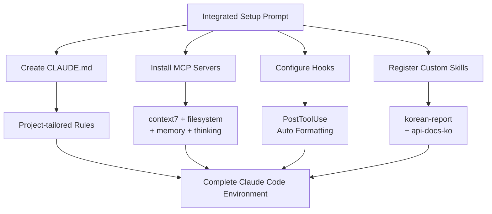

# Integrated Setup Prompt

## Core Concepts / How It Works



An integrated prompt for setting up CLAUDE.md + MCP servers + Hooks + custom skills all at once when starting a new project.

## One-Line Summary

Tell it your project stack (Next.js/Spring Boot) and purpose, and it sets up CLAUDE.md, MCP configuration, Hooks, and custom skills all in one go.

## Prompt Template

```
Please fully set up a Claude Code environment for my new project.

Project information:
- Name: [project name]
- Stack: Next.js 15 + TypeScript / Spring Boot 3 / [other]
- Purpose: [project purpose in 1-2 sentences]
- Team size: [number of people]
- Key features: [up to 3 core features]

Setup requests:
1. Create CLAUDE.md (project-tailored rules)
2. Install MCP servers (Windows environment, cmd /c wrapper)
   - Required: context7, filesystem, memory, thinking
   - Optional: playwright (QA), github (PR management)
3. Configure Hooks (.claude/settings.json)
   - PostToolUse: auto Prettier formatting
   - PostToolUse: auto ESLint check (optional)
4. Register custom skills (~/.claude/skills/)
   - korean-report: Korean progress reports
   - [stack-specific additional skills]

OS: Windows 11
Language: English (all comments/commit messages in English)
```

## Practical Example

**Complete setup for the Student Club Notice Board project**:

```
Input:
- Name: club-notice-board
- Stack: Next.js 15 + Spring Boot 3
- Purpose: Student club notice board fullstack app
- Team: 3 people
- Features: notice CRUD, social login, file attachments

Generated files:
1. CLAUDE.md (mixed Next.js + Spring Boot rules)
2. MCP: installation commands for 6 servers
3. .claude/settings.json (Prettier + ESLint Hooks)
4. ~/.claude/skills/korean-report.md
5. ~/.claude/skills/api-docs-ko.md
```

## Learning Points / Common Pitfalls

- If CLAUDE.md is too long → wasted tokens → keep core rules within 20 lines
- Keep MCP servers to 5-6 active at a time maximum
- Watch for Hook failures blocking work (`|| true` pattern)
- Project CLAUDE.md **overrides** global `~/.claude/CLAUDE.md`

## Related Resources

- [MCP Server Installation Prompt](/en/prompts/install-mcp.md)
- [Hooks Setup Prompt](/en/prompts/setup-hooks.md)
- [Custom Skill Writing Prompt](/en/prompts/write-custom-skill.md)
- [Sub-agent Pattern Prompt](/en/prompts/subagent-pattern.md)
- [Next.js CLAUDE.md Template](/en/my-collection/custom-claude-md-nextjs.md)

## Source & Attribution

| Field | Value |
|-------|-------|
| Source URL | https://github.com/mygithub05253/Claude-Code-Study |
| Author | Claude-Code-Study Community |
| License | MIT |
| Translation Date | 2026-04-13 |
| Category | prompts / integrated setup |
