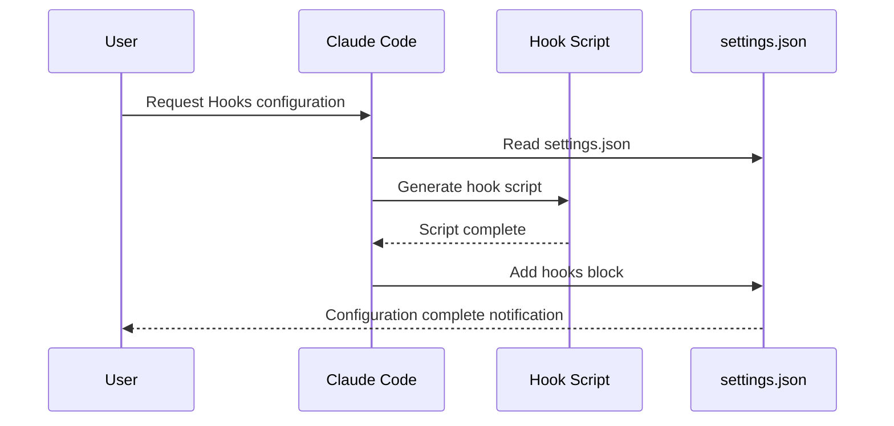

# Hooks Setup Prompt

## Core Concepts / How It Works



Claude Code Hooks are shell scripts that automatically run before/after tool execution, or on session start/end. Use this prompt to quickly set up the Hook you need.

## One-Line Summary

For requests like "auto-format on every file save", generates the correct Hook event (PreToolUse/PostToolUse) and script, and registers it in settings.json.

## Prompt Template

```
Please set up a Claude Code Hook that automates the following behavior.

Automation purpose: [description of desired automation]
Trigger timing: [before/after file modification, session start/end, etc.]
Operating system: Windows / macOS / Linux

Hook event types:
- PreToolUse: before tool execution (can block)
- PostToolUse: after tool execution
- Notification: on Claude notification
- Stop: on response complete
- SubagentStop: on subagent complete

Config file location:
- Global: ~/.claude/settings.json
- Project: .claude/settings.json

If Windows environment, write using PowerShell or cmd commands.
```

## Practical Example

**Prettier Auto-Formatting Hook**:

```json
{
  "hooks": {
    "PostToolUse": [
      {
        "matcher": "Edit|Write",
        "hooks": [
          {
            "type": "command",
            "command": "npx prettier --write \"${tool_input.file_path}\" 2>/dev/null || true"
          }
        ]
      }
    ]
  }
}
```

**ESLint Auto-Check Hook**:

```json
{
  "hooks": {
    "PostToolUse": [
      {
        "matcher": "Edit",
        "hooks": [
          {
            "type": "command",
            "command": "npx eslint \"${tool_input.file_path}\" --fix 2>&1 | head -20"
          }
        ]
      }
    ]
  }
}
```

## Learning Points / Common Pitfalls

- If a hook script fails (exit 1), PreToolUse will block the operation
- Use `|| true` to ignore failures, or apply the `|| exit 0` pattern
- On Windows, watch for PowerShell path separator differences (`\` vs `/`)

## Related Resources

- [Auto Commit Message Hook](/en/my-collection/hook-auto-commit-msg.md)
- [Hooks Recipe Hub](/en/hooks/)
- [Integrated Setup Prompt](/en/prompts/integrated-setup.md)

## Source & Attribution

| Field | Value |
|-------|-------|
| Source URL | https://github.com/mygithub05253/Claude-Code-Study |
| Author | Claude-Code-Study Community |
| License | MIT |
| Translation Date | 2026-04-13 |
| Category | prompts / Hooks configuration |
