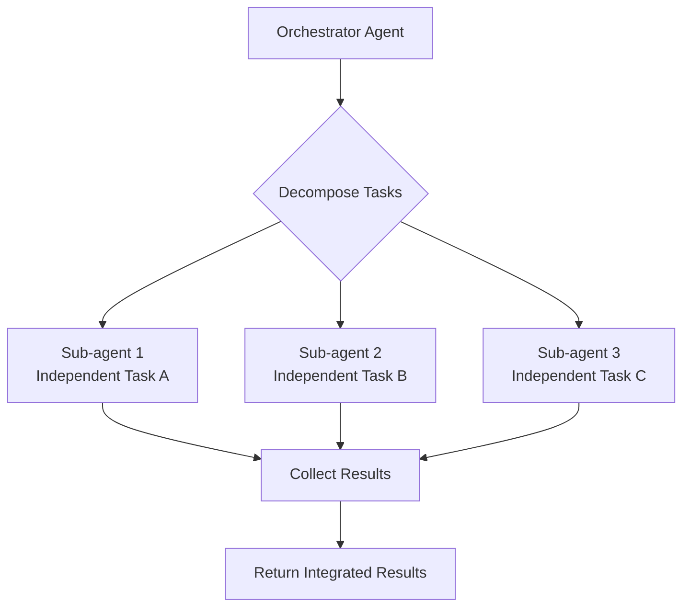

# Sub-agent Pattern Configuration Prompt

## Core Concepts / How It Works



A prompt that helps configure the Multi-agent pattern for decomposing complex tasks into independent sub-tasks and executing them in parallel.

## One-Line Summary

When asked to "process this task in parallel", identifies independent sub-tasks, assigns appropriate context and tools to each sub-agent, and creates a parallel execution plan.

## Prompt Template

```
Please design the following task to be processed in parallel using the Sub-agent pattern.

Task description: [full task description]
Estimated number of sub-tasks: [approximate number]

Design requests:
1. Decompose into independently processable sub-tasks
2. Define each sub-agent's role and input/output
3. Identify tasks with dependencies (requiring sequential processing)
4. Parallel execution order diagram

Pattern: utilize dispatching-parallel-agents or subagent-driven-development skill
Also specify the result integration method.
```

## Practical Example

**Parallel processing of 48 skill English translations**:

```
Orchestrator distributes 48 skills into 8 groups:

Group 1 (Sub-agent 1): brainstorming, writing-plans, executing-plans, ...
Group 2 (Sub-agent 2): careful, guard, verification-before-completion, ...
...
Group 8 (Sub-agent 8): writing-skills, test-driven-development, ...

Each sub-agent:
- Read 6 files → translate to English → save to content/en/skills/
- Convert frontmatter lang:en
- Translate 7-section headings to English

Parallel execution → orchestrator collects results → commit
```

## Learning Points / Common Pitfalls

- Tasks that modify shared state cannot be parallelized (file conflicts)
- Each sub-agent needs sufficient context passed to it
- Orchestrator context window management: collect only summaries of sub-agent results

## Related Resources

- [Agents Pattern Hub](/en/agents/)
- [dispatching-parallel-agents skill](/en/skills/dispatching-parallel-agents.md)
- [Integrated Setup Prompt](/en/prompts/integrated-setup.md)

## Source & Attribution

| Field | Value |
|-------|-------|
| Source URL | https://github.com/mygithub05253/Claude-Code-Study |
| Author | Claude-Code-Study Community |
| License | MIT |
| Translation Date | 2026-04-13 |
| Category | prompts / Sub-agent pattern |
