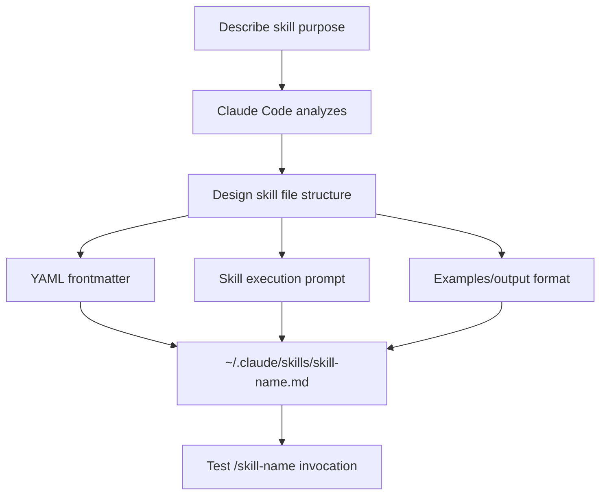

# Custom Skill Writing Prompt

## Core Concepts / How It Works



Claude Code's custom skills are Markdown files located at `~/.claude/skills/` or `.claude/skills/`. Use this prompt to automatically generate the custom skill you need.

## One-Line Summary

Just describe "I need a skill that does X" and it generates a complete skill file with correct YAML frontmatter, execution prompt, and example output.

## Prompt Template

```
Please write a Claude Code custom skill file for the following purpose.

Skill purpose: [description of the desired skill]
Skill name: [English hyphen format, e.g.: korean-report]
Invocation method: /[skill-name]

Content to include:
1. YAML frontmatter (name, description)
2. Instructions Claude should follow when executing the skill
3. How to handle input parameters
4. Example output format

Save location: ~/.claude/skills/[skill-name].md

Include English comments, consider TypeScript/Next.js 15 project context
```

## Practical Example

**Student Club Notice Board API documentation auto-generation skill**:

```markdown
---
name: api-docs-ko
description: Analyze current project's API endpoints and generate Korean API documentation
---

Analyze the API endpoints (Express router or Next.js API Routes) in the current
project and generate Korean API documentation.

## Analysis Targets
- Express: routes/ or src/routes/ directory
- Next.js: app/api/ or pages/api/ directory
- Spring Boot: classes with @RestController annotation

## Output Format
### [METHOD] [PATH]
- **Description**: role of the endpoint
- **Request**: parameter/body schema
- **Response**: success/failure examples
- **Auth**: whether required
```

## Learning Points / Common Pitfalls

- Skill names must be lowercase + hyphens only (no spaces or special characters)
- Overly complex skills increase prompt length → wasted tokens
- Project-specific skills in `.claude/skills/`, global skills in `~/.claude/skills/`

## Related Resources

- [Korean Report Writing Skill](/en/my-collection/skill-korean-report.md)
- [Skills Hub](/en/skills/)
- [Integrated Setup Prompt](/en/prompts/integrated-setup.md)

## Source & Attribution

| Field | Value |
|-------|-------|
| Source URL | https://github.com/mygithub05253/Claude-Code-Study |
| Author | Claude-Code-Study Community |
| License | MIT |
| Translation Date | 2026-04-13 |
| Category | prompts / custom skills |
