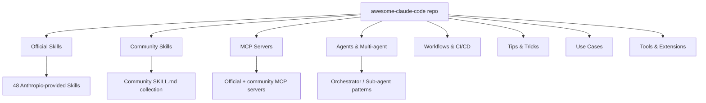

# awesome-claude-code

## Core Concepts / How It Works

awesome-claude-code is a curated list that organizes all resources in the Claude Code ecosystem by category.



Each entry is listed in the following format:
- Name + GitHub link
- One-line description
- License notation
- (Some) demo screenshots or example links

## One-Line Summary

A curated awesome list that systematically organizes all resources in the Claude Code ecosystem (Skills, Agents, MCP servers, use cases, tips).

## Getting Started

### Clone and Explore the Repo

```bash
# Clone the repo
git clone https://github.com/hesreallyhim/awesome-claude-code
cd awesome-claude-code

# Open README.md directly to browse categories
# Or use Ctrl+F on GitHub to search by keyword
```

### Integrating with Claude Code

Ask Claude Code to recommend resources using this repo:

```text
Referring to the awesome-claude-code repo (https://github.com/hesreallyhim/awesome-claude-code),
recommend MCP servers and Skills useful for the Next.js 15 + Supabase combination
in order of priority.
```

### How to Explore Specific Categories

```text
Referring to the "Skills > Review" section of awesome-claude-code,
tell me the best way to automate code reviews.
```

### Contributing to This Project

How to contribute a newly discovered useful resource via PR:

```bash
# 1. Fork the repo
gh repo fork hesreallyhim/awesome-claude-code

# 2. Create a branch
git checkout -b add-[resource-name]

# 3. Add an item to the appropriate category in README.md
# Format: - [Name](URL) — One-line description (License)

# 4. Submit a PR
gh pr create --title "Add [resource-name]" --body "description"
```

## Practical Example

**Scenario**: A college student starting the Next.js 15 "Student Club Notice Board" project for the first time.

### Scenario 1: Resource Research Before Starting a Project

When first adopting Claude Code, you can look at this list to decide which tools to install first.

```text
Referring to the "Web Development" section of the awesome-claude-code repo,
recommend MCP servers and Skills useful for the Next.js 15 + Supabase combination
in order of priority.
```

### Scenario 2: Finding Solutions to Specific Problems

When you want to automate code reviews, looking at the "Skills > Review" section of this list lets you quickly identify community-validated methods.

### Scenario 3: Designing a Learning Roadmap

When introducing Claude Code to team members at a project kickoff meeting, sharing the "Getting Started" section of this list helps members who are new to it get up to speed quickly.

### Scenario 4: Contributing Resources Discovered in This Project

You can contribute useful MCP servers or Skills newly discovered in this `Claude-Code-Study` project to awesome-claude-code via PR. This can serve as an open-source contribution record for academic portfolios.

## Learning Points / Common Pitfalls

- **Category Exploration over Full Browse**: With hundreds of entries, don't try to read everything. Focus exclusively on the category you need right now (MCP, Skills, Agents, etc.).
- **Stars Count = Validation Indicator**: More stars means more community validation. Start with top-starred entries first.
- **License Verification Required**: Each entry has a different license. For commercial projects, prioritize MIT, Apache 2.0, and CC0 licenses.
- **Check Update Frequency**: Updated continuously through community PRs 1-2 times per week, so setting Watch lets you quickly identify new resources.
- **Use in Parallel with Claude-Code-Study**: awesome-claude-code provides a list, while Claude-Code-Study provides detailed English explanations — using them together creates synergy through this division of roles.

## Related Resources

- [modelcontextprotocol-servers](./modelcontextprotocol-servers.md) — The original MCP server repo discovered through the awesome list
- [claude-code-study](./claude-code-study.md) — This project that provides English explanations of awesome list items
- [filesystem-mcp](../mcp/filesystem-mcp.md) — Detailed explanation of the representative server in the awesome list's MCP section

---

| Field | Value |
|---|---|
| Source URL | https://github.com/hesreallyhim/awesome-claude-code |
| License | CC0 1.0 (Public Domain, needs verification) |
| Translation Date | 2026-04-12 |
| Author | Claude-Code-Study Project |
