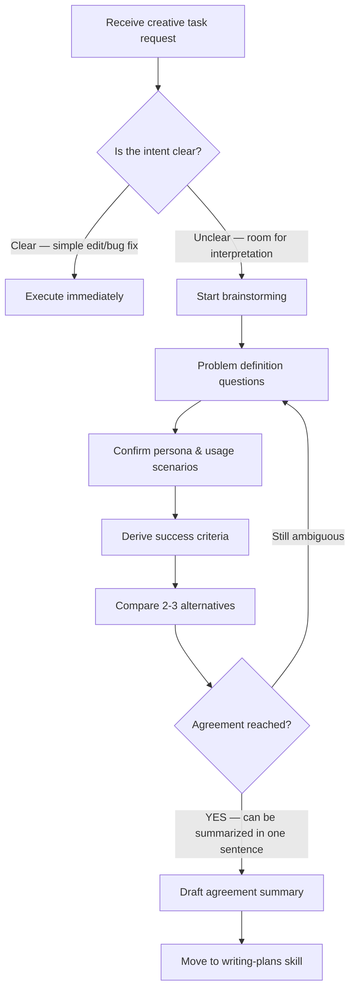

# Brainstorming

## Core Concepts / How It Works

The original skill treats brainstorming as a **"HARD-GATE"** — a checkpoint that must be passed before moving on to the next stage (writing plans / writing code). Four core principles:

1. **Intent First**: Understand the problem the feature is trying to solve, not just what to build.
2. **Requirements Separation**: Have the user explicitly distinguish between must-haves and nice-to-haves.
3. **Design Exploration**: Compare 2–3 approaches before committing to a single solution.
4. **Explicit Agreement**: Repeat until the answer is "yes" to "Is this clear enough to move on to writing-plans?"



## One-Line Summary

A structured question-and-exploration skill used **before any creative work** (feature, component, or behavior change) to surface the user's real intent and requirements. Agree on the "why / what / how" before writing any code.

## Getting Started

```bash
# Invoke with slash command in a Claude Code session
/brainstorming
```

**SKILL.md location**: `~/.claude/skills/brainstorming/SKILL.md`

This skill does not generate code — it changes **how Claude asks questions**. Instead of writing code immediately upon receiving a request, it forces Claude to ask structured questions first.

To customize, copy the SKILL.md and modify the question patterns:

```bash
mkdir -p ~/.claude/skills/brainstorming-custom
cp ~/.claude/skills/brainstorming/SKILL.md ~/.claude/skills/brainstorming-custom/SKILL.md
# Then open in an editor and adjust question patterns to fit your context
```

## Practical Example

**Scenario**: You have been assigned a project to build a "Student Club Notice Board" using Next.js 15 App Router. The professor only said "CRUD with login is fine."

```bash
# In a Claude Code session
> I want to build a student club notice board with Next.js 15. Let's use the brainstorming skill to agree on intent first.
```

Example questions Claude might ask:

1. "Who are the primary readers of the notices? (Club members only / Open to all students)" → determines **authentication scope**
2. "Who writes the notices? (President only / Officers / All members)" → determines **permission model**
3. "Is a read receipt or notification feature needed?" → determines **DB schema**
4. "Could Discord replace this board?" → determines **whether to build it at all**

Final agreement statement:
> "A notice page built with Next.js 15 + Supabase, used by logged-in club members (read) and officers (write). Notifications are excluded from MVP."

```ts
// Only after brainstorming can you confidently make these decisions
// app/notices/page.tsx — server component (read-only)
// app/notices/new/page.tsx — officers only (permission middleware required)
// lib/auth.ts — role-based guard
```

## Learning Points / Common Pitfalls

- **Resist the urge to "code first"**: The most common mistake is running `npm create next-app` with only half the requirements understood. 15–30 minutes of brainstorming prevents 3 hours of going in the wrong direction.
- **Remember just four questions**: "Who uses it / What do they want / When does it fail / Why now?" clears up 90% of ambiguity.
- **Always end with a one-sentence summary**: The completion criterion for brainstorming is "Can it be summarized in one line?" If not, agreement is still lacking.
- **Next.js 15 tip**: Choosing between server components and client components is actually a brainstorming-stage decision. Agreeing on "Is interaction needed? Is there a form?" first makes placing `"use client"` much cleaner.

## Related Resources

- [Writing Plans (writing-plans)](/skills/writing-plans) — The next step after brainstorming
- [Executing Plans (executing-plans)](/skills/executing-plans) — Execute after planning
- [CEO Review (plan-ceo-review)](/skills/plan-ceo-review) — Re-examine plan scope
- [Office Hours (office-hours)](/skills/office-hours) — YC-style idea exploration

---

| Field | Value |
|---|---|
| Source URL | https://docs.anthropic.com/en/docs/claude-code/skills |
| Author / Source | Anthropic |
| License | Commentary MIT, original for reference only |
| Translation Date | 2026-04-13 |
