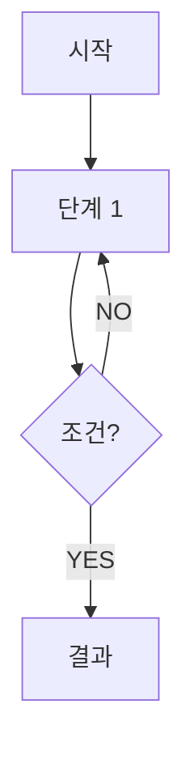

---
# === 스킬용 frontmatter ===
title: "[스킬 제목]"
source: "~/.claude/skills/[skill-name]/SKILL.md"
sourceHash: "sha256:..."
lang: ko
generatedAt: "YYYY-MM-DDThh:mm:ss+09:00"
promptVersion: "ko-v1"
source_url: "https://docs.anthropic.com/en/docs/claude-code/skills"
source_author: "Anthropic"

# === MCP/Hooks/Agents/Repos용 frontmatter ===
# title: "[제목]"
# category: [mcp|hooks|agents|repos|use-cases]
# source_url: "[원본 URL]"
# source_author: "[작성자]"
# license: "[라이선스]"
# last_reviewed: "YYYY-MM-DD"
# tags: ["태그1", "태그2"]
---

# [제목]

## 핵심 개념 / 작동 원리

<!-- 기존 "핵심 개념" 섹션 확장. 원본 영어 내용의 충실한 번역/해설 포함 -->
<!-- mermaid 다이어그램: 흐름이 복잡한 경우 필수 -->



## 한 줄 요약

<!-- 상세를 읽은 뒤 정리용 한 문장. 굵게 강조 포함 권장 -->

## 프로젝트에 도입하기

<!-- Skills: 슬래시 명령어 + SKILL.md 위치 + 커스터마이징 방법 -->
<!-- MCP: .claude/settings.json mcpServers JSON + 설치 확인 방법 -->
<!-- Hooks: .claude/settings.json hooks JSON + 쉘 스크립트 + 권한 -->
<!-- Agents: 프롬프트 패턴 복사 블록 + Task 도구 호출 예시 -->
<!-- Repos: git clone + 의존성 설치 + 핵심 설정 -->

```bash
# Skills 예시
/[skill-name]
```

**SKILL.md 파일 위치**: `~/.claude/skills/[skill-name]/SKILL.md`

## 실전 예제 (대학생 관점)

<!-- 동아리 공지 게시판 맥락 통일: Next.js 15 + TypeScript + Supabase -->

**상황**: [구체적인 시나리오]

```bash
# Claude Code 세션에서
> [예시 명령어]
```

[예상 결과 설명]

```ts
// 결과 코드 예시 (선택)
```

## 학습 포인트 / 흔한 함정

<!-- 기존 학습 포인트 유지 + 흔한 함정 추가 -->

- **[포인트 1]**: [설명]
- **[함정]**: [설명]

## 관련 리소스

<!-- 같은 카테고리 상호 참조 링크 2~4개 -->

- [[관련 리소스 1]](/[path]) — [한 줄 설명]
- [[관련 리소스 2]](/[path]) — [한 줄 설명]

---

| 항목 | 내용 |
|---|---|
| 원본 URL | [URL] |
| 작성자/출처 | [작성자] |
| 라이선스 | [라이선스] |
| 해설 작성일 | YYYY-MM-DD |
