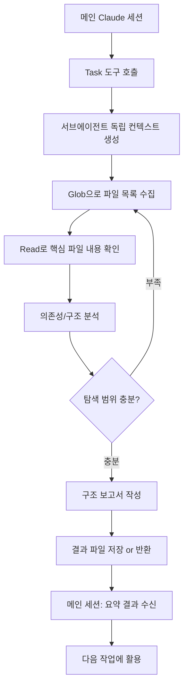

# 코드베이스 탐색 에이전트 (explore-agent)

## 핵심 개념 / 작동 원리

Claude Code의 서브에이전트는 `Task` 도구를 통해 별도의 격리된 컨텍스트에서 실행된다. Explore 에이전트 패턴은 메인 세션이 서브에이전트에게 "이 레포를 탐색하고 요약해줘"라는 작업을 위임하는 구조다.



서브에이전트의 장점:
- **컨텍스트 격리**: 탐색 중 읽은 수백 개 파일이 메인 컨텍스트를 오염시키지 않음
- **병렬화 가능**: 여러 디렉토리를 동시에 탐색하는 에이전트를 동시 실행 가능
- **재사용**: 탐색 결과를 파일로 저장하면 이후 세션에서 재활용 가능

## 한 줄 요약

새 프로젝트에 투입되거나 오래된 코드베이스를 다시 볼 때, Explore 에이전트 패턴을 활용해 전체 구조를 빠르게 파악하고 핵심 파일 목록을 자동으로 정리한다.

## 프로젝트에 도입하기

서브에이전트는 별도의 스킬 파일 없이 Claude Code의 **Task 도구** 를 직접 활용한다.

### 기본 탐색 프롬프트 (복사용)

```text
서브에이전트를 실행해서 다음 탐색 작업을 수행해줘:

탐색 대상: [디렉토리 경로]
탐색 목적: [무엇을 파악하고 싶은지]
출력 파일: docs/codebase-map.md

탐색 단계:
1. 디렉토리 구조 파악 (Glob 패턴 활용)
2. package.json / 설정 파일에서 의존성 확인
3. 진입점 파일(index.ts, main.ts, page.tsx) 내용 확인
4. 핵심 파일 목록과 역할 정리
5. 결과를 출력 파일에 마크다운으로 저장
```

### 병렬 탐색 (프론트엔드 + 백엔드 동시)

```text
두 개의 서브에이전트를 병렬로 실행해줘:
- 에이전트 1: apps/frontend/ 구조 탐색 → docs/frontend-map.md
- 에이전트 2: apps/backend/ 구조 탐색 → docs/backend-map.md
```

## 실전 예제 (대학생 관점)

**상황**: Next.js 15 "동아리 공지 게시판" 프로젝트에 신규 팀원 합류. 전체 구조 파악 필요.

```text
이 프로젝트의 전체 구조를 탐색하는 서브에이전트를 실행해줘.
에이전트가 수행할 작업:
1. 디렉토리 트리 구조 파악 (apps/, packages/, content/, scripts/)
2. 각 디렉토리의 역할과 주요 파일 식별
3. package.json에서 의존성과 스크립트 확인
4. 진입점 파일 내용 확인
5. 결과를 docs/codebase-map.md 파일로 저장
```

서브에이전트가 생성하는 `docs/codebase-map.md` 예시:

```markdown
# 코드베이스 구조 맵 (2026-04-12 기준)

## 디렉토리 역할
| 디렉토리 | 역할 |
|---|---|
| apps/docs/ | VitePress 문서 사이트 |
| packages/parser/ | SKILL.md → JSON 파서 |
| content/ko/ | 한국어 해설 콘텐츠 |

## 핵심 파일
- apps/docs/.vitepress/config.ts — VitePress 설정
- scripts/sync-content-to-docs.ts — 콘텐츠 동기화
```

## 학습 포인트 / 흔한 함정

- **독립 컨텍스트 이해**: 서브에이전트는 메인 세션과 메모리를 공유하지 않는다. 결과를 파일로 저장하거나 Task 도구의 반환값을 활용해야 한다.
- **탐색 범위를 명확히 지정**: "전체 프로젝트 탐색"처럼 범위가 너무 넓으면 느려진다. "apps/docs/의 VitePress 설정만"처럼 범위를 좁히는 것이 효율적이다.
- **결과 캐싱 전략**: 탐색 결과를 `docs/codebase-map.md`에 저장하고 git에 커밋하면 다음 세션에서 재탐색 불필요. 코드 변경 시에만 재탐색한다.
- **병렬 탐색 활용**: 프론트엔드와 백엔드가 분리된 경우, 두 서브에이전트를 동시에 실행해 시간을 절반으로 줄인다.
- **컨텍스트 절약 효과**: 대형 레포 탐색 시 수십 개 파일을 읽어야 하는데, 서브에이전트에게 위임하면 메인 컨텍스트는 요약 결과만 받는다.

## 관련 리소스

- [Plan Agent](/agents/plan-agent) — 구현 계획 수립 전담 에이전트
- [병렬 디스패치 (parallel-dispatch)](/agents/parallel-dispatch) — 병렬 에이전트 패턴
- [병렬 에이전트 스킬 (dispatching-parallel-agents)](/skills/dispatching-parallel-agents) — 관련 스킬
- [서브에이전트 주도 개발 (subagent-driven-development)](/skills/subagent-driven-development) — 서브에이전트 패턴 심화

---

| 항목 | 내용 |
|---|---|
| 원본 URL | https://docs.anthropic.com/en/docs/claude-code/sub-agents |
| 작성자/출처 | Anthropic |
| 라이선스 | CC BY 4.0 |
| 해설 작성일 | 2026-04-12 |
