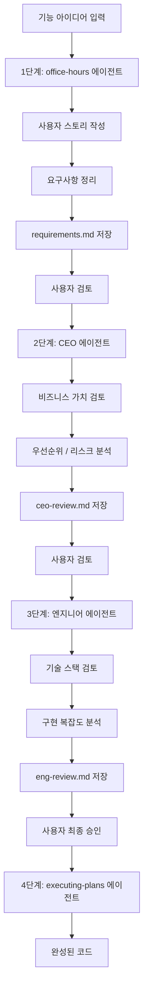

# GStack 역할 기반 에이전트 파이프라인 (gstack-roles)

## 핵심 개념 / 작동 원리

GStack 패턴은 여러 역할을 가진 에이전트들을 **순차적**으로 실행하는 멀티에이전트 파이프라인이다. 각 에이전트는 이전 에이전트의 결과물을 입력으로 받아 자신의 역할 관점에서 보완한다.



각 에이전트가 독립 컨텍스트에서 실행되므로:
- 이전 탐색 내역이 다음 에이전트를 오염시키지 않는다
- 각 역할의 페르소나가 명확히 유지된다
- 단계별 결과물이 파일로 보존되어 추적 가능하다

## 한 줄 요약

CEO, 디자이너, 엔지니어 등 역할별 에이전트를 순차 실행하여 아이디어 브레인스토밍부터 최종 구현까지 체계적인 파이프라인으로 처리한다.

## 프로젝트에 도입하기

### 언제 사용하나?

- 새 기능 아이디어를 비즈니스 관점 검토 → 설계 검토 → 기술 구현까지 단계별로 처리하고 싶을 때
- 각 역할의 시각에서 설계를 검증받아 품질을 높이고 싶을 때
- 혼자 개발하지만 팀이 있는 것처럼 다각도 검토를 받고 싶을 때
- 스타트업 또는 1인 개발자가 실제 팀의 역할별 검토 과정을 Claude로 시뮬레이션하고 싶을 때

### 파이프라인 자동화 프롬프트 패턴

다음 프롬프트 블록을 복사해 사용한다:

```text
"[기능명]" 기능에 대해 GStack 파이프라인을 순서대로 실행해줘:
1. office-hours 에이전트 (요구사항 정리)
   → 출력: docs/plans/[기능명]-requirements.md
2. ceo-review 에이전트 (비즈니스 검토)
   → 출력: docs/plans/[기능명]-ceo-review.md
3. eng-review 에이전트 (기술 검토)
   → 출력: docs/plans/[기능명]-eng-review.md
4. 내가 최종 승인하면 executing-plans 에이전트 (구현)

각 단계 완료 후 나에게 결과를 보여주고 다음 단계로 진행할지 확인받아줘.
```

### 각 역할별 에이전트 프롬프트 템플릿

**office-hours 에이전트 (요구사항 정리)**:
```text
서브에이전트를 실행해서 다음 기능의 요구사항을 정리해줘.
역할: 요구사항 분석가 (Office Hours 진행자)

기능 아이디어: [아이디어 설명]

작업:
1. 사용자 스토리 작성 (AS-A / I-WANT / SO-THAT 형식)
2. 기능적/비기능적 요구사항 목록 작성
3. 범위 내/외(In Scope / Out of Scope) 명시
4. docs/plans/[기능명]-requirements.md에 저장
```

**CEO 에이전트 (비즈니스 검토)**:
```text
서브에이전트를 실행해서 아래 기능 계획을 CEO 시각으로 검토해줘.
역할: 스타트업 CEO (비즈니스 가치 중심)

입력 문서: docs/plans/[기능명]-requirements.md

검토 항목:
1. 이 기능이 핵심 사용자 가치에 기여하는가?
2. 구현 비용(개발 시간) 대비 가치는 적절한가?
3. MVP 범위에서 제거할 수 있는 요소는?
4. 잠재적 리스크는?

출력: docs/plans/[기능명]-ceo-review.md
```

**엔지니어 에이전트 (기술 검토)**:
```text
서브에이전트를 실행해서 아래 기능 계획을 시니어 엔지니어 시각으로 검토해줘.
역할: 풀스택 시니어 엔지니어

입력 문서:
- docs/plans/[기능명]-requirements.md
- docs/plans/[기능명]-ceo-review.md

현재 기술 스택: [스택 나열]

검토 항목:
1. 아키텍처 제안
2. DB 스키마 변경 범위
3. 기존 코드 변경 영향도
4. 구현 순서 및 예상 소요 시간

출력: docs/plans/[기능명]-eng-review.md
```

## 실전 예제 (대학생 관점)

**상황**: Next.js 15 "동아리 공지 게시판" 프로젝트에 "공지 구독 알림" 기능을 추가하는 전체 파이프라인

### 1단계: office-hours 에이전트 (요구사항 정리)

```text
서브에이전트를 실행해서 다음 기능의 요구사항을 정리해줘.
역할: 요구사항 분석가 (Office Hours 진행자)

기능 아이디어:
- 동아리 회원이 특정 카테고리의 공지를 구독하면 새 공지 등록 시 이메일 알림 수신

작업:
1. 사용자 스토리 작성 (AS-A / I-WANT / SO-THAT 형식)
2. 기능적/비기능적 요구사항 목록 작성
3. 범위 내/외(In Scope / Out of Scope) 명시
4. docs/plans/notice-subscribe-requirements.md에 저장
```

### 2단계: CEO 에이전트 (비즈니스 검토)

```text
서브에이전트를 실행해서 아래 기능 계획을 CEO 시각으로 검토해줘.
역할: 스타트업 CEO (비즈니스 가치 중심)

입력 문서: docs/plans/notice-subscribe-requirements.md

검토 항목:
1. 이 기능이 핵심 사용자 가치에 기여하는가?
2. 구현 비용(개발 시간) 대비 가치는 적절한가?
3. MVP 범위에서 제거할 수 있는 요소는?
4. 잠재적 리스크는?

출력: docs/plans/notice-subscribe-ceo-review.md
```

### 3단계: 엔지니어 에이전트 (기술 검토)

```text
서브에이전트를 실행해서 아래 기능 계획을 시니어 엔지니어 시각으로 검토해줘.
역할: 풀스택 시니어 엔지니어

입력 문서:
- docs/plans/notice-subscribe-requirements.md
- docs/plans/notice-subscribe-ceo-review.md

현재 기술 스택: Next.js 15, Prisma, NextAuth.js, Nodemailer

검토 항목:
1. 이메일 발송 아키텍처 제안 (동기 vs 비동기 큐)
2. DB 스키마 변경 범위
3. 기존 코드 변경 영향도
4. 구현 순서 및 예상 소요 시간

출력: docs/plans/notice-subscribe-eng-review.md
```

### 4단계: executing-plans 에이전트 (구현)

```text
서브에이전트를 실행해서 다음 계획서들을 기반으로 구현을 시작해줘.

입력 문서:
- docs/plans/notice-subscribe-requirements.md
- docs/plans/notice-subscribe-ceo-review.md
- docs/plans/notice-subscribe-eng-review.md

구현 순서 (eng-review 문서의 순서를 따를 것):
1. Prisma 스키마에 Subscription 모델 추가
2. 구독 API 라우트 구현 (/api/notices/subscribe)
3. 공지 등록 시 이메일 발송 로직 추가
4. 구독 버튼 컴포넌트 추가

각 단계마다 완료 확인 메시지를 출력할 것.
```

## 학습 포인트 / 흔한 함정

- **순차 실행의 의미**: GStack 파이프라인은 병렬 디스패치와 달리 단계를 순서대로 처리한다. 이전 에이전트의 결과가 다음 에이전트의 입력이 되는 의존 관계가 있기 때문이다.
- **인간 검토 게이트(Human Gate) 삽입**: 각 단계 사이에 사람이 결과를 검토하고 다음 단계로 진행을 승인하는 게이트를 넣으면, 에이전트가 잘못된 방향으로 가는 것을 조기에 발견할 수 있다.
- **역할 페르소나의 효과**: CEO 에이전트에게 "비용 대비 가치"를 물으면 실제로 다른 관점의 피드백이 나온다. 역할 페르소나는 모델이 특정 관점에 집중하도록 유도하는 효과적인 방법이다.
- **문서 누적 vs 덮어쓰기**: 각 단계의 결과를 별도 파일에 저장(누적)해야 이전 단계로 돌아가 수정할 수 있다. 단일 파일에 덮어쓰면 이전 검토가 사라진다.
- **파이프라인 중단 지점**: 엔지니어 리뷰에서 "이 기능은 현재 기술 스택으로 구현하기 너무 복잡하다"는 결론이 나오면 implementing 단계로 넘어가지 않고 요구사항을 재정의해야 한다. 파이프라인은 항상 앞 단계로 돌아갈 수 있어야 한다.

## 관련 리소스

- [plan-agent](./plan-agent.md) — GStack의 1단계(요구사항 정리)를 Plan Agent 패턴으로 강화 가능
- [parallel-dispatch](./parallel-dispatch.md) — GStack 파이프라인 완료 후 병렬 구현에 활용
- [brainstorming 스킬](../skills/brainstorming.md) — office-hours 에이전트 대신 brainstorming 스킬로 아이디어 발산 단계 대체 가능
- [과제 프로젝트 개발](../use-cases/과제-프로젝트-개발.md) — GStack 파이프라인을 학기말 프로젝트에 적용하는 전체 워크플로우

---

| 항목 | 내용 |
|---|---|
| 원본 URL | https://docs.anthropic.com/en/docs/claude-code/sub-agents |
| 라이선스 | CC BY 4.0 |
| 해설 작성일 | 2026-04-12 |
| 작성자 | Claude-Code-Study 프로젝트 |
