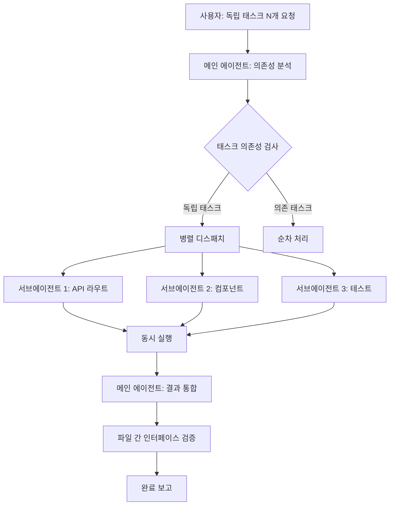

# 병렬 태스크 디스패치 패턴 (parallel-dispatch)

## 핵심 개념 / 작동 원리

병렬 디스패치 패턴은 서로 의존하지 않는 태스크들을 동시에 여러 서브에이전트에게 분배해 처리 시간을 단축하는 패턴이다.



핵심 규칙 — 병렬화 가능 조건:
1. 태스크 A의 결과가 태스크 B의 입력이 아닐 것 (비의존성)
2. 같은 파일을 동시에 수정하지 않을 것 (충돌 방지)
3. 각 태스크가 독립적으로 완료 가능할 것

직렬 vs 병렬 처리 비교:
```
직렬 방식 (기본):
시간: ──[A: 5분]──[B: 5분]──[C: 5분]──  총 15분

병렬 디스패치:
시간: ──[A: 5분]──  총 5분
      ──[B: 5분]──
      ──[C: 5분]──
```

## 한 줄 요약

서로 의존성이 없는 N개의 독립 태스크를 동시에 서브에이전트로 디스패치하여 전체 작업 시간을 획기적으로 단축한다.

## 프로젝트에 도입하기

### 언제 사용하나?

- 서로 관련 없는 여러 파일(API 라우트, 컴포넌트, 테스트)을 동시에 구현해야 할 때
- 모노레포의 여러 패키지를 독립적으로 업데이트해야 할 때
- 여러 페이지의 스타일을 동시에 리팩토링할 때
- 독립적인 여러 버그를 동시에 수정해야 할 때

### 병렬 디스패치 프롬프트 패턴

다음 프롬프트 블록을 복사해 사용한다:

```text
다음 [N]가지 작업을 서브에이전트 [N]개를 동시에 실행해서 병렬로 처리해줘.
각 작업은 서로 독립적이야.

[에이전트 1 - 역할명]
담당: [파일 경로 또는 디렉토리]
작업:
- [세부 작업 1]
- [세부 작업 2]
참고 파일: [참조할 파일들]

[에이전트 2 - 역할명]
담당: [파일 경로 또는 디렉토리]
작업:
- [세부 작업 1]
참고 파일: [참조할 파일들]

모든 에이전트 완료 후 결과를 요약하고 파일 간 인터페이스를 검증해줘.
```

### 의존성 분석 프롬프트

병렬화 전에 태스크 간 의존성을 먼저 확인한다:

```text
다음 작업 목록을 분석해서, 병렬로 처리 가능한 그룹과
순차로 처리해야 하는 그룹을 나누어줘.

작업 목록:
1. [작업 A]
2. [작업 B]
3. [작업 C]
4. [작업 D]

기준:
- 같은 파일을 수정하는 작업은 동일 그룹으로
- 한 작업의 출력이 다른 작업의 입력이면 순차로
- 나머지는 병렬 가능
```

### Task 도구 호출 예시

내부적으로 Claude Code가 여러 Task 도구를 동시에 호출하는 구조:

```text
[Task 1] API 라우트 구현
  담당: backend/routes/notices/
  완료 기준: GET/POST/PUT/DELETE 4개 엔드포인트 생성

[Task 2] 프론트엔드 컴포넌트 구현  ← 동시 실행
  담당: frontend/components/notices/
  완료 기준: NoticeList, NoticeCard, NoticeForm 3개 생성

[Task 3] 테스트 파일 생성  ← 동시 실행
  담당: backend/routes/notices/__tests__/
  완료 기준: 전체 API 통합 테스트 작성
```

## 실전 예제 (대학생 관점)

**상황**: Next.js 15 "동아리 공지 게시판" 프로젝트에서 공지사항 CRUD의 API 라우트, 프론트엔드 컴포넌트, 테스트를 동시에 구현

### Claude Code 세션에서의 실제 사용

```text
다음 3가지 작업을 서브에이전트 3개를 동시에 실행해서 병렬로 처리해줘.
각 작업은 서로 독립적이야.

[에이전트 1 - API 라우트]
담당: backend/routes/notices/ 디렉토리
작업:
- GET /api/notices → 전체 공지 목록 반환 (페이지네이션 포함)
- POST /api/notices → 새 공지 생성 (인증 필요)
- PUT /api/notices/:id → 공지 수정 (작성자만 가능)
- DELETE /api/notices/:id → 공지 삭제 (작성자만 가능)
참고 파일: backend/middleware/auth.ts, backend/types/notice.ts

[에이전트 2 - 프론트엔드 컴포넌트]
담당: frontend/components/notices/ 디렉토리
작업:
- NoticeList.tsx: 공지 목록 + 무한 스크롤
- NoticeCard.tsx: 개별 공지 카드
- NoticeForm.tsx: 공지 작성/수정 폼
참고 파일: frontend/types/notice.ts, frontend/hooks/useAuth.ts

[에이전트 3 - 테스트]
담당: backend/routes/notices/__tests__/ 디렉토리
작업:
- notices.test.ts: API 라우트 전체 테스트
- 목(mock) 설정: prisma, nextauth
참고 파일: vitest.config.ts, backend/utils/test-helpers.ts

모든 에이전트 완료 후 결과를 요약해줘.
```

### 병렬 디스패치 결과 통합 예시

3개 에이전트가 동시 완료 후 메인 에이전트가 보고:

```
[에이전트 1 완료] API 라우트 4개 생성
  - backend/routes/notices/index.ts (GET, POST)
  - backend/routes/notices/[id].ts (PUT, DELETE)

[에이전트 2 완료] 프론트엔드 컴포넌트 3개 생성
  - frontend/components/notices/NoticeList.tsx
  - frontend/components/notices/NoticeCard.tsx
  - frontend/components/notices/NoticeForm.tsx

[에이전트 3 완료] 테스트 파일 생성
  - backend/routes/notices/__tests__/notices.test.ts
  - 총 12개 테스트 케이스

통합 결과: 모든 파일 생성 완료.
NoticeList.tsx가 /api/notices를 호출하는지 연결 확인 필요.
```

## 학습 포인트 / 흔한 함정

- **파일 충돌 방지 최우선**: 두 에이전트가 같은 파일을 동시에 수정하면 마지막으로 쓴 내용이 이전 내용을 덮어씌운다. 반드시 담당 파일 영역을 명확히 분리한다.
- **공유 타입 파일은 순차 처리**: `types/notice.ts` 같은 공유 타입 파일은 먼저 한 에이전트가 작성하고, 이후 다른 에이전트들이 그것을 참조하도록 순차 처리한다.
- **3~5개가 실용적인 한계**: 이론적으로 N개를 병렬 실행할 수 있지만, 너무 많은 에이전트를 동시에 실행하면 메인 에이전트가 결과를 통합하는 데 혼란이 생길 수 있다. 실용적으로는 3~5개가 적절하다.
- **결과 통합 단계 명시**: 병렬 완료 후 메인 에이전트가 파일 간 인터페이스(API 호출 URL, 타입 일치 등)를 검증하는 통합 단계를 명시적으로 요청한다.
- **실패한 에이전트 처리**: 3개 중 1개가 실패했을 때 나머지 2개는 이미 완료되어 있다. 실패한 에이전트만 재실행하도록 요청하면 된다.

## 관련 리소스

- [plan-agent](./plan-agent.md) — 병렬 구현 전 설계 분리에 Plan Agent 패턴을 먼저 적용
- [gstack-roles](./gstack-roles.md) — 역할별 에이전트를 순차가 아닌 병렬로 확장하는 변형 패턴
- [subagent-driven-development 스킬](../skills/subagent-driven-development.md) — 병렬 디스패치의 스킬 버전
- [팀 협업 워크플로우](../use-cases/팀-협업-워크플로우.md) — 팀원별 병렬 개발에 이 패턴 적용 사례

---

| 항목 | 내용 |
|---|---|
| 원본 URL | https://docs.anthropic.com/en/docs/claude-code/sub-agents |
| 라이선스 | CC BY 4.0 |
| 해설 작성일 | 2026-04-12 |
| 작성자 | Claude-Code-Study 프로젝트 |
