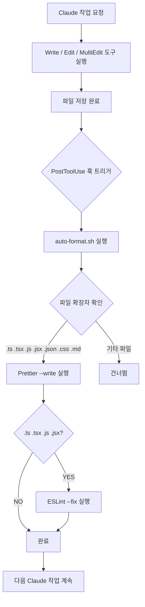

# 자동 포맷 훅 (auto-format)

## 핵심 개념 / 작동 원리

`PostToolUse` 훅은 Claude가 특정 도구를 사용한 **직후** 에 실행된다. `Write`, `Edit`, `MultiEdit` 등 파일 수정 도구가 완료되면 훅이 트리거되어 지정한 명령어를 자동 실행한다.



exit code 처리:
- `0`: 정상 완료, Claude 작업 계속
- `1`: 오류, Claude에 stderr 전달 (작업 중단 없음)
- `2`: 작업 차단 (이 훅에서는 사용하지 않음)

## 한 줄 요약

Claude가 파일을 수정할 때마다 Prettier와 ESLint를 자동 실행하여 코드 스타일을 항상 일관되게 유지한다.

## 프로젝트에 도입하기

### 1단계: 스크립트 파일 생성

```bash
mkdir -p scripts
cat > scripts/auto-format.sh << 'EOF'
#!/usr/bin/env bash
# Claude가 수정한 파일에 자동으로 포맷 적용
set -e

FILE="$1"
if [ -z "$FILE" ] || [ ! -f "$FILE" ]; then
  exit 0
fi

export PATH="./node_modules/.bin:$PATH"

case "$FILE" in
  *.ts|*.tsx|*.js|*.jsx|*.json|*.css|*.md)
    prettier --write "$FILE" 2>&1 || true
    ;;
  *) exit 0 ;;
esac

case "$FILE" in
  *.ts|*.tsx|*.js|*.jsx)
    eslint --fix "$FILE" 2>&1 || true
    ;;
esac

exit 0
EOF
chmod +x scripts/auto-format.sh
```

### 2단계: `.claude/settings.json` 설정

```json
{
  "hooks": {
    "PostToolUse": [
      {
        "matcher": "Write|Edit|MultiEdit",
        "hooks": [
          {
            "type": "command",
            "command": "bash scripts/auto-format.sh \"$CLAUDE_TOOL_INPUT_PATH\""
          }
        ]
      }
    ]
  }
}
```

### 3단계: 동작 확인

Claude에게 파일 수정을 요청하면 자동으로 Prettier + ESLint가 실행된다.

## 실전 예제 (대학생 관점)

**상황**: Next.js 15 "동아리 공지 게시판" 프로젝트에서 Claude가 생성하는 컴포넌트마다 수동으로 `pnpm format`을 실행해야 하는 불편 해소.

```
Claude에게 요청:
"동아리 공지 게시판의 공지 목록 컴포넌트를 생성해줘.
파일: components/notices/NoticeList.tsx"
```

Claude가 파일을 저장하는 순간 → `auto-format.sh` 자동 실행 → Prettier + ESLint 적용 완료. 개발자는 별도로 `pnpm format`을 실행할 필요가 없다.

```bash
# pnpm workspace 모노레포에서 경로 설정
# scripts/auto-format.sh 상단에 추가:
export PATH="./node_modules/.bin:$PATH"
```

## 학습 포인트 / 흔한 함정

- **파일 경로 주입 방식**: `PostToolUse` 훅에서 수정된 파일 경로는 `CLAUDE_TOOL_INPUT_PATH` 환경변수로 전달된다. 공식 문서의 환경변수 목록을 반드시 확인할 것.
- **무한 루프 걱정 불필요**: Prettier가 파일을 수정해도 다시 `PostToolUse`가 트리거되지 않는다. Hooks는 Claude 도구 실행에만 반응한다.
- **느린 포맷터 주의**: ESLint `--fix`는 대형 파일에서 수 초가 걸릴 수 있다. 느릴 경우 `Write`만으로 제한하거나 큰 파일은 제외하는 조건을 추가한다.
- **Windows Git Bash 환경**: `\` 경로 구분자 문제가 발생할 수 있다. `FILE` 변수에 슬래시 변환 처리를 추가한다.

## 관련 리소스

- [위험 명령 차단 (block-dangerous)](/hooks/block-dangerous) — 파괴적 명령 차단 훅
- [자동 테스트 (auto-test)](/hooks/auto-test) — 테스트 자동 실행 훅
- [완료 알림 (notify-complete)](/hooks/notify-complete) — 작업 완료 데스크톱 알림
- [Hooks 레시피 전체 목록](/hooks/) — 모든 Hooks 모음

---

| 항목 | 내용 |
|---|---|
| 원본 URL | https://docs.anthropic.com/en/docs/claude-code/hooks |
| 작성자/출처 | Anthropic |
| 라이선스 | CC BY 4.0 |
| 해설 작성일 | 2026-04-12 |
