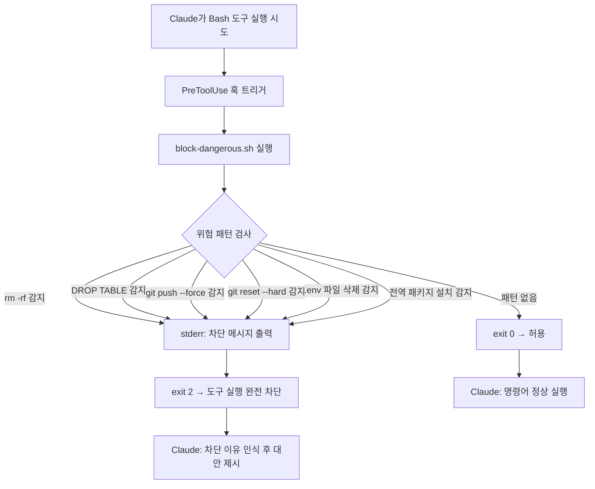

# 위험 명령어 차단 훅 (block-dangerous)

## 핵심 개념 / 작동 원리

`PreToolUse` 훅은 Claude가 도구를 **실행하기 직전**에 트리거된다. 훅에서 `exit code 2`로 종료하면 Claude는 해당 도구 실행을 **완전히 거부**하고, stderr에 출력된 메시지를 사용자에게 전달한다.



`exit code` 의미:
- `0`: 허용 — 도구 실행을 계속한다
- `2`: 차단 — 도구 실행을 중단하고 Claude에 거부 이유를 전달한다
- `1`: 오류 — 훅 자체에 오류가 발생했음을 알린다 (실행은 계속될 수 있음)

## 한 줄 요약

`PreToolUse` 훅으로 `rm -rf`, `DROP TABLE`, `git push --force` 같은 파괴적 명령어를 Claude가 실행하기 전에 사전 차단한다.

## 프로젝트에 도입하기

**상황**: Next.js 15 "동아리 공지 게시판" 프로젝트에서 Claude가 실수로 데이터를 삭제하거나 강제 push하는 것을 방지

### `.claude/settings.json` 설정

```json
{
  "hooks": {
    "PreToolUse": [
      {
        "matcher": "Bash",
        "hooks": [
          {
            "type": "command",
            "command": "bash /workspace/scripts/block-dangerous.sh"
          }
        ]
      }
    ]
  }
}
```

### `scripts/block-dangerous.sh` 스크립트

```bash
#!/usr/bin/env bash
# PreToolUse 훅: 위험한 Bash 명령어 실행 전 차단
# Claude가 실행하려는 명령어는 CLAUDE_TOOL_INPUT_COMMAND 환경변수로 전달됨

COMMAND="${CLAUDE_TOOL_INPUT_COMMAND:-}"

# 명령어가 없으면 허용
if [ -z "$COMMAND" ]; then
  exit 0
fi

# ─────────────────────────────────────────────
# 위험 패턴 목록
# ─────────────────────────────────────────────

# 1. 파일 시스템 파괴
if echo "$COMMAND" | grep -qE 'rm\s+-[a-z]*r[a-z]*f|rm\s+-[a-z]*f[a-z]*r'; then
  echo "[block-dangerous] 거부: 'rm -rf' 명령어는 허용되지 않습니다." >&2
  echo "[block-dangerous] 대안: 삭제 대상 파일을 명시적으로 지정하거나 휴지통으로 이동하세요." >&2
  exit 2
fi

# 2. 데이터베이스 테이블 삭제
if echo "$COMMAND" | grep -qiE 'DROP\s+TABLE|DROP\s+DATABASE|TRUNCATE\s+TABLE'; then
  echo "[block-dangerous] 거부: SQL DROP/TRUNCATE 명령어는 허용되지 않습니다." >&2
  echo "[block-dangerous] 대안: 마이그레이션 파일을 통해 스키마 변경을 관리하세요." >&2
  exit 2
fi

# 3. Git 강제 Push
if echo "$COMMAND" | grep -qE 'git\s+push.*(--force|-f)'; then
  echo "[block-dangerous] 거부: 'git push --force'는 허용되지 않습니다." >&2
  echo "[block-dangerous] 대안: 'git push --force-with-lease'를 사용하거나 관리자에게 문의하세요." >&2
  exit 2
fi

# 4. Git 히스토리 파괴
if echo "$COMMAND" | grep -qE 'git\s+reset\s+--hard|git\s+clean\s+-[a-z]*f'; then
  echo "[block-dangerous] 거부: 'git reset --hard' 또는 'git clean -f'는 허용되지 않습니다." >&2
  echo "[block-dangerous] 대안: 변경 사항을 stash하거나 사용자에게 확인을 요청하세요." >&2
  exit 2
fi

# 5. 환경변수 파일 삭제 또는 덮어쓰기
if echo "$COMMAND" | grep -qE '(rm|>|truncate)\s+.*\.env'; then
  echo "[block-dangerous] 거부: .env 파일 삭제 또는 덮어쓰기는 허용되지 않습니다." >&2
  echo "[block-dangerous] 대안: .env.example을 수정하거나 새 변수를 .env.local에 추가하세요." >&2
  exit 2
fi

# 6. 시스템 전역 패키지 변경
if echo "$COMMAND" | grep -qE 'npm\s+install\s+-g|pnpm\s+add\s+-g|yarn\s+global'; then
  echo "[block-dangerous] 경고: 전역 패키지 설치는 지양합니다." >&2
  echo "[block-dangerous] 대안: 프로젝트 로컬 의존성으로 추가하세요: pnpm add -D [패키지]" >&2
  exit 2
fi

# 모든 검사 통과 → 허용
exit 0
```

## 실전 예제 (대학생 관점)

### 실제 차단 시나리오

**시나리오 1 — 실수로 전체 삭제 시도**

Claude가 다음을 실행하려 할 때:
```bash
rm -rf ./node_modules ./dist
```

훅이 트리거되어 차단:
```
[block-dangerous] 거부: 'rm -rf' 명령어는 허용되지 않습니다.
[block-dangerous] 대안: 삭제 대상 파일을 명시적으로 지정하거나 휴지통으로 이동하세요.
```

Claude는 차단 메시지를 받고 대안을 제시한다:
```
rm -rf가 차단되었습니다. node_modules를 안전하게 정리하려면 다음을 사용할 수 있습니다:
pnpm store prune  또는  npx rimraf node_modules
```

**시나리오 2 — 강제 Push 차단**
```bash
git push origin main --force
# → [block-dangerous] 거부: 'git push --force'는 허용되지 않습니다.
```

**시나리오 3 — DB 삭제 차단**
```bash
psql -c "DROP TABLE notices;"
# → [block-dangerous] 거부: SQL DROP/TRUNCATE 명령어는 허용되지 않습니다.
```

## 학습 포인트 / 흔한 함정

- **exit 2의 의미**: exit 0(허용), exit 1(오류), exit 2(차단) 세 가지를 명확히 구분한다. exit 2만이 도구 실행을 완전히 막는다.
- **패턴 오탐(False Positive) 주의**: `rm -rf node_modules`처럼 실제로 허용해야 할 명령어가 차단될 수 있다. 패턴을 너무 넓게 잡지 말고, 필요하다면 허용 목록(allowlist)도 함께 관리한다.
- **CLAUDE_TOOL_INPUT_COMMAND 환경변수**: Claude가 Bash 도구로 실행하려는 명령어 전체 문자열이 이 변수에 담긴다. 공식 문서에서 훅별로 주입되는 환경변수를 확인해야 한다.
- **파이프라인 명령어 탐지 한계**: `rm -rf /`를 `rm -r/ -f`처럼 분리하거나 변수 치환으로 우회하는 경우 탐지가 어렵다. 완벽한 보안 도구가 아니라 "실수 방지" 안전망으로 인식할 것.
- **팀 공유 설정**: `.claude/settings.json`을 git에 커밋하면 팀 전원에게 동일한 안전망이 적용된다.

## 관련 리소스

- [자동 포맷 훅](./auto-format.md) — 파일 저장 후 자동으로 코드를 포맷하는 PostToolUse 훅 레시피입니다.
- [작업 내역 로그 훅](./work-log.md) — 차단된 명령어를 포함해 Claude의 모든 도구 사용 내역을 기록합니다.
- [supabase-mcp](../mcp/supabase-mcp.md) — Supabase MCP와 함께 사용하면 DROP TABLE 차단 훅이 더욱 중요해집니다.

---

| 항목 | 내용 |
|---|---|
| 원본 URL | https://docs.anthropic.com/en/docs/claude-code/hooks |
| 라이선스 | CC BY 4.0 |
| 해설 작성일 | 2026-04-12 |
| 작성자 | Claude-Code-Study 프로젝트 |
