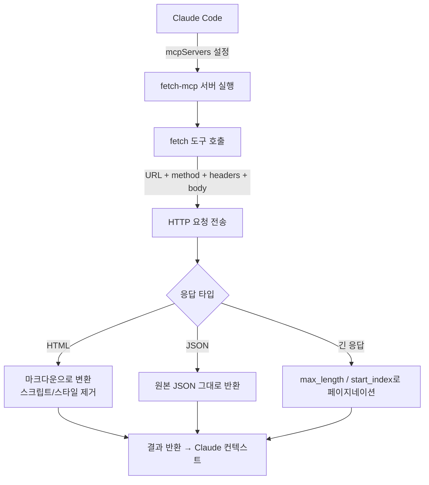

# fetch-mcp

## 핵심 개념 / 작동 원리

`fetch-mcp`는 HTTP/HTTPS 요청을 실행하고 응답을 Claude에게 전달하는 도구입니다. HTML 응답은 자동으로 마크다운으로 변환되어 Claude가 더 잘 이해할 수 있는 형태로 제공됩니다.



### 제공 도구 목록

| 도구 | 설명 |
|---|---|
| `fetch` | URL에 HTTP GET 요청을 실행하고 응답 반환 |

### fetch 도구 파라미터

| 파라미터 | 타입 | 설명 |
|---|---|---|
| `url` | string (필수) | 요청할 URL |
| `method` | string | HTTP 메서드 (기본값: GET) |
| `headers` | object | 요청 헤더 키-값 쌍 |
| `body` | string | 요청 바디 (POST/PUT 등) |
| `max_length` | number | 응답 최대 길이 (기본값: 5000자) |
| `start_index` | number | 응답 시작 위치 (페이지네이션) |
| `raw` | boolean | HTML을 마크다운 변환 없이 원본 반환 |

### 처리 방식

- **HTML 응답**: 기본적으로 마크다운으로 변환해 반환 (스크립트/스타일 태그 제거)
- **JSON 응답**: 원본 JSON 그대로 반환
- **긴 응답**: `max_length`와 `start_index`로 페이지네이션 처리 가능
- **인증이 필요한 API**: `headers`에 Authorization 헤더 포함 가능

## 한 줄 요약

Claude가 대화 중에 HTTP 요청을 직접 실행해 공개 API를 호출하거나 웹 문서를 가져올 수 있게 하는 MCP 서버.

## 프로젝트에 도입하기

### 사전 요구사항

- Node.js 18+
- 인터넷 연결

### Claude Code `.claude/settings.json` 설정

```json
{
  "mcpServers": {
    "fetch": {
      "command": "npx",
      "args": ["-y", "@modelcontextprotocol/server-fetch"]
    }
  }
}
```

### Claude Desktop `claude_desktop_config.json` 설정

```json
{
  "mcpServers": {
    "fetch": {
      "command": "npx",
      "args": ["-y", "@modelcontextprotocol/server-fetch"]
    }
  }
}
```

별도 환경변수나 추가 설정 없이 바로 사용할 수 있습니다. 단, 인증이 필요한 API는 요청 시 headers를 프롬프트에서 지정해야 합니다.

## 실전 예제 (대학생 관점)

**상황**: Next.js 15 "동아리 공지 게시판" 프로젝트 개발 중입니다. 외부 API를 연동하거나 최신 라이브러리 문서를 참조해야 합니다.

**예제 1: 공개 API 테스트**

```
fetch를 사용해서 아래 엔드포인트가 올바르게 응답하는지 확인해줘:
https://jsonplaceholder.typicode.com/posts/1

응답 구조를 분석하고, 이 API를 Next.js App Router의
server component에서 호출하는 코드도 작성해줘.
```

**예제 2: 라이브러리 문서 실시간 참조**

```
Supabase의 Row Level Security 공식 문서를 가져와서
읽어줘:
https://supabase.com/docs/guides/database/row-level-security

그 다음 우리 공지 게시판의 notices 테이블에 맞는
RLS 정책 SQL을 작성해줘:
- 로그인 사용자만 읽기 가능
- 관리자 역할만 쓰기 가능
```

**예제 3: GitHub API 직접 호출 (토큰 없이 공개 정보)**

```
fetch로 다음 GitHub API를 호출해서
modelcontextprotocol/servers 레포의 최근 릴리즈 정보를 가져와줘:
https://api.github.com/repos/modelcontextprotocol/servers/releases/latest
```

**예제 4: 긴 문서 페이지네이션**

```
https://nextjs.org/docs/app/building-your-application/routing
이 문서를 가져와서 App Router의 라우팅 규칙을 요약해줘.
내용이 길면 start_index를 늘려가며 나눠서 가져와줘.
```

**예제 5: POST 요청으로 API 테스트**

```
로컬 개발 서버의 공지 생성 API를 테스트해줘:
URL: http://localhost:3000/api/notices
Method: POST
Headers: Content-Type: application/json
Body: {"title": "테스트 공지", "content": "내용"}

응답 코드와 바디를 확인하고 문제가 있으면 알려줘.
```

## 학습 포인트 / 흔한 함정

### 효과적인 사용 방법

- **문서 + 코드 연계**: 공식 문서를 `fetch`로 가져온 직후 "이 문서를 바탕으로 코드를 작성해줘"라고 요청하면 최신 API를 정확히 반영한 코드를 얻을 수 있습니다.
- **`raw: false` 기본값 활용**: HTML 페이지는 마크다운 변환이 기본이므로, 구조적인 문서를 더 잘 이해합니다.
- **로컬 서버 테스트**: `http://localhost:3000`으로 개발 중인 API를 직접 테스트할 수 있어 Postman 없이도 빠른 검증이 가능합니다.

### 흔한 함정

- **인증 필요 URL 접근 불가**: 로그인이 필요한 관리자 페이지나 비공개 API는 일반적으로 가져올 수 없습니다. 쿠키 기반 인증은 지원하지 않습니다.
- **CORS 우회 아님**: 브라우저의 CORS 제약이 아니라 서버 사이드 요청이므로 CORS는 관계없지만, IP 차단이나 User-Agent 필터링에 걸릴 수 있습니다.
- **동적 렌더링 페이지**: React SPA처럼 JavaScript로 렌더링되는 페이지는 빈 HTML만 가져올 수 있습니다. SSR/SSG 페이지에서만 의미 있는 내용을 얻을 수 있습니다.
- **Rate Limit 주의**: 외부 API를 반복 호출하면 Rate Limit에 걸릴 수 있습니다. 한 번 가져온 데이터는 대화 컨텍스트에 남아 있으므로 재호출을 최소화하세요.
- **응답 길이 제한**: 기본 `max_length`가 5000자이므로 긴 문서는 잘릴 수 있습니다. `start_index`로 순차적으로 읽는 방식을 활용하세요.

### 보안 고려사항

- 이 MCP는 Claude가 임의의 HTTP 요청을 실행할 수 있게 합니다. 내부 네트워크 주소(`192.168.x.x`, `10.x.x.x`, `localhost`)에도 접근할 수 있으므로, 신뢰하지 않는 프롬프트 입력을 이 MCP와 함께 사용할 때 주의하세요.
- API 키를 프롬프트에 직접 입력하면 대화 기록에 남습니다. 민감한 키는 환경변수나 별도 관리 방법을 사용하세요.

## 관련 리소스

- [github-mcp](./github-mcp.md) — GitHub API를 인증과 함께 사용하려면 fetch-mcp 대신 github-mcp를 활용하세요.
- [filesystem-mcp](./filesystem-mcp.md) — fetch로 가져온 데이터를 로컬 파일에 저장할 때 filesystem-mcp와 조합합니다.
- [sequential-thinking](./sequential-thinking.md) — 복잡한 API 응답을 단계적으로 분석할 때 sequential-thinking MCP와 함께 사용하면 효과적입니다.

---

| 항목 | 내용 |
|---|---|
| 원본 URL | https://github.com/modelcontextprotocol/servers/tree/main/src/fetch |
| 라이선스 | MIT |
| 해설 작성일 | 2026-04-12 |
| 작성자 | Claude-Code-Study 프로젝트 |
