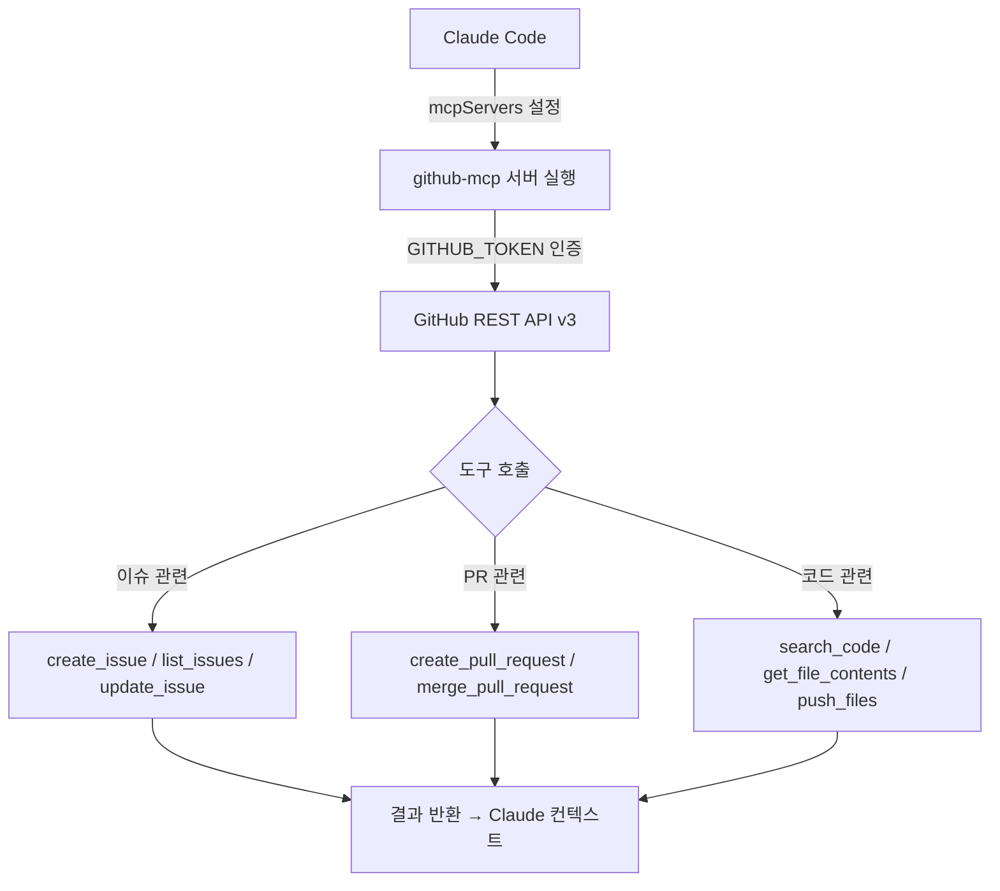

# github-mcp

## 핵심 개념 / 작동 원리

`github-mcp` 서버는 GitHub REST API v3를 래핑한 MCP 서버로, Claude가 대화 중에 GitHub 이슈·PR·코드를 직접 조작할 수 있게 합니다.



### 제공 도구 목록

| 도구 | 설명 |
|---|---|
| `create_or_update_file` | 레포 파일 생성 또는 수정 |
| `search_repositories` | GitHub 레포 검색 |
| `create_repository` | 새 레포 생성 |
| `get_file_contents` | 파일/디렉토리 내용 조회 |
| `push_files` | 여러 파일을 한 번에 커밋 |
| `create_issue` | 이슈 생성 |
| `create_pull_request` | PR 생성 |
| `fork_repository` | 레포 포크 |
| `create_branch` | 브랜치 생성 |
| `list_commits` | 커밋 목록 조회 |
| `list_issues` | 이슈 목록 조회 |
| `update_issue` | 이슈 수정 |
| `add_issue_comment` | 이슈에 댓글 추가 |
| `list_pull_requests` | PR 목록 조회 |
| `get_pull_request` | PR 상세 조회 |
| `merge_pull_request` | PR 머지 |
| `search_code` | 코드 검색 |
| `search_issues` | 이슈/PR 검색 |
| `get_issue` | 이슈 상세 조회 |

### 인증 방식

GitHub Personal Access Token(PAT)을 환경변수 `GITHUB_TOKEN`으로 설정합니다. 읽기 전용 작업이라면 `public_repo` 스코프로 충분하고, 이슈 생성·PR 머지 등에는 `repo` 스코프가 필요합니다.

## 한 줄 요약

GitHub API를 Claude에서 직접 호출할 수 있게 하는 MCP 서버로, 이슈 생성·PR 검토·코드 검색을 대화 중에 수행할 수 있습니다.

## 프로젝트에 도입하기

### 사전 요구사항

- Node.js 18+
- GitHub Personal Access Token 발급 ([GitHub Settings > Developer settings > Personal access tokens](https://github.com/settings/tokens))

### Claude Code `.claude/settings.json` 설정

```json
{
  "mcpServers": {
    "github": {
      "command": "npx",
      "args": ["-y", "@modelcontextprotocol/server-github"],
      "env": {
        "GITHUB_TOKEN": "ghp_여기에_토큰_입력"
      }
    }
  }
}
```

### Claude Desktop `claude_desktop_config.json` 설정

```json
{
  "mcpServers": {
    "github": {
      "command": "npx",
      "args": ["-y", "@modelcontextprotocol/server-github"],
      "env": {
        "GITHUB_TOKEN": "ghp_여기에_토큰_입력"
      }
    }
  }
}
```

**주의**: `GITHUB_TOKEN` 값을 설정 파일에 하드코딩하지 말고, 가능하면 환경변수나 비밀 관리 도구를 사용하세요.

## 실전 예제 (대학생 관점)

**상황**: Next.js 15 "동아리 공지 게시판" 프로젝트에서 팀 협업을 진행 중입니다. Claude와 대화하면서 GitHub 이슈를 생성하고 PR을 검토하려고 합니다.

**예제 1: 버그 이슈 생성**

```
공지 목록 API에서 페이지네이션이 작동하지 않는 버그를 발견했어.
GitHub 이슈로 등록해줘.

레포: mygithub05253/club-notice-board
제목: [Bug] 공지 목록 페이지네이션 미작동
내용: 페이지 2 이상 요청 시 항상 첫 페이지 결과 반환됨.
재현 방법, 예상 동작, 실제 동작 섹션 포함해서 작성해줘.
```

**예제 2: PR 코드 리뷰**

```
PR #42 내용을 가져와서 코드 리뷰해줘.
특히 Supabase RLS 정책 관련 보안 이슈가 있는지 확인해줘.
```

**예제 3: 유사 레포 코드 검색**

```
GitHub에서 Next.js App Router + Supabase Auth 조합으로 구현된
공개 레포의 middleware.ts 코드를 검색해서
세션 처리 패턴 3가지를 비교해줘.
```

**예제 4: 이슈 목록 조회 후 우선순위 정리**

```
mygithub05253/club-notice-board 레포의 열린 이슈 목록을 가져와서
버그/기능/개선 레이블로 분류하고 우선순위 순으로 정리해줘.
```

## 학습 포인트 / 흔한 함정

### 효과적인 사용 방법

- **이슈 템플릿 활용**: 이슈 생성 시 "버그 리포트 템플릿으로 작성해줘"처럼 요청하면 Claude가 구조화된 이슈를 만들어줍니다.
- **코드 검색 + 분석 연계**: `search_code`로 관련 코드를 가져온 뒤 바로 분석을 요청할 수 있습니다.
- **브랜치 전략 자동화**: `create_branch` → 코드 수정 → `push_files` → `create_pull_request` 흐름을 한 대화에서 처리할 수 있습니다.

### 흔한 함정

- **토큰 스코프 부족**: `repo` 스코프 없이 private 레포에 쓰기 작업을 시도하면 403 에러가 발생합니다. 필요한 스코프를 미리 확인하세요.
- **Rate Limit 초과**: 코드 검색은 API Rate Limit이 엄격합니다. 대량 검색 시 429 에러가 날 수 있습니다.
- **PR 머지 주의**: `merge_pull_request` 도구는 실제로 머지를 수행합니다. 프롬프트에서 명확히 요청한 경우에만 Claude가 실행하지만, 팀 프로젝트에서는 주의가 필요합니다.

### 보안 고려사항

- `GITHUB_TOKEN`은 강력한 권한을 가집니다. 설정 파일에 하드코딩하거나 git에 커밋하지 마세요.
- Fine-grained Personal Access Token을 사용해 레포별로 최소 권한을 부여하는 것을 권장합니다.
- 가능하면 읽기 전용 작업에는 별도의 제한된 토큰을 사용하세요.
- `.claude/settings.json`은 `.gitignore`에 추가하거나, 토큰을 환경변수로 분리하세요.

## 관련 리소스

- [filesystem-mcp](./filesystem-mcp.md) — 로컬 파일을 Claude에서 직접 조작하는 MCP. GitHub 코드 변경 전후로 함께 사용하면 유용합니다.
- [fetch-mcp](./fetch-mcp.md) — GitHub API를 토큰 없이 공개 정보만 가져올 때 대안으로 사용할 수 있습니다.
- [supabase-mcp](./supabase-mcp.md) — 코드 변경(github-mcp)과 DB 마이그레이션(supabase-mcp)을 하나의 워크플로로 연결할 수 있습니다.

---

| 항목 | 내용 |
|---|---|
| 원본 URL | https://github.com/modelcontextprotocol/servers/tree/main/src/github |
| 라이선스 | MIT |
| 해설 작성일 | 2026-04-12 |
| 작성자 | Claude-Code-Study 프로젝트 |
