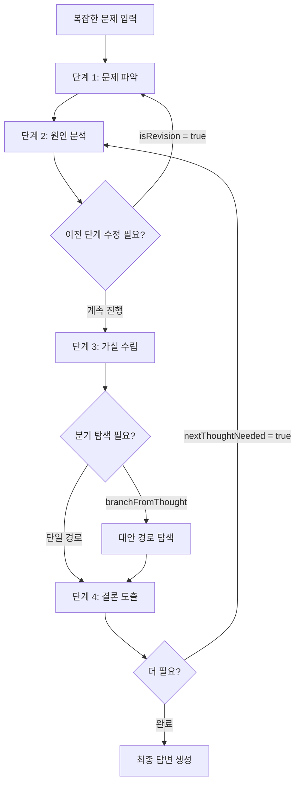

# sequential-thinking

## 핵심 개념 / 작동 원리

`sequential-thinking` MCP 서버는 `sequentialthinking` 도구 하나를 제공한다. Claude가 답변을 생성하기 전에 **사고 단계(thought)** 를 명시적으로 선언하고 순서대로 진행하도록 강제한다.



각 사고 단계는 다음 필드로 구성된다:

| 필드 | 설명 |
|---|---|
| `thought` | 현재 단계 추론 내용 |
| `thoughtNumber` | 현재 단계 번호 |
| `totalThoughts` | 예상 총 단계 수 (동적 조정 가능) |
| `nextThoughtNeeded` | 다음 단계 필요 여부 |
| `isRevision` | 이전 단계를 수정하는지 여부 |
| `branchFromThought` | 분기 시작 단계 |

핵심 특징:
- **동적 단계 수 조정**: 문제가 예상보다 복잡하면 `totalThoughts`를 늘릴 수 있음
- **역방향 수정**: 앞 단계 추론이 잘못됐으면 되돌아가 수정 가능
- **분기 탐색**: 여러 접근법을 병렬로 비교
- **최소 3단계 권장**: 단순 질문에는 오버헤드가 됨

## 한 줄 요약

복잡한 문제를 단계별 사고 블록으로 분해해 Claude의 추론 정확도와 투명성을 높이는 MCP 서버.

## 프로젝트에 도입하기

### `.claude/settings.json` 설정

```json
{
  "mcpServers": {
    "sequential-thinking": {
      "command": "npx",
      "args": ["-y", "@modelcontextprotocol/server-sequential-thinking"]
    }
  }
}
```

### 설치 확인

```bash
# 설정 후 Claude Code 재시작, 아래 명령으로 도구 활성화 확인
# Claude에게 다음 질문:
# "sequential thinking 도구를 사용할 수 있어?"
```

### Claude Desktop (`claude_desktop_config.json`) 설정

```json
{
  "mcpServers": {
    "sequential-thinking": {
      "command": "npx",
      "args": ["-y", "@modelcontextprotocol/server-sequential-thinking"]
    }
  }
}
```

사전 요구사항: Node.js 18+, npx 사용 가능 환경.

## 실전 예제 (대학생 관점)

**상황**: Next.js 15 "동아리 공지 게시판"에서 공지 작성 API에 간헐적 403 에러가 발생했다.

```text
/mcp sequential-thinking 을 사용해서 다음 버그를 단계별로 분석해줘:

- Next.js 15 App Router, Supabase Auth 사용
- POST /api/notices 에서 간헐적 403 발생
- 에러 로그: "Row Level Security policy violation"
- 재현 조건: 로그인 직후 빠르게 공지 작성 시 주로 발생
```

Claude의 순차 사고 흐름:

```
단계 1: 403 에러 발생 조건 분석
 → RLS 정책 위반 + "로그인 직후 빠르게" = 타이밍 문제 의심

단계 2: Supabase Auth 토큰 전달 경로 추적
 → 클라이언트 → API Route → Supabase 클라이언트 순서 확인
 → supabaseServerClient()에서 쿠키/헤더 읽는 시점 문제?

단계 3: App Router 특성과 세션 동기화
 → 미들웨어에서 세션 갱신 후 쿠키가 아직 전파 안 됐을 수 있음

단계 4: 근본 원인 결론 (isRevision = false)
 → 미들웨어의 session refresh 완료 전에 Route Handler가 구 쿠키로 Supabase 클라이언트 생성
 → 해결: middleware에서 세션 갱신 후 응답 헤더에 새 토큰 포함
```

## 학습 포인트 / 흔한 함정

- **복잡도 기준 적용**: 조건이 3개 이상 얽힌 문제에서 효과가 뚜렷하다. 단순 질문에는 응답이 오히려 느려진다.
- **단계 수 힌트 제공**: "5단계로 분석해줘"처럼 힌트를 주면 Claude가 적절한 `totalThoughts`를 설정한다.
- **수정 기능 활용**: 중간 단계에서 앞 단계를 수정하는 것을 보면 그 지점이 핵심 논리 분기점이다.
- **단계 수 과다 주의**: 10단계 이상으로 설정하면 토큰 소비가 급증한다. 5~7단계가 일반적인 상한선.
- **결과만 보고 과정 무시 금지**: 이 MCP의 진짜 가치는 중간 단계의 추론 과정이다.
- **보안 리스크 없음**: 외부 네트워크/파일시스템에 접근하지 않는 순수 추론 구조화 도구.

## 관련 리소스

- [조사 (investigate)](/skills/investigate) — 유사한 4단계 근본 원인 분석 스킬
- [체계적 디버깅 (systematic-debugging)](/skills/systematic-debugging) — 디버깅 의사결정 체계
- [GitHub MCP](/mcp/github-mcp) — 연동 활용 MCP
- [Fetch MCP](/mcp/fetch-mcp) — 다른 인기 MCP 서버

---

| 항목 | 내용 |
|---|---|
| 원본 URL | https://github.com/modelcontextprotocol/servers/tree/main/src/sequentialthinking |
| 작성자/출처 | Anthropic (Model Context Protocol) |
| 라이선스 | MIT |
| 해설 작성일 | 2026-04-12 |
