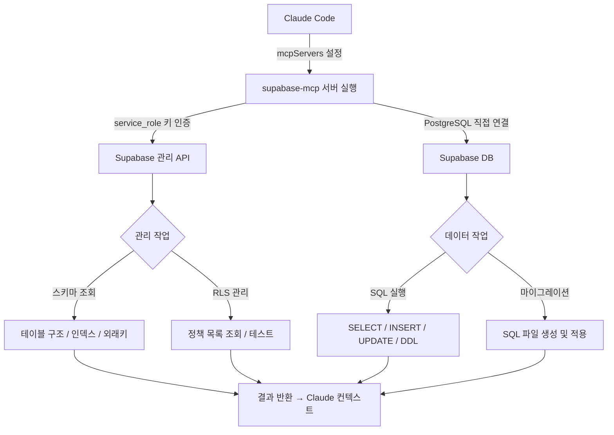

# supabase-mcp

## 핵심 개념 / 작동 원리

`supabase-mcp`는 Supabase의 관리 API와 PostgreSQL 연결을 통해 Claude가 프로젝트 데이터베이스를 직접 조작할 수 있게 합니다.



**주의**: Supabase MCP 서버는 2024~2025년 사이 여러 커뮤니티 버전이 등장했으며, 공식 Supabase에서도 자체 MCP를 제공하기 시작했습니다. 설치 전 최신 공식 가이드를 확인하세요.

참고 링크:
- Supabase 공식 MCP: [Supabase 공식 문서의 MCP 섹션](https://supabase.com/docs/guides/getting-started/mcp) 참조
- 커뮤니티 버전: https://github.com/supabase-community/supabase-mcp

### 주요 기능

- **스키마 조회**: 테이블, 컬럼, 인덱스, 외래키 구조 파악
- **SQL 실행**: SELECT, INSERT, UPDATE, DELETE, DDL 등 직접 실행
- **RLS 정책 관리**: 정책 목록 조회 및 테스트
- **Supabase 관리 API 연동**: 프로젝트 설정, Edge Functions, Storage 등 관리
- **마이그레이션 지원**: SQL 파일 기반 마이그레이션 생성 및 적용

### 인증 방식

Supabase `service_role` 키를 사용합니다. 이 키는 RLS를 우회하는 강력한 권한을 가지므로 보안에 특히 주의가 필요합니다.

## 한 줄 요약

Supabase 프로젝트를 Claude에서 직접 관리할 수 있는 MCP 서버로, 테이블 조회·RLS 정책 확인·SQL 실행을 대화 중에 처리합니다.

## 프로젝트에 도입하기

### 사전 요구사항

- Node.js 18+
- Supabase 프로젝트 생성 완료
- Supabase `service_role` 키 (프로젝트 Settings > API)
- Supabase 프로젝트 URL

### Claude Code `.claude/settings.json` 설정

아래는 커뮤니티 버전 기준 예시입니다. 실제 패키지명과 설정 방식은 최신 README를 확인하세요.

```json
{
  "mcpServers": {
    "supabase": {
      "command": "npx",
      "args": ["-y", "@supabase-community/supabase-mcp"],
      "env": {
        "SUPABASE_URL": "https://your-project-ref.supabase.co",
        "SUPABASE_SERVICE_ROLE_KEY": "eyJhbGci..."
      }
    }
  }
}
```

### 공식 Supabase MCP (2025년 기준)

Supabase가 공식 MCP를 제공하는 경우 아래 형식을 사용합니다. 정확한 방법은 [Supabase 공식 문서](https://supabase.com/docs)를 참고하세요.

```json
{
  "mcpServers": {
    "supabase": {
      "command": "npx",
      "args": [
        "-y",
        "@supabase/mcp-server-supabase@latest",
        "--access-token",
        "your-personal-access-token"
      ]
    }
  }
}
```

**중요**: `service_role` 키를 설정 파일에 하드코딩하지 마세요. 환경변수로 분리하거나 `.claude/settings.json`을 `.gitignore`에 추가하세요.

## 실전 예제 (대학생 관점)

**상황**: Next.js 15 "동아리 공지 게시판" 프로젝트에서 Supabase를 데이터베이스로 사용합니다. 아래 스키마가 구성되어 있습니다:
- `profiles` 테이블: 사용자 프로필
- `notices` 테이블: 공지사항
- `comments` 테이블: 댓글

**예제 1: 스키마 파악**

```
Supabase 프로젝트의 모든 테이블 구조를 보여줘.
notices 테이블의 컬럼, 타입, 제약조건을 특히 자세히 설명해줘.
```

**예제 2: RLS 정책 검증**

```
notices 테이블에 설정된 RLS 정책 목록을 보여줘.
그리고 실제로 일반 사용자 권한으로 notices를 조회하는
SQL을 실행해서 RLS가 제대로 작동하는지 확인해줘.
```

**예제 3: 마이그레이션 작성 및 적용**

```
notices 테이블에 is_pinned(boolean, 기본값 false) 컬럼을
추가하는 마이그레이션 SQL을 작성하고 적용해줘.
적용 후 테이블 구조가 변경됐는지 확인해줘.
```

**예제 4: 데이터 분석**

```
최근 30일간 notices 테이블에서:
1. 공지 작성 수가 가장 많은 상위 5명 사용자
2. 댓글이 가장 많이 달린 공지 TOP 5
를 SQL로 조회해줘.
```

**예제 5: 성능 문제 진단**

```
notices 테이블의 현재 인덱스 현황을 보여줘.
그리고 "작성자별 최신 공지 조회" 쿼리에 적합한
인덱스가 빠져 있다면 추가해줘.
```

## 학습 포인트 / 흔한 함정

### 효과적인 사용 방법

- **스키마 우선 파악**: 대화 시작 시 "현재 테이블 구조를 모두 보여줘"로 Claude에게 스키마 컨텍스트를 제공하면 이후 모든 SQL 생성 품질이 높아집니다.
- **트랜잭션 활용**: 여러 테이블을 동시에 수정할 때는 트랜잭션으로 처리해 일관성을 유지하세요.
- **개발/프로덕션 분리**: 개발 Supabase 프로젝트와 프로덕션 프로젝트를 분리하고, MCP에는 개발 프로젝트만 연결하세요.

### 흔한 함정

- **service_role 키 노출**: 이 키는 RLS를 완전히 우회합니다. `.env` 파일에서도 별도 관리하고, 절대로 git에 커밋하지 마세요.
- **프로덕션 DB 직접 연결**: Claude가 실수로 데이터를 삭제하거나 스키마를 변경할 수 있습니다. 반드시 개발/스테이징 환경에서만 사용하고, 프로덕션은 읽기 전용으로만 연결하세요.
- **버전 혼재**: 커뮤니티 버전과 공식 버전의 설정 방식이 다릅니다. 사용하려는 버전의 최신 문서를 반드시 확인하세요.
- **SQL Injection 위험**: 프롬프트에 사용자 입력을 그대로 넣어 SQL을 생성하지 마세요. Claude가 생성한 SQL을 실행하기 전에 검토하는 습관을 들이세요.

### 보안 고려사항

- `service_role` 키는 데이터베이스 관리자 권한에 준하는 강력한 키입니다. 이 키가 노출되면 모든 데이터가 위험에 처합니다.
- 프로덕션 환경에서는 절대 MCP를 통한 직접 조작을 피하고, 마이그레이션 파일 + CI/CD 파이프라인을 통해 변경사항을 관리하세요.
- Supabase 프로젝트에서 "Database Webhooks"나 "Realtime" 기능을 통해 비정상적인 접근을 모니터링하는 것을 권장합니다.

## 관련 리소스

- [github-mcp](./github-mcp.md) — 마이그레이션 SQL 파일을 작성(supabase-mcp)하고 GitHub에 PR로 올리는 워크플로(github-mcp)를 조합할 수 있습니다.
- [fetch-mcp](./fetch-mcp.md) — Supabase REST API를 fetch-mcp로 직접 호출해 RLS 적용 결과를 외부 관점에서 검증할 수 있습니다.
- [위험 명령어 차단 훅](../hooks/block-dangerous.md) — `DROP TABLE` 같은 위험한 SQL 실행을 Claude가 시도할 때 사전 차단하는 안전망으로 함께 사용하세요.

---

| 항목 | 내용 |
|---|---|
| 원본 URL | https://github.com/supabase-community/supabase-mcp |
| 라이선스 | MIT |
| 해설 작성일 | 2026-04-12 |
| 작성자 | Claude-Code-Study 프로젝트 |
