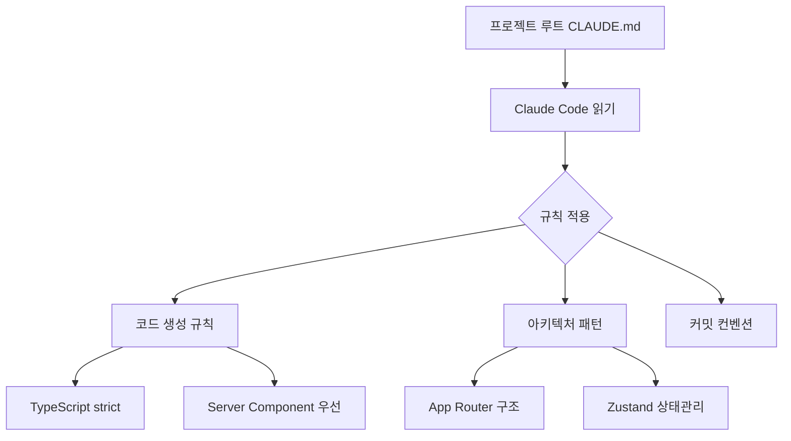

# Next.js 15 프로젝트용 CLAUDE.md 템플릿

## 1. 핵심 개념 / 작동 원리



CLAUDE.md는 프로젝트 루트에 위치한 설정 파일로, Claude Code가 해당 프로젝트에서 작업할 때 따라야 할 규칙을 정의합니다. Next.js 15 App Router 기반 프로젝트에 최적화된 템플릿입니다.

## 2. 한 줄 요약

Next.js 15 + TypeScript + Tailwind CSS 프로젝트에 즉시 사용 가능한 CLAUDE.md 템플릿으로, Claude Code가 App Router 패턴, Server Component 우선 원칙, shadcn/ui 컴포넌트를 올바르게 활용하도록 안내합니다.

## 3. 프로젝트에 도입하기

프로젝트 루트에 `CLAUDE.md` 파일을 생성하고 아래 템플릿을 붙여넣기 합니다:

```bash
# 프로젝트 루트에서 실행
touch CLAUDE.md
```

```markdown
# [프로젝트명] CLAUDE.md

## 언어 및 코드 스타일
- 모든 주석, 커밋 메시지: **한국어**
- TypeScript strict 모드, `any` 사용 금지
- 들여쓰기 2 spaces
- 변수/함수: camelCase, 컴포넌트: PascalCase, 상수: UPPER_SNAKE_CASE

## 프레임워크 규칙
- **Next.js 15 App Router** (pages/ 라우터 금지)
- **Server Component 우선**: `"use client"` 지시어는 꼭 필요한 경우만
- **Tailwind CSS** + shadcn/ui 컴포넌트 우선 사용
- **Zustand**: 클라이언트 전역 상태만 (서버 상태는 React Query 또는 Server Action)

## 디렉토리 구조
\`\`\`
src/
  app/          # Next.js App Router 페이지
  components/
    ui/         # shadcn/ui 컴포넌트 (수정 최소화)
    features/   # 기능별 컴포넌트
  lib/          # 유틸리티, helpers
  store/        # Zustand 스토어
  types/        # TypeScript 타입 정의
  actions/      # Server Actions
\`\`\`

## 커밋 컨벤션
- feat: 새 기능
- fix: 버그 수정
- docs: 문서 변경
- refactor: 리팩토링

## 금지 사항
- `any` 타입
- `pages/` 라우터 사용
- 직접 fetch 없이 Server Action 우회
- console.log 잔류 (개발 완료 후)
```

## 4. 실전 예제

동아리 공지 게시판(Next.js 15 + Supabase) 프로젝트에 적용하는 예시:

```markdown
# 동아리 공지 게시판 CLAUDE.md

## 스택
- Next.js 15 App Router + TypeScript strict
- Supabase (DB + Auth + Storage)
- Tailwind CSS + shadcn/ui
- Zustand (클라이언트 상태)
- React Hook Form + Zod (폼 검증)

## 특이 사항
- 인증: Supabase Auth (소셜 로그인 포함)
- 이미지 업로드: Supabase Storage → Next.js Image 컴포넌트
- 실시간 알림: Supabase Realtime subscription
- API 경로: /api/ 미사용, Server Action 전용

## 폴더 구조
src/
  app/
    (auth)/     # 인증 필요 없는 페이지 그룹
    (dashboard)/ # 로그인 후 페이지 그룹
  components/
    notices/    # 공지 관련 컴포넌트
    auth/       # 인증 관련 컴포넌트
```

## 5. 학습 포인트 / 흔한 함정

**Server Component 우선 실수**:
```typescript
// ❌ 불필요하게 클라이언트 컴포넌트로 만드는 경우
"use client";
export default function UserName({ name }: { name: string }) {
  return <span>{name}</span>; // 상호작용 없으면 Server Component로!
}

// ✅ Server Component로 충분
export default function UserName({ name }: { name: string }) {
  return <span>{name}</span>;
}
```

**흔한 함정**:
- `"use client"` 남발 → 번들 크기 증가
- Server Action에서 `revalidatePath` 누락 → 캐시 갱신 안 됨
- shadcn/ui 컴포넌트 직접 수정 → 업데이트 시 충돌

## 6. 관련 리소스

- [MCP 풀스택 설정 조합](./mcp-settings-fullstack.md)
- [Spring Boot 프로젝트용 CLAUDE.md](./custom-claude-md-spring.md)
- [통합 셋업 프롬프트](../prompts/integrated-setup.md)
- [한국어 커밋 메시지 Hook](./hook-auto-commit-msg.md)

## 7. 원본 링크 & 저작권

| 항목 | 내용 |
|------|------|
| 원본 URL | https://github.com/mygithub05253/Claude-Code-Study |
| 작성자 | Claude-Code-Study 커뮤니티 |
| 라이선스 | MIT |
| 해설 작성일 | 2026-04-13 |
| 카테고리 | my-collection / 커스텀 리소스 |
