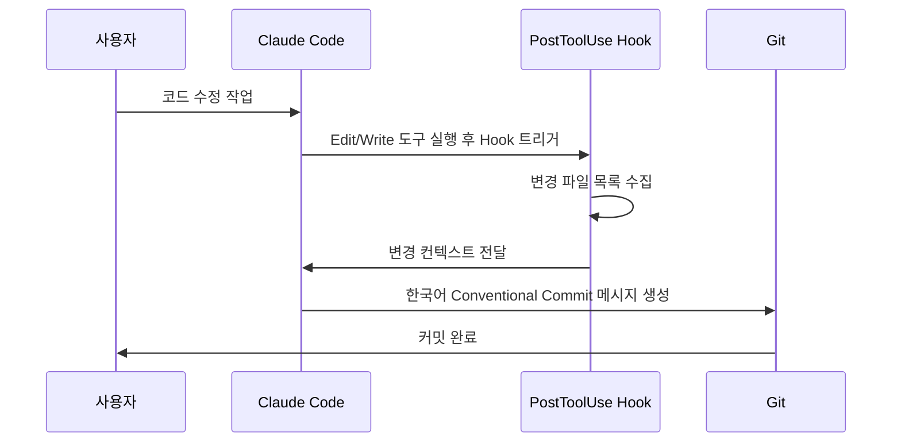

# 한국어 커밋 메시지 자동 생성 Hook

## 1. 핵심 개념 / 작동 원리



PostToolUse Hook을 활용하여 파일 수정 후 자동으로 한국어 Conventional Commits 형식의 커밋 메시지를 생성하는 패턴입니다.

## 2. 한 줄 요약

Edit/Write 도구 실행 후 변경 내용을 분석해 `feat: 공지 CRUD API 추가` 형식의 한국어 커밋 메시지를 자동 생성하여 팀 커밋 컨벤션을 강제합니다.

## 3. 프로젝트에 도입하기

`~/.claude/settings.json`에 다음 Hook 설정을 추가합니다:

```json
{
  "hooks": {
    "PostToolUse": [
      {
        "matcher": "Edit|Write",
        "hooks": [
          {
            "type": "command",
            "command": "node C:/Users/[username]/.claude/hooks/suggest-commit-msg.js"
          }
        ]
      }
    ]
  }
}
```

`~/.claude/hooks/suggest-commit-msg.js` 파일 생성:

```javascript
#!/usr/bin/env node
/**
 * PostToolUse Hook: 파일 수정 후 한국어 커밋 메시지 제안
 * stdin에서 도구 실행 결과를 읽어 컨텍스트 제공
 */
const readline = require('readline');

const rl = readline.createInterface({ input: process.stdin });
const lines = [];

rl.on('line', (line) => lines.push(line));
rl.on('close', () => {
  const input = lines.join('\n');
  // 변경된 파일 경로 추출 (hook이 JSON 형태로 전달)
  try {
    const data = JSON.parse(input);
    const filePath = data?.tool_input?.file_path || data?.tool_input?.path || '';
    if (filePath) {
      process.stderr.write(
        `[Hook] 변경 파일: ${filePath}\n` +
        `커밋 메시지 예시: feat: [기능 설명]\n` +
        `한국어 Conventional Commits 형식을 유지하세요.\n`
      );
    }
  } catch {
    // JSON 파싱 실패 시 무시
  }
  process.exit(0);
});
```

## 4. 실전 예제

동아리 공지 게시판 개발 중 자동 커밋 메시지 생성:

```
[시나리오]
1. Claude Code가 NoticeService.java 수정
2. PostToolUse Hook 트리거
3. Hook이 변경 파일 감지: src/main/java/.../NoticeService.java
4. Claude Code에 컨텍스트 전달
5. 생성된 커밋 메시지:
   "feat: 공지사항 CRUD 서비스 계층 구현

   - 공지 생성/조회/수정/삭제 메서드 추가
   - @Transactional 읽기 전용 기본값 적용
   - DTO 변환 로직 포함

   Co-Authored-By: Claude Sonnet 4.6 <noreply@anthropic.com>"
```

## 5. 학습 포인트 / 흔한 함정

**Conventional Commits 형식**:
```
type(scope): 한국어 설명

feat:     새 기능 추가
fix:      버그 수정
docs:     문서 변경
refactor: 리팩토링 (기능 변경 없음)
test:     테스트 추가/수정
chore:    빌드/설정 변경
```

**흔한 함정**:
- Hook 스크립트에 실행 권한 필요 (Linux/Mac: `chmod +x`)
- Windows에서는 `node` 경로가 PATH에 있어야 함
- stdin 읽기 타임아웃 주의 (긴 처리 시 `process.exit(0)` 명시)

## 6. 관련 리소스

- [Hooks 레시피 허브](../hooks/)
- [통합 셋업 프롬프트](../prompts/setup-hooks.md)
- [MCP 풀스택 설정](./mcp-settings-fullstack.md)
- [Next.js CLAUDE.md 템플릿](./custom-claude-md-nextjs.md)

## 7. 원본 링크 & 저작권

| 항목 | 내용 |
|------|------|
| 원본 URL | https://github.com/mygithub05253/Claude-Code-Study |
| 작성자 | Claude-Code-Study 커뮤니티 |
| 라이선스 | MIT |
| 해설 작성일 | 2026-04-13 |
| 카테고리 | my-collection / Hooks 레시피 |
