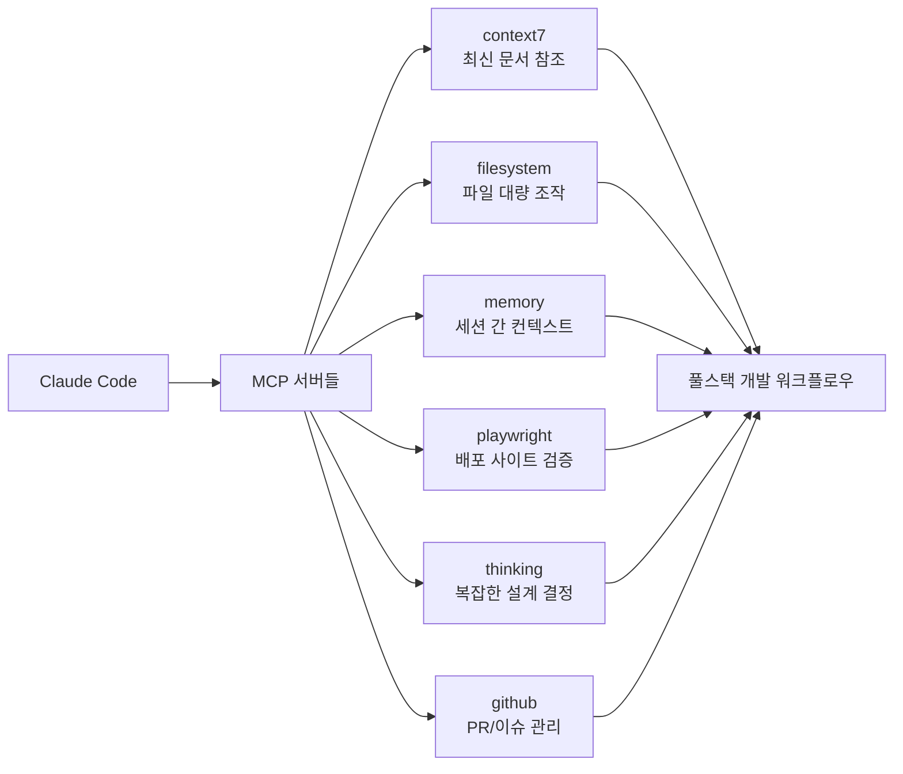

# 풀스택 MCP 설정 조합

## 1. 핵심 개념 / 작동 원리



풀스택 프로젝트(Next.js 15 프론트엔드 + Spring Boot/Node.js 백엔드)에서 Claude Code를 최대한 활용하기 위한 MCP 서버 조합과 설정 가이드입니다.

## 2. 한 줄 요약

프론트엔드(Next.js)와 백엔드(Spring Boot/Express)를 동시에 개발할 때 context7 + filesystem + memory + playwright + thinking을 조합해 최신 문서 참조, 파일 대량 조작, 세션 컨텍스트 유지, 시각적 검증을 자동화합니다.

## 3. 프로젝트에 도입하기

```bash
# Windows 환경 (cmd /c 래퍼 필수)
claude mcp add context7 -- cmd /c npx -y @upstash/context7-mcp@latest
claude mcp add thinking -- cmd /c npx -y @modelcontextprotocol/server-sequential-thinking
claude mcp add playwright -- cmd /c npx -y @playwright/mcp@latest
claude mcp add filesystem -- cmd /c npx -y @modelcontextprotocol/server-filesystem "C:/Users/[username]/workspace"
claude mcp add memory -- cmd /c npx -y @modelcontextprotocol/server-memory
claude mcp add --transport http github https://api.githubcopilot.com/mcp/

# 설치 확인
claude mcp list
```

### 토큰 관리 전략
```
기본 활성: context7 + filesystem + memory + thinking
QA/검증 시: playwright 추가 활성화
PR 작업 시: github 추가 활성화
→ 동시 활성 5~6개 유지
```

## 4. 실전 예제

**동아리 공지 게시판 개발 시나리오**:

```
시나리오: Next.js 15 프론트 + Spring Boot 백엔드 풀스택 개발

1. 새 기능 설계 (thinking MCP 활용)
   "공지 CRUD API 설계해줘" → Sequential Thinking으로 단계별 분석

2. 최신 문서 참조 (context7 MCP 활용)
   "use context7" + "Next.js 15 Server Actions 공식 문서 기준으로 작성"

3. 대량 파일 생성 (filesystem MCP 활용)
   여러 컴포넌트/서비스 파일 동시 생성

4. 배포 후 검증 (playwright MCP 활용)
   "배포된 /notices 페이지 스크린샷 찍어서 확인해줘"

5. PR 생성 (github MCP 활용)
   GitHub OAuth 인증 후 자동 PR 생성
```

## 5. 학습 포인트 / 흔한 함정

**컨텍스트 창 관리**:
- Playwright는 도구 22개, ~3,442 토큰 → QA 시만 활성화
- context7은 "use context7" 명시적 트리거 사용
- memory MCP는 긴 번역/분석 작업 시 중간 저장에 활용

**흔한 함정**:
- MCP 서버 너무 많이 활성화 → 토큰 소모 증가
- Windows에서 `cmd /c` 없이 npx 직접 호출 시 실패
- GitHub MCP HTTP 모드는 OAuth 인증 필요 (첫 사용 시 브라우저 인증)

## 6. 관련 리소스

- [MCP 서버 설치 프롬프트](../prompts/install-mcp.md)
- [Next.js 15 CLAUDE.md 템플릿](./custom-claude-md-nextjs.md)
- [Spring Boot CLAUDE.md 템플릿](./custom-claude-md-spring.md)
- [MCP 서버 해설 허브](../mcp/)

## 7. 원본 링크 & 저작권

| 항목 | 내용 |
|------|------|
| 원본 URL | https://github.com/mygithub05253/Claude-Code-Study |
| 작성자 | Claude-Code-Study 커뮤니티 |
| 라이선스 | MIT |
| 해설 작성일 | 2026-04-13 |
| 카테고리 | my-collection / MCP 설정 |
