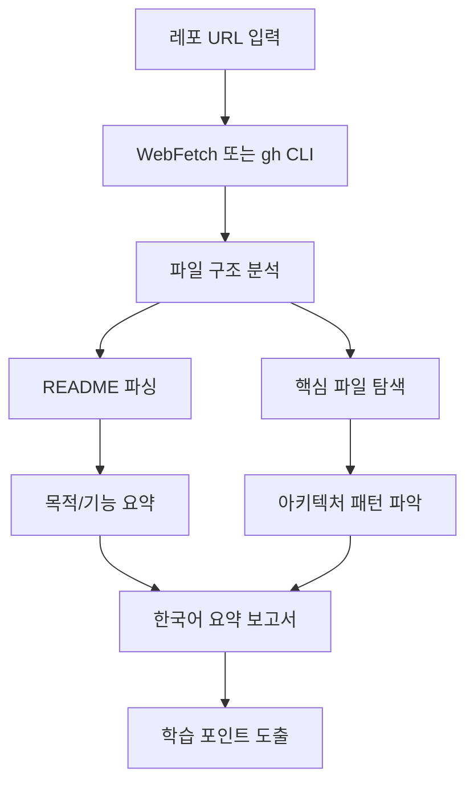

# 외부 레포 분석 프롬프트

## 1. 핵심 개념 / 작동 원리



GitHub 레포지토리를 체계적으로 분석하여 한국어 요약 보고서를 생성하는 프롬프트 템플릿입니다. 외부 코드 복제 없이 링크와 요약만 제공합니다.

## 2. 한 줄 요약

GitHub URL을 주면 레포의 목적, 핵심 기술 스택, 아키텍처 패턴, 학습 가치를 한국어로 요약하여 `content/ko/repos/` 해설 파일 형식으로 출력합니다.

## 3. 프롬프트 템플릿

```
다음 GitHub 레포지토리를 분석하고 한국어 해설 파일을 작성해줘.

레포 URL: [GitHub URL]

분석 요청 사항:
1. 레포의 핵심 목적과 해결하는 문제
2. 기술 스택 (언어, 프레임워크, 주요 패키지)
3. 아키텍처 패턴 (있는 경우)
4. Claude Code / AI 개발 워크플로우와의 연관성
5. 대학생이 배울 수 있는 핵심 포인트 3가지
6. 실제 프로젝트 적용 시나리오

출력 형식:
- content/ko/repos/ 7섹션 구조
- frontmatter: title, source_url, source_author, license, tags, last_reviewed
- 원본 코드 복제 금지, 링크 + 한국어 요약만

외부 원본 코드를 복사하지 말고, 링크와 한국어 설명만 포함해줘.
```

## 4. 실전 예제

```
분석 요청: https://github.com/vercel/next.js

출력 예시:
---
title: "Next.js — React 풀스택 프레임워크"
source_url: "https://github.com/vercel/next.js"
source_author: "Vercel"
license: "MIT"
tags: ["Next.js", "React", "TypeScript", "풀스택"]
---

# Next.js — React 풀스택 프레임워크

## 1. 핵심 개념
Next.js는 React 기반 풀스택 프레임워크로...
[mermaid 다이어그램]

## 2. 한 줄 요약
App Router + Server Components로 SEO와 성능을 동시에 해결하는
현대적 React 풀스택 프레임워크
...
```

## 5. 학습 포인트 / 흔한 함정

- 원본 코드 복사 금지 (저작권 준수)
- README가 없는 레포는 package.json, 주요 파일로 유추
- star 수보다 코드 품질과 학습 가치에 집중

## 6. 관련 리소스

- [GitHub 레포 해설 허브](../repos/)
- [생태계 탐색 허브](../ecosystem/)
- [통합 셋업 프롬프트](./integrated-setup.md)

## 7. 원본 링크 & 저작권

| 항목 | 내용 |
|------|------|
| 원본 URL | https://github.com/mygithub05253/Claude-Code-Study |
| 작성자 | Claude-Code-Study 커뮤니티 |
| 라이선스 | MIT |
| 해설 작성일 | 2026-04-13 |
| 카테고리 | prompts / 레포 분석 |
