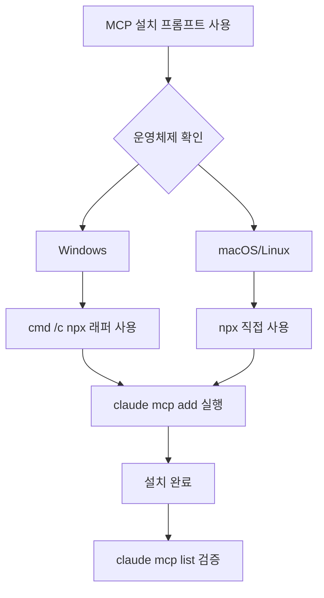

# MCP 서버 설치 프롬프트

## 1. 핵심 개념 / 작동 원리



Windows 환경에서 MCP 서버를 설치할 때 `cmd /c` 래퍼가 필요한 이유와 각 MCP 서버의 역할을 설명하고, 올바른 설치 명령어를 제공하는 프롬프트 템플릿입니다.

## 2. 한 줄 요약

"Windows에서 MCP 서버를 설치해줘" 요청 시 `cmd /c npx` 래퍼를 자동 적용하고 context7, filesystem, memory, playwright, thinking, github MCP를 순서대로 설치합니다.

## 3. 프롬프트 템플릿

```
다음 MCP 서버들을 Windows 환경에 설치해줘.
Windows에서는 반드시 cmd /c 래퍼를 사용해야 해.

설치 목록:
1. context7 (@upstash/context7-mcp@latest) - VitePress/Vue/TS 최신 문서 참조
2. thinking (@modelcontextprotocol/server-sequential-thinking) - 복잡한 설계 결정
3. playwright (@playwright/mcp@latest) - 배포 사이트 시각적 검증
4. filesystem (@modelcontextprotocol/server-filesystem) - 파일 대량 조작
   경로: C:/Users/[사용자명]/workspace
5. memory (@modelcontextprotocol/server-memory) - 세션 간 컨텍스트 유지
6. github (HTTP MCP) - PR/이슈 관리

설치 후 claude mcp list로 확인해줘.
```

## 4. 실전 예제

**실제 사용 시나리오**:

```bash
# context7
claude mcp add context7 -- cmd /c npx -y @upstash/context7-mcp@latest

# sequential thinking
claude mcp add thinking -- cmd /c npx -y @modelcontextprotocol/server-sequential-thinking

# playwright
claude mcp add playwright -- cmd /c npx -y @playwright/mcp@latest

# filesystem (경로 수정 필요)
claude mcp add filesystem -- cmd /c npx -y @modelcontextprotocol/server-filesystem "C:/Users/[username]/workspace"

# memory
claude mcp add memory -- cmd /c npx -y @modelcontextprotocol/server-memory

# github (HTTP 모드, OAuth 인증 필요)
claude mcp add --transport http github https://api.githubcopilot.com/mcp/
```

## 5. 학습 포인트 / 흔한 함정

- Windows Git Bash에서 npx 실행 시 경로 문제 → `cmd /c` 필수
- `claude mcp list` 출력 없으면 CLI 버전 업데이트 필요
- GitHub MCP는 초기 인증 시 브라우저 팝업 발생

## 6. 관련 리소스

- [MCP 풀스택 설정 조합](../my-collection/mcp-settings-fullstack.md)
- [MCP 서버 해설 허브](../mcp/)
- [통합 셋업 프롬프트](./integrated-setup.md)

## 7. 원본 링크 & 저작권

| 항목 | 내용 |
|------|------|
| 원본 URL | https://github.com/mygithub05253/Claude-Code-Study |
| 작성자 | Claude-Code-Study 커뮤니티 |
| 라이선스 | MIT |
| 해설 작성일 | 2026-04-13 |
| 카테고리 | prompts / MCP 설치 |
