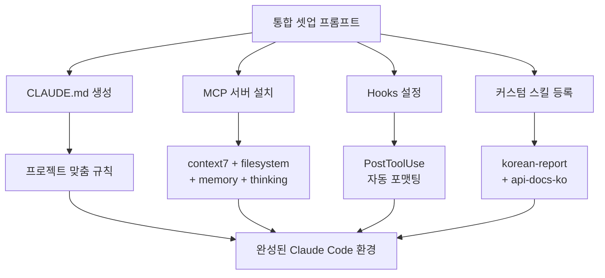

# 통합 셋업 프롬프트

## 1. 핵심 개념 / 작동 원리



새 프로젝트를 시작할 때 CLAUDE.md + MCP 서버 + Hooks + 커스텀 스킬을 한 번에 설정하는 통합 프롬프트입니다.

## 2. 한 줄 요약

프로젝트 스택(Next.js/Spring Boot)과 목적을 알려주면 CLAUDE.md, MCP 설정, Hooks, 커스텀 스킬을 모두 한 번에 셋업합니다.

## 3. 프롬프트 템플릿

```
새 프로젝트에 Claude Code 환경을 완전히 셋업해줘.

프로젝트 정보:
- 이름: [프로젝트명]
- 스택: Next.js 15 + TypeScript / Spring Boot 3 / [기타]
- 목적: [프로젝트 목적 1-2줄]
- 팀 규모: [인원]
- 주요 기능: [핵심 기능 3개 이내]

셋업 요청:
1. CLAUDE.md 생성 (프로젝트 맞춤 규칙)
2. MCP 서버 설치 (Windows 환경, cmd /c 래퍼)
   - 필수: context7, filesystem, memory, thinking
   - 선택: playwright(QA), github(PR관리)
3. Hooks 설정 (.claude/settings.json)
   - PostToolUse: 자동 Prettier 포맷팅
   - PostToolUse: ESLint 자동 검사 (선택)
4. 커스텀 스킬 등록 (~/.claude/skills/)
   - korean-report: 한국어 진행 보고서
   - [스택별 추가 스킬]

운영체제: Windows 11
언어: 한국어 (주석/커밋 메시지 모두 한국어)
```

## 4. 실전 예제

**동아리 공지 게시판 프로젝트 완전 셋업**:

```
입력:
- 이름: club-notice-board
- 스택: Next.js 15 + Spring Boot 3
- 목적: 동아리 공지 게시판 풀스택 앱
- 팀: 3명
- 기능: 공지 CRUD, 소셜 로그인, 파일 첨부

생성 파일:
1. CLAUDE.md (Next.js + Spring Boot 혼합 규칙)
2. MCP: 6개 서버 설치 명령어
3. .claude/settings.json (Prettier + ESLint Hooks)
4. ~/.claude/skills/korean-report.md
5. ~/.claude/skills/api-docs-ko.md
```

## 5. 학습 포인트 / 흔한 함정

- CLAUDE.md가 너무 길면 토큰 낭비 → 핵심 규칙 20줄 이내
- MCP 서버는 동시 5~6개 이하 유지
- Hooks 실패 시 작업 차단 주의 (`|| true` 패턴)
- 프로젝트 CLAUDE.md가 전역 `~/.claude/CLAUDE.md`를 **오버라이드** 함

## 6. 관련 리소스

- [MCP 서버 설치 프롬프트](./install-mcp.md)
- [Hooks 설정 프롬프트](./setup-hooks.md)
- [커스텀 스킬 작성 프롬프트](./write-custom-skill.md)
- [Sub-agent 패턴 프롬프트](./subagent-pattern.md)
- [Next.js CLAUDE.md 템플릿](../my-collection/custom-claude-md-nextjs.md)

## 7. 원본 링크 & 저작권

| 항목 | 내용 |
|------|------|
| 원본 URL | https://github.com/mygithub05253/Claude-Code-Study |
| 작성자 | Claude-Code-Study 커뮤니티 |
| 라이선스 | MIT |
| 해설 작성일 | 2026-04-13 |
| 카테고리 | prompts / 통합 셋업 |
