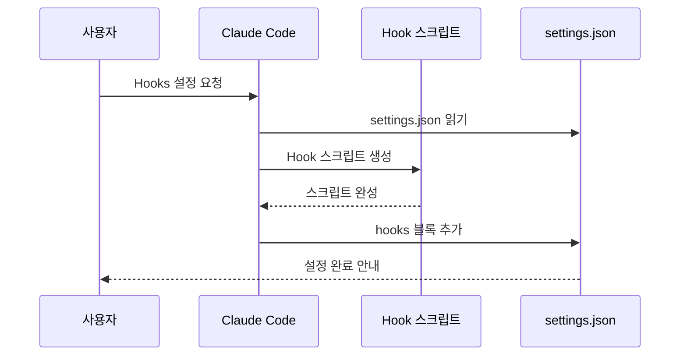

# Hooks 설정 프롬프트

## 1. 핵심 개념 / 작동 원리



Claude Code Hooks는 도구 실행 전후, 세션 시작/종료 시 자동으로 실행되는 셸 스크립트입니다. 이 프롬프트로 원하는 Hook을 빠르게 설정합니다.

## 2. 한 줄 요약

"파일 저장할 때마다 자동 포맷팅해줘" 같은 요청을 받으면 올바른 Hook 이벤트(PreToolUse/PostToolUse)와 스크립트를 생성하고 settings.json에 등록합니다.

## 3. 프롬프트 템플릿

```
다음 동작을 자동화하는 Claude Code Hook을 설정해줘.

자동화 목적: [원하는 자동화 설명]
트리거 시점: [파일 수정 전/후, 세션 시작/종료 등]
운영체제: Windows / macOS / Linux

Hook 이벤트 종류:
- PreToolUse: 도구 실행 전 (차단 가능)
- PostToolUse: 도구 실행 후
- Notification: Claude 알림 시
- Stop: 응답 완료 시
- SubagentStop: 서브에이전트 완료 시

설정 파일 위치:
- 전역: ~/.claude/settings.json
- 프로젝트: .claude/settings.json

Windows 환경이면 PowerShell 또는 cmd 명령어로 작성해줘.
```

## 4. 실전 예제

**Prettier 자동 포맷팅 Hook**:

```json
{
  "hooks": {
    "PostToolUse": [
      {
        "matcher": "Edit|Write",
        "hooks": [
          {
            "type": "command",
            "command": "npx prettier --write \"${tool_input.file_path}\" 2>/dev/null || true"
          }
        ]
      }
    ]
  }
}
```

**ESLint 자동 검사 Hook**:

```json
{
  "hooks": {
    "PostToolUse": [
      {
        "matcher": "Edit",
        "hooks": [
          {
            "type": "command",
            "command": "npx eslint \"${tool_input.file_path}\" --fix 2>&1 | head -20"
          }
        ]
      }
    ]
  }
}
```

## 5. 학습 포인트 / 흔한 함정

- Hook 스크립트가 실패(exit 1)하면 PreToolUse는 작업을 차단함
- `|| true`로 실패를 무시하거나 `|| exit 0` 패턴 사용
- Windows에서는 PowerShell 경로 구분자 주의 (`\` vs `/`)

## 6. 관련 리소스

- [한국어 커밋 메시지 Hook](../my-collection/hook-auto-commit-msg.md)
- [Hooks 레시피 허브](../hooks/)
- [통합 셋업 프롬프트](./integrated-setup.md)

## 7. 원본 링크 & 저작권

| 항목 | 내용 |
|------|------|
| 원본 URL | https://github.com/mygithub05253/Claude-Code-Study |
| 작성자 | Claude-Code-Study 커뮤니티 |
| 라이선스 | MIT |
| 해설 작성일 | 2026-04-13 |
| 카테고리 | prompts / Hooks 설정 |
