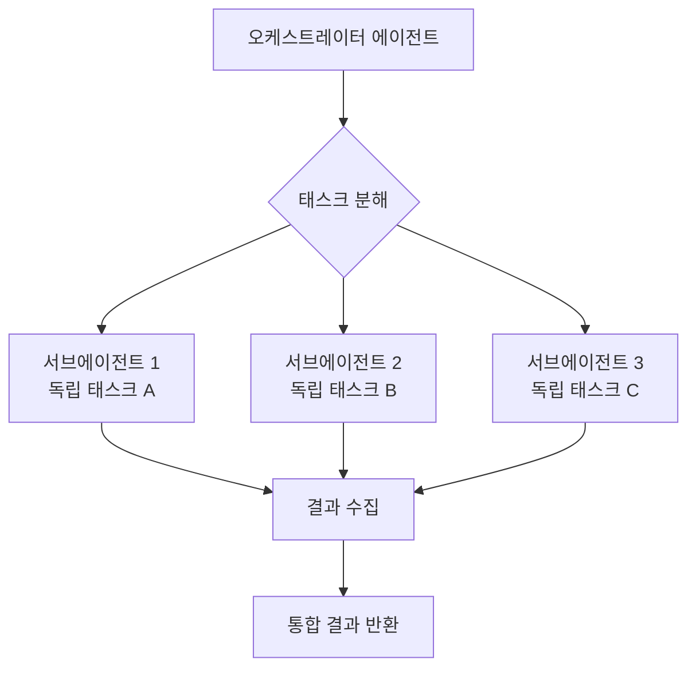

# Sub-agent 패턴 구성 프롬프트

## 1. 핵심 개념 / 작동 원리



복잡한 작업을 독립적인 서브태스크로 분해하여 병렬로 실행하는 Multi-agent 패턴 구성을 돕는 프롬프트입니다.

## 2. 한 줄 요약

"이 작업을 병렬로 처리해줘" 요청 시 독립적인 서브태스크를 식별하고, 각 서브에이전트에게 적절한 컨텍스트와 도구를 배정하여 병렬 실행 계획을 수립합니다.

## 3. 프롬프트 템플릿

```
다음 작업을 Sub-agent 패턴으로 병렬 처리하도록 설계해줘.

작업 내용: [전체 작업 설명]
예상 서브태스크 수: [대략적인 수]

설계 요청:
1. 독립적으로 처리 가능한 서브태스크 분해
2. 각 서브에이전트의 역할과 입력/출력 정의
3. 의존 관계가 있는 태스크 식별 (순차 처리 필요)
4. 병렬 실행 순서 다이어그램

패턴: dispatching-parallel-agents 또는 subagent-driven-development 스킬 활용
결과 통합 방법도 명시해줘.
```

## 4. 실전 예제

**48개 스킬 영어 번역 병렬 처리**:

```
오케스트레이터가 48개 스킬을 8그룹으로 분배:

그룹1 (서브에이전트1): brainstorming, writing-plans, executing-plans, ...
그룹2 (서브에이전트2): careful, guard, verification-before-completion, ...
...
그룹8 (서브에이전트8): writing-skills, test-driven-development, ...

각 서브에이전트:
- 6개 파일 읽기 → 영어 번역 → content/en/skills/ 저장
- frontmatter lang:en 변환
- 7섹션 헤딩 영어화

병렬 실행 → 오케스트레이터가 결과 수집 → 커밋
```

## 5. 학습 포인트 / 흔한 함정

- 공유 상태를 수정하는 태스크는 병렬화 불가 (파일 충돌)
- 서브에이전트마다 충분한 컨텍스트 전달 필요
- 오케스트레이터 컨텍스트 창 관리: 서브에이전트 결과 요약만 수집

## 6. 관련 리소스

- [Agents 패턴 허브](../agents/)
- [dispatching-parallel-agents 스킬](../skills/dispatching-parallel-agents.md)
- [통합 셋업 프롬프트](./integrated-setup.md)

## 7. 원본 링크 & 저작권

| 항목 | 내용 |
|------|------|
| 원본 URL | https://github.com/mygithub05253/Claude-Code-Study |
| 작성자 | Claude-Code-Study 커뮤니티 |
| 라이선스 | MIT |
| 해설 작성일 | 2026-04-13 |
| 카테고리 | prompts / Sub-agent 패턴 |
