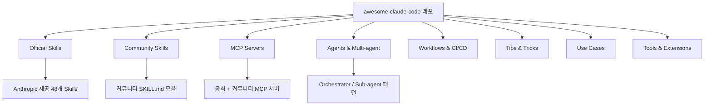

# awesome-claude-code

## 핵심 개념 / 작동 원리

awesome-claude-code는 Claude Code 생태계의 모든 리소스를 카테고리별로 정리한 큐레이션 리스트다.



각 항목은 다음 형식으로 기재됩니다:
- 이름 + GitHub 링크
- 한 줄 설명
- 라이선스 표기
- (일부) 데모 스크린샷 또는 예제 링크

## 한 줄 요약

Claude Code 생태계의 모든 리소스(Skills, Agents, MCP 서버, 활용 사례, 팁)를 체계적으로 큐레이션한 awesome 리스트.

## 프로젝트에 도입하기

### 레포 클론 및 탐색

```bash
# 레포 클론
git clone https://github.com/hesreallyhim/awesome-claude-code
cd awesome-claude-code

# README.md를 직접 열어 카테고리 탐색
# 또는 GitHub에서 Ctrl+F로 키워드 검색
```

### Claude Code와 연동

Claude Code에게 이 레포를 활용해 리소스 추천 요청:

```text
awesome-claude-code 레포(https://github.com/hesreallyhim/awesome-claude-code)를 참고해서
Next.js 15 + Supabase 조합에 유용한 MCP 서버와 Skills를
우선순위 순으로 추천해줘.
```

### 특정 카테고리 탐색 방법

```text
awesome-claude-code의 "Skills > Review" 섹션을 참고해서
코드 리뷰를 자동화하는 가장 좋은 방법을 알려줘.
```

### 이 프로젝트에 기여하기

새로 발굴한 유용한 리소스를 PR로 기여하는 방법:

```bash
# 1. 레포 Fork
gh repo fork hesreallyhim/awesome-claude-code

# 2. 브랜치 생성
git checkout -b add-[리소스명]

# 3. README.md의 해당 카테고리에 항목 추가
# 형식: - [이름](URL) — 한 줄 설명 (라이선스)

# 4. PR 제출
gh pr create --title "Add [리소스명]" --body "설명"
```

## 실전 예제 (대학생 관점)

**상황**: Next.js 15 "동아리 공지 게시판" 프로젝트를 처음 시작하는 대학생 입장에서.

### 시나리오 1: 프로젝트 시작 전 리소스 조사

처음 Claude Code를 도입할 때 어떤 도구부터 설치할지 이 리스트를 보고 판단할 수 있습니다.

```text
awesome-claude-code 레포의 "Web Development" 섹션을 참고해서
Next.js 15 + Supabase 조합에 유용한 MCP 서버와 Skills를
우선순위 순으로 추천해줘.
```

### 시나리오 2: 특정 문제 해결법 탐색

코드 리뷰를 자동화하고 싶을 때, 이 리스트의 "Skills > Review" 섹션을 찾아보면 커뮤니티가 검증한 방법을 빠르게 파악할 수 있습니다.

### 시나리오 3: 학습 로드맵 설계

대학교 프로젝트 수업에서 팀원에게 Claude Code를 소개할 때 이 리스트의 "Getting Started" 섹션을 공유하면 처음 접하는 팀원도 빠르게 따라올 수 있습니다.

### 시나리오 4: 이 프로젝트에서 발굴한 리소스 기여

이 `Claude-Code-Study` 프로젝트에서 새로 발굴한 유용한 MCP 서버나 Skills를 awesome-claude-code에 PR로 기여할 수 있습니다. 학과 외부 오픈소스 기여 이력으로 활용 가능합니다.

## 학습 포인트 / 흔한 함정

- **전수 탐색보다 카테고리 탐색**: 항목이 수백 개이므로 전부 읽으려 하지 말고, 지금 필요한 카테고리(MCP, Skills, Agents 등)만 집중적으로 탐색한다.
- **Stars 수 = 검증 지표**: Stars가 많을수록 커뮤니티 검증을 많이 받은 리소스다. 처음에는 Stars 상위 항목부터 시도한다.
- **라이선스 확인 필수**: 각 항목의 라이선스가 다르다. 상업 프로젝트에 사용할 때는 MIT, Apache 2.0, CC0 라이선스를 우선 선택한다.
- **업데이트 주기 확인**: 주 1~2회 커뮤니티 PR을 통해 지속적으로 업데이트되므로 Watch 설정을 하면 새 리소스를 빠르게 파악할 수 있다.
- **Claude-Code-Study와 병행 활용**: awesome-claude-code는 목록 제공, Claude-Code-Study는 한국어 상세 해설 제공이라는 역할 분담으로 함께 활용하면 시너지가 높다.

## 관련 리소스

- [modelcontextprotocol-servers](./modelcontextprotocol-servers.md) — awesome 리스트에서 발굴한 MCP 서버 원본 레포
- [claude-code-study](./claude-code-study.md) — awesome 리스트 항목을 한국어로 해설하는 이 프로젝트
- [filesystem-mcp](../mcp/filesystem-mcp.md) — awesome 리스트 MCP 섹션의 대표 서버 상세 해설

---

| 항목 | 내용 |
|---|---|
| 원본 URL | https://github.com/hesreallyhim/awesome-claude-code |
| 라이선스 | CC0 1.0 (퍼블릭 도메인, 확인 필요) |
| 해설 작성일 | 2026-04-12 |
| 작성자 | Claude-Code-Study 프로젝트 |
