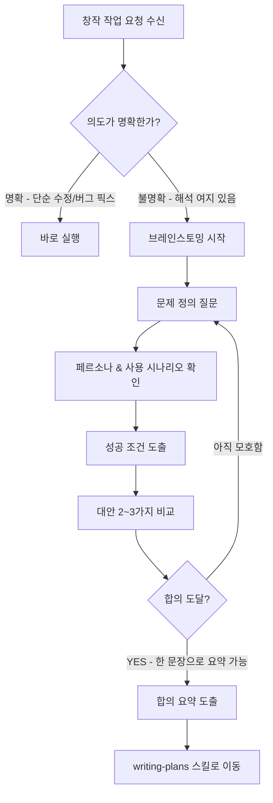

# 브레인스토밍 (Brainstorming)

## 핵심 개념 / 작동 원리

원본은 브레인스토밍을 **"HARD-GATE"** 로 취급한다. 다음 단계(계획 작성/코드 작성)로 넘어가기 전에 반드시 통과해야 하는 관문이다. 4가지 핵심 원칙:

1. **의도 우선**: 무엇을 만들지가 아니라, 그 기능이 풀려는 문제를 먼저 이해한다.
2. **요구사항 분리**: 필수(must-have)와 선택(nice-to-have)을 사용자가 직접 구분하게 만든다.
3. **디자인 탐색**: 하나의 해법에 고정되기 전에 2~3개의 접근을 비교한다.
4. **명시적 합의**: "이제 writing-plans로 넘어가도 될 만큼 명확한가?"라는 질문에 yes가 나올 때까지 반복한다.



## 한 줄 요약

기능/컴포넌트/동작 변경 등 **창작 작업 이전에** 사용자의 진짜 의도와 요구사항을 끌어내기 위한 구조화된 질문-탐색 스킬이다. 코드를 쓰기 전에 "왜/무엇을/어떻게"를 먼저 합의한다.

## 프로젝트에 도입하기

```bash
# Claude Code 세션에서 슬래시 명령어로 호출
/brainstorming
```

**SKILL.md 파일 위치**: `~/.claude/skills/brainstorming/SKILL.md`

이 스킬은 코드를 생성하지 않고, Claude의 **질문-응답 방식** 자체를 바꾼다. 요청을 받은 즉시 코드를 쓰는 대신, 구조화된 질문을 먼저 던지도록 강제한다.

커스터마이징이 필요하다면 SKILL.md를 복사 후 질문 패턴을 수정한다:

```bash
mkdir -p ~/.claude/skills/brainstorming-ko
cp ~/.claude/skills/brainstorming/SKILL.md ~/.claude/skills/brainstorming-ko/SKILL.md
# 이후 편집기로 열어 한국어 컨텍스트에 맞게 질문 패턴 변경
```

## 실전 예제 (대학생 관점)

**상황**: Next.js 15 App Router로 "동아리 공지 게시판"을 만드는 과제를 받았다. 교수님은 "CRUD 되고 로그인 있는 거면 된다"라고만 말씀하셨다.

```bash
# Claude Code 세션에서
> 동아리 공지 게시판을 Next.js 15로 만들려고 해. brainstorming 스킬로 먼저 의도부터 합의하자.
```

Claude가 던지는 질문 예시:

1. "공지의 핵심 독자는 누구인가요? (동아리원만 / 일반 학생도 포함)" → **인증 범위** 결정
2. "공지를 작성하는 사람은 누구인가요? (회장만 / 임원진 / 모든 동아리원)" → **권한 모델** 결정
3. "읽음 표시나 알림이 필요한가요?" → **DB 스키마** 결정
4. "게시판 말고 Discord로 대체 가능한가요?" → **그냥 만들지 말지** 결정

최종 합의 문장:
> "로그인한 동아리원(읽기)과 임원진(쓰기)이 사용하는, Next.js 15 + Supabase 기반의 공지 페이지. 알림은 MVP에서 제외."

```ts
// 브레인스토밍 이후에야 아래와 같은 결정을 자신 있게 내릴 수 있다
// app/notices/page.tsx — 서버 컴포넌트 (읽기 전용)
// app/notices/new/page.tsx — 임원진만 접근 (권한 미들웨어 필요)
// lib/auth.ts — 역할 기반 가드
```

## 학습 포인트 / 흔한 함정

- **"코드 먼저"의 유혹에 저항하기**: 요구사항을 절반만 이해한 채 `npm create next-app`부터 치는 것이 가장 흔한 실수다. 브레인스토밍 15~30분으로 엉뚱한 방향의 3시간을 막는다.
- **질문 4개만 기억하기**: "누가 쓰는가 / 무엇을 원하는가 / 언제 실패하는가 / 왜 지금인가"만으로 90%의 모호함이 해소된다.
- **반드시 한 문장으로 끝내기**: 브레인스토밍의 완료 기준은 "한 줄로 요약할 수 있는가"이다. 요약이 안 되면 아직 합의가 부족한 것이다.
- **Next.js 15 팁**: 서버 컴포넌트 vs 클라이언트 컴포넌트 선택은 실제로 브레인스토밍 단계의 결정이다. "상호작용이 필요한가? 폼이 있는가?"를 먼저 합의해야 `"use client"` 배치가 깔끔해진다.

## 관련 리소스

- [계획 작성 (writing-plans)](/skills/writing-plans) — 브레인스토밍 이후 다음 단계
- [계획 실행 (executing-plans)](/skills/executing-plans) — 계획 수립 후 실행
- [CEO 리뷰 (plan-ceo-review)](/skills/plan-ceo-review) — 계획 범위 재검토
- [오피스 아워 (office-hours)](/skills/office-hours) — YC 스타일 아이디어 탐색

---

| 항목 | 내용 |
|---|---|
| 원본 URL | https://docs.anthropic.com/en/docs/claude-code/skills |
| 작성자/출처 | Anthropic |
| 라이선스 | 해설 MIT, 원본 참조용 |
| 해설 작성일 | 2026-04-12 |
